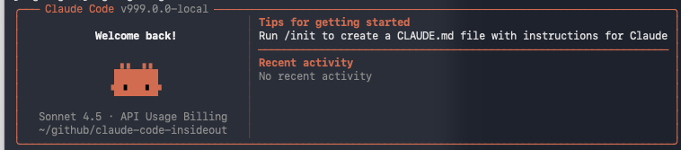
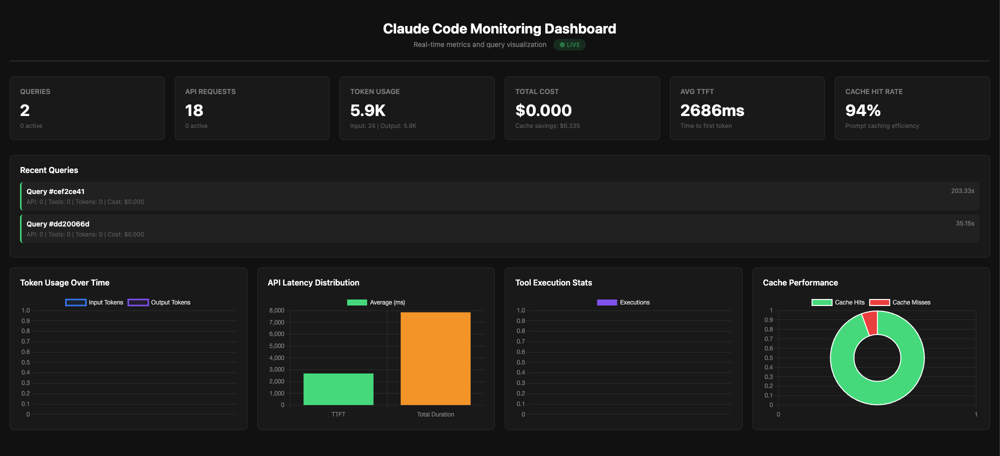
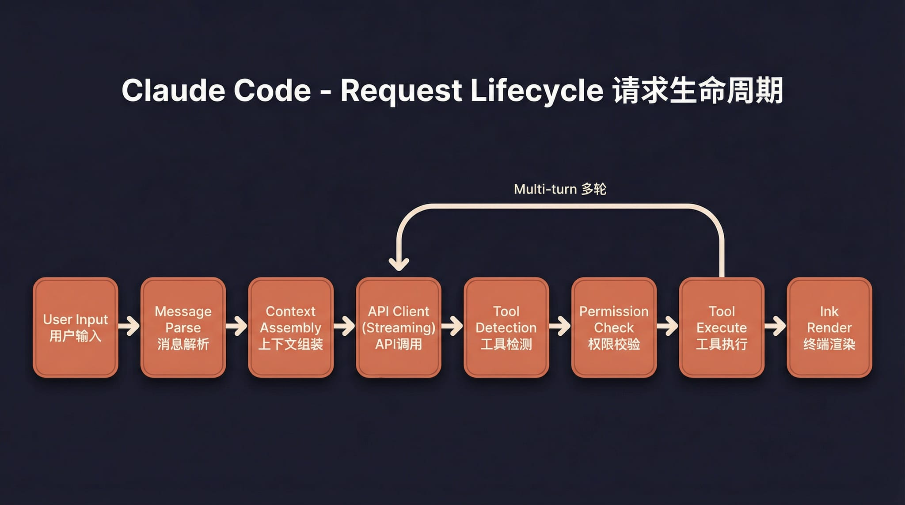
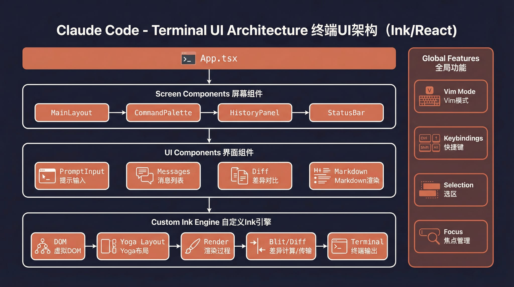

# Claude Code Inside Out

<p align="right"><strong>English</strong> | <a href="./README.zh.md">中文</a></p>

**Understand how Claude Code works under the hood** — Built on the [claude-code-haha](https://github.com/mygu/claude-code-haha) project with extensive logging added throughout the codebase.

This project helps developers understand the interaction between the Claude Code client and Large Language Models (LLMs) by revealing through detailed logs:
- 🔍 Complete request/response lifecycle
- 🛠️ Tool invocation and execution flow
- 💬 Message streaming and context management
- 📊 Token usage and caching mechanisms
- 🔐 Authentication and API client initialization

> **Foundation**: The original leaked source code doesn't run out of the box. This repository builds on claude-code-haha's fixes and adds observability enhancements, allowing you to see "inside" Claude Code's internal workings.

> **📍 Debug Logs Location:**  
> All internal logs are automatically saved to **`~/.claude/logs/debug.log`** (Linux/macOS) or **`%USERPROFILE%\.claude\logs\debug.log`** (Windows).  
> View in real-time: `tail -f ~/.claude/logs/debug.log`

<p align="center">
  
</p>

## 📊 Example Logging Output

The enhanced logging reveals the complete request lifecycle. Here's what you'll see when you run a query:

```log
[TRACE] processUserInput called - mode: prompt, inputString: <user-prompt>, skipSlashCommands: false
[TRACE] processUserInput result: shouldQuery=true, messages.length=3, model=default
[TRACE] Calling onQuery - shouldQuery=true, allowedTools=[], model=claude-sonnet-4.5, primaryInput="<prompt>", newMessages.length=3

[TRACE] [REPL] onQuery called - shouldQuery: true, newMessages.length: 3, model: claude-sonnet-4.5
[TRACE] [REPL] Query guard acquired, generation: 1
[TRACE] [REPL] onQueryImpl started - shouldQuery: true, messagesIncludingNewMessages.length: 6
[TRACE] [REPL] Starting query() generator loop

[TRACE] query() called - messages.length: 6, model: undefined, systemPrompt length: 11
[TRACE] [REPL] Received event from query() - type: stream_request_start

[TRACE] [QUERY] Entering API call loop - attemptWithFallback: true
[TRACE] [QUERY] Starting API call iteration - turnCount: 1, model: claude-sonnet-4.5, messagesForQuery.length: 6
[TRACE] [LLM] queryModelWithVCR called - messages.length: 7, tools.length: 22, model: claude-sonnet-4.5

[TRACE] API Request - model: claude-haiku-4.5, max_tokens: 32000, messages.length: 1, tools.length: 0
[TRACE] [LLM] Send request to LLM:
{
  "model": "claude-haiku-4.5",
  "messages": [{"role": "user", "content": [{"type": "text", "text": "<user-prompt>"}]}],
  "system": [
    {"type": "text", "text": "x-anthropic-billing-header: cc_version=999.0.0-local.xxx; cc_entrypoint=cli;"},
    {"type": "text", "text": "You are Claude Code, Anthropic's official CLI for Claude."},
    {"type": "text", "text": "Generate a concise, sentence-case title..."}
  ],
  "metadata": {"user_id": "{\"device_id\":\"<device-id>\",\"session_id\":\"<session-id>\"}"},
  "max_tokens": 32000,
  "temperature": 1
}
```

**Key Insights Revealed:**
- **Input Processing**: How user prompts are parsed and validated
- **Message Flow**: Tracking message count as they move through the pipeline
- **Model Selection**: See which models are chosen for different tasks
- **Tool Availability**: Monitor which tools are available (22 tools in this example)
- **API Request Structure**: Full visibility into request parameters sent to the LLM
- **System Prompts**: Understand how Claude Code instructs the AI
- **Query Lifecycle**: From user input → processing → API call → response streaming

**📊 [View Complete Request Flow Sequence Diagram](docs/sequence-diagram.md)** - Interactive Mermaid diagram showing the entire request lifecycle with all components and their interactions.

**🔐 [View Authentication Flow Diagrams](docs/authentication-flow.md)** - Detailed sequence diagrams for all 6 authentication methods with decision trees and log examples.

**📘 [Explore Example Queries with Log Analysis](examples/)** - 4 detailed examples showing simple queries, tool usage, multiple tools, and error handling with complete log breakdowns.

**🔍 [Log Extraction Guide](docs/log-extraction-guide.md)** - Complete guide to extracting LLM requests/responses, prompts, context, and token usage from debug logs.

## 📡 Real-time Monitoring Dashboard

Type `/dashboard` inside the session to launch a live web dashboard at `http://localhost:8765`:

<p align="center">
  
</p>

The dashboard shows real-time metrics wired directly into the query pipeline:
- **Queries & API Requests** — counts and active status
- **Token Usage** — input/output/cached tokens
- **Avg TTFT** — time to first token per request
- **Cache Hit Rate** — prompt caching efficiency
- **Recent Queries** — live query timeline with duration and cost
- **API Latency / Tool Stats / Cache Performance** — interactive charts

---

## Features

- Full Ink TUI experience (matching the official Claude Code interface)
- `--print` headless mode for scripts and CI
- MCP server, plugin, and Skills support
- Custom API endpoint and model support
- Fallback Recovery CLI mode

---

## Architecture Overview

**📚 [Read Complete Architecture Documentation](ARCHITECTURE.md)** - Detailed guide covering authentication systems, request lifecycle, tool execution, and all internal components.

<table>
  <tr>
    <td align="center" width="25%"><br><b>Overall architecture</b></td>
    <td align="center" width="25%"><br><b>Request lifecycle</b></td>
    <td align="center" width="25%"><br><b>Tool system</b></td>
    <td align="center" width="25%"><br><b>Multi-agent architecture</b></td>
  </tr>
  <tr>
    <td align="center" width="25%"><br><b>Terminal UI</b></td>
    <td align="center" width="25%"><br><b>Permissions and security</b></td>
    <td align="center" width="25%"><br><b>Services layer</b></td>
    <td align="center" width="25%"><br><b>State and data flow</b></td>
  </tr>
</table>

---

## Quick Start

### 1. Install Bun

This project requires [Bun](https://bun.sh). If Bun is not installed on the target machine yet, use one of the following methods first:

```bash
# macOS / Linux (official install script)
curl -fsSL https://bun.sh/install | bash
```

If a minimal Linux image reports `unzip is required to install bun`, install `unzip` first:

```bash
# Ubuntu / Debian
apt update && apt install -y unzip
```

```bash
# macOS (Homebrew)
brew install bun
```

```powershell
# Windows (PowerShell)
powershell -c "irm bun.sh/install.ps1 | iex"
```

After installation, reopen the terminal and verify:

```bash
bun --version
```

### 2. Install project dependencies

```bash
bun install
```

### 3. Configure environment variables

Copy the example file and fill in your API key:

```bash
cp .env.example .env
```

Edit `.env`:

```env
# API authentication (choose one)
ANTHROPIC_API_KEY=sk-xxx          # Standard API key via x-api-key header
ANTHROPIC_AUTH_TOKEN=sk-xxx       # Bearer token via Authorization header

# API endpoint (optional, defaults to Anthropic)
ANTHROPIC_BASE_URL=https://api.minimaxi.com/anthropic

# Model configuration
ANTHROPIC_MODEL=MiniMax-M2.7-highspeed
ANTHROPIC_DEFAULT_SONNET_MODEL=MiniMax-M2.7-highspeed
ANTHROPIC_DEFAULT_HAIKU_MODEL=MiniMax-M2.7-highspeed
ANTHROPIC_DEFAULT_OPUS_MODEL=MiniMax-M2.7-highspeed

# Timeout in milliseconds
API_TIMEOUT_MS=3000000

# Disable telemetry and non-essential network traffic
DISABLE_TELEMETRY=1
CLAUDE_CODE_DISABLE_NONESSENTIAL_TRAFFIC=1
```

### 4. Start

#### macOS / Linux

```bash
# Interactive TUI mode (full interface)
./bin/claude-code-insideout

# Headless mode (single prompt)
./bin/claude-code-insideout -p "your prompt here"

# Pipe input
echo "explain this code" | ./bin/claude-code-insideout -p

# Show all options
./bin/claude-code-insideout --help
```

#### Windows

> **Prerequisite**: [Git for Windows](https://git-scm.com/download/win) must be installed (provides Git Bash, which the project's internal shell execution depends on).

The startup script `bin/claude-code-insideout` is a bash script and cannot run directly in cmd or PowerShell. Use one of the following methods:

**Option 1: PowerShell / cmd — call Bun directly (recommended)**

```powershell
# Interactive TUI mode
bun --env-file=.env ./src/entrypoints/cli.tsx

# Headless mode
bun --env-file=.env ./src/entrypoints/cli.tsx -p "your prompt here"

# Fallback Recovery CLI
bun --env-file=.env ./src/localRecoveryCli.ts
```

**Option 2: Run inside Git Bash**

```bash
# Same usage as macOS / Linux
./bin/claude-code-insideout
```

> **Note**: Some features (voice input, Computer Use, sandbox isolation, etc.) are not available on Windows. This does not affect the core TUI interaction.

---

## Environment Variables

| Variable | Required | Description |
|------|------|------|
| `ANTHROPIC_API_KEY` | One of two | API key sent via the `x-api-key` header |
| `ANTHROPIC_AUTH_TOKEN` | One of two | Auth token sent via the `Authorization: Bearer` header |
| `ANTHROPIC_BASE_URL` | No | Custom API endpoint, defaults to Anthropic |
| `ANTHROPIC_MODEL` | No | Default model |
| `ANTHROPIC_DEFAULT_SONNET_MODEL` | No | Sonnet-tier model mapping |
| `ANTHROPIC_DEFAULT_HAIKU_MODEL` | No | Haiku-tier model mapping |
| `ANTHROPIC_DEFAULT_OPUS_MODEL` | No | Opus-tier model mapping |
| `API_TIMEOUT_MS` | No | API request timeout, default `600000` (10min) |
| `DISABLE_TELEMETRY` | No | Set to `1` to disable telemetry |
| `CLAUDE_CODE_DISABLE_NONESSENTIAL_TRAFFIC` | No | Set to `1` to disable non-essential network traffic |
| `CLAUDE_CODE_DEBUG_ENABLED` | No | Enable debug logging, default `1` (enabled). Set to `0` to disable |
| `CLAUDE_CODE_DEBUG_LOG` | No | Custom log file path. Default: `~/.claude/logs/debug.log` (Linux/macOS) or `%USERPROFILE%\.claude\logs\debug.log` (Windows) |

---

## 🔍 Debug Logging

Enhanced debug logging is enabled by default to help you understand Claude Code's internals.

**Default Log Locations:**
- **Linux/macOS**: `~/.claude/logs/debug.log`
- **Windows**: `%USERPROFILE%\.claude\logs\debug.log`

**Configuration:**

```bash
# Disable logging
export CLAUDE_CODE_DEBUG_ENABLED=0

# Custom log path (works on all platforms)
export CLAUDE_CODE_DEBUG_LOG=/path/to/your/debug.log

# On Windows PowerShell:
$env:CLAUDE_CODE_DEBUG_LOG="C:\logs\claude-debug.log"
```

**View Logs in Real-time:**

```bash
# Linux/macOS
tail -f ~/.claude/logs/debug.log

# Windows PowerShell
Get-Content "$env:USERPROFILE\.claude\logs\debug.log" -Wait -Tail 50
```

The logging system automatically:
- ✅ Creates the log directory if it doesn't exist
- ✅ Falls back to temp directory if home is not accessible
- ✅ Works cross-platform (Linux, macOS, Windows)
- ✅ Silently fails to avoid breaking the application

---

## Fallback Mode

If the full TUI has issues, use the simplified readline-based interaction mode:

```bash
CLAUDE_CODE_FORCE_RECOVERY_CLI=1 ./bin/claude-code-insideout
```

---

## Fixes Compared with the Original Leaked Source

The leaked source could not run directly. This repository mainly fixes the following issues:

| Issue | Root cause | Fix |
|------|------|------|
| TUI does not start | The entry script routed no-argument startup to the recovery CLI | Restored the full `cli.tsx` entry |
| Startup hangs | The `verify` skill imports a missing `.md` file, causing Bun's text loader to hang indefinitely | Added stub `.md` files |
| `--print` hangs | `filePersistence/types.ts` was missing | Added type stub files |
| `--print` hangs | `ultraplan/prompt.txt` was missing | Added resource stub files |
| **Enter key does nothing** | The `modifiers-napi` native package was missing, `isModifierPressed()` threw, `handleEnter` was interrupted, and `onSubmit` never ran | Added try/catch fault tolerance |
| Setup was skipped | `preload.ts` automatically set `LOCAL_RECOVERY=1`, skipping all initialization | Removed the default setting |

---

## Project Structure

```text
bin/claude-code-insideout          # Entry script
preload.ts               # Bun preload (sets MACRO globals)
.env.example             # Environment variable template
src/
├── entrypoints/cli.tsx  # Main CLI entry
├── main.tsx             # Main TUI logic (Commander.js + React/Ink)
├── localRecoveryCli.ts  # Fallback Recovery CLI
├── setup.ts             # Startup initialization
├── screens/REPL.tsx     # Interactive REPL screen
├── ink/                 # Ink terminal rendering engine
├── components/          # UI components
├── tools/               # Agent tools (Bash, Edit, Grep, etc.)
├── commands/            # Slash commands (/commit, /review, etc.)
├── skills/              # Skill system
├── services/            # Service layer (API, MCP, OAuth, etc.)
├── hooks/               # React hooks
└── utils/               # Utility functions
```

---

## Tech Stack

| Category | Technology |
|------|------|
| Runtime | [Bun](https://bun.sh) |
| Language | TypeScript |
| Terminal UI | React + [Ink](https://github.com/vadimdemedes/ink) |
| CLI parsing | Commander.js |
| API | Anthropic SDK |
| Protocols | MCP, LSP |

---

## Disclaimer

This repository is based on the Claude Code source leaked from the Anthropic npm registry on 2026-03-31. All original source code copyrights belong to [Anthropic](https://www.anthropic.com). It is provided for learning and research purposes only.
