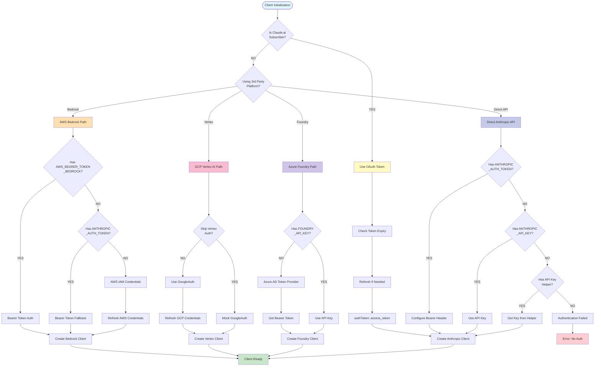
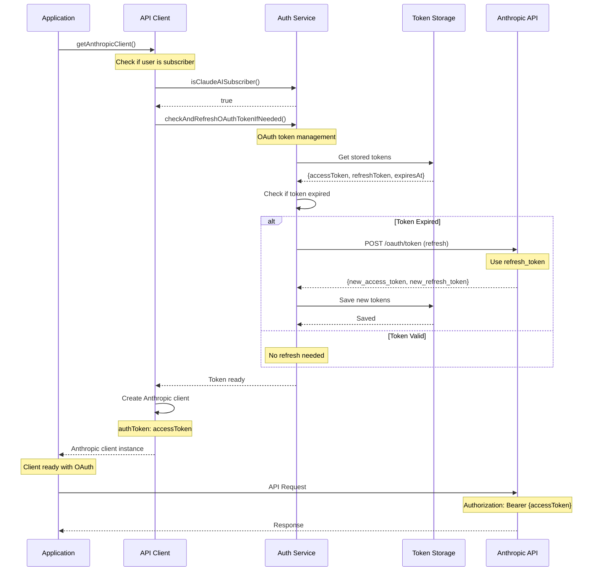
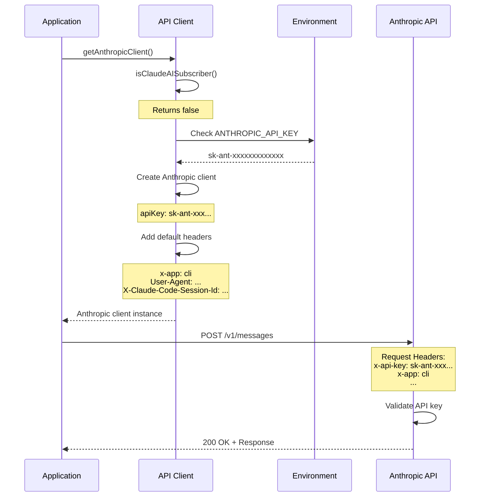
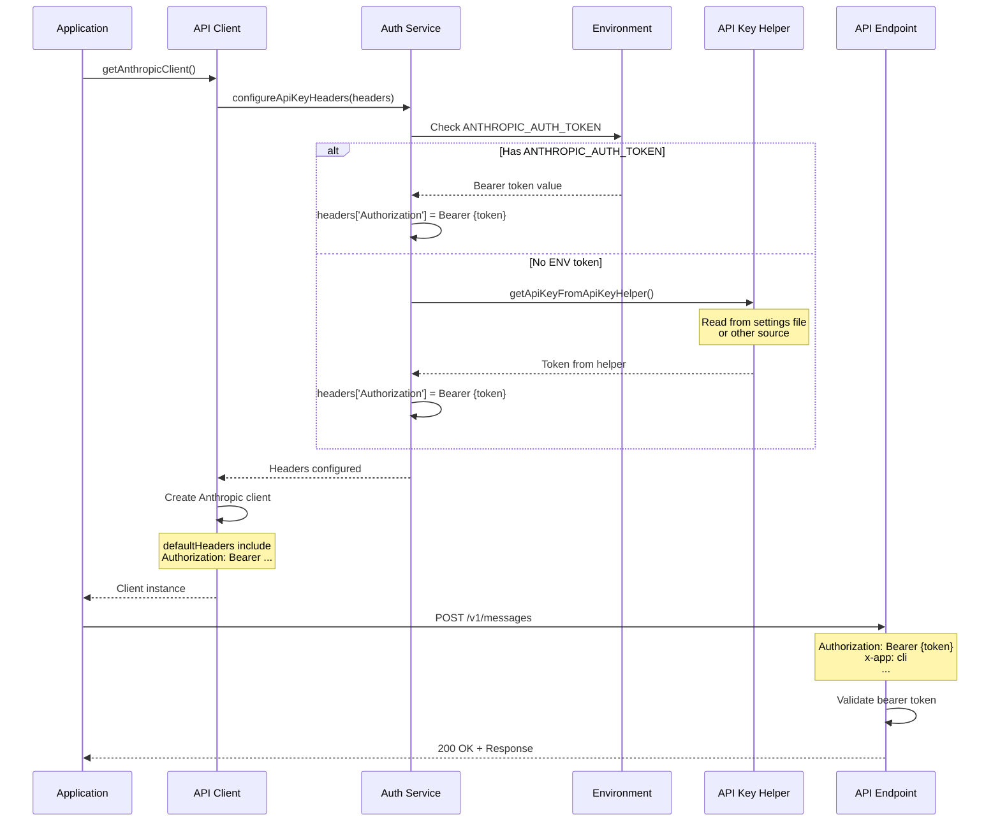
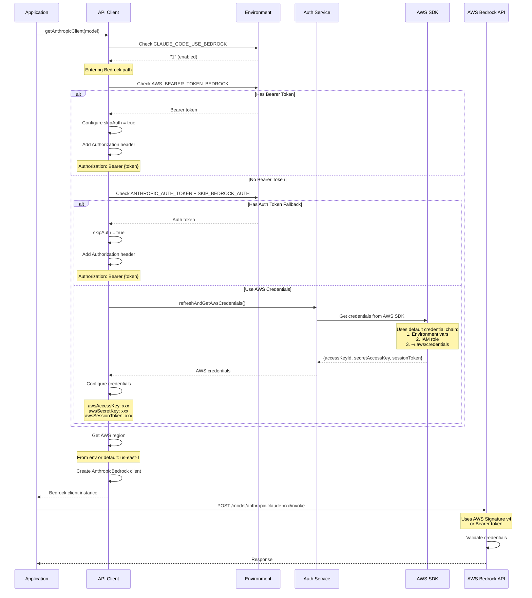
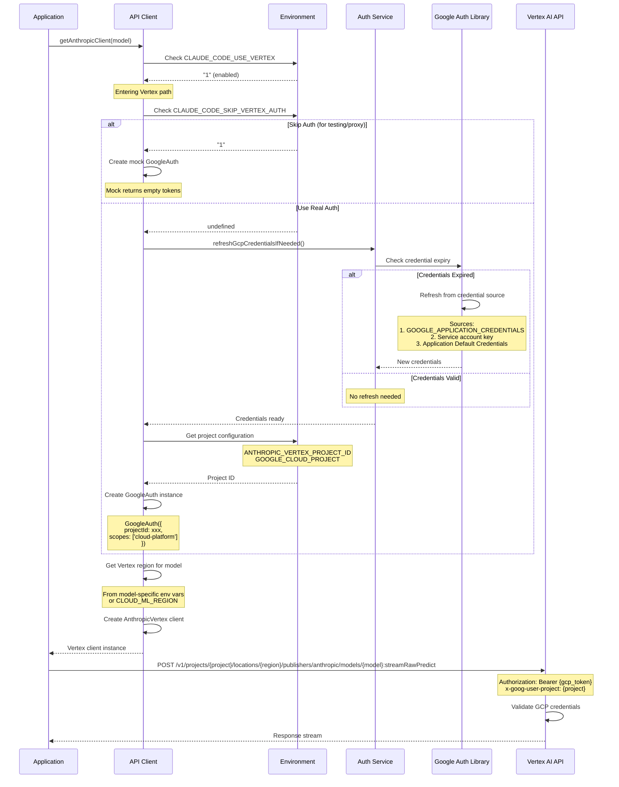
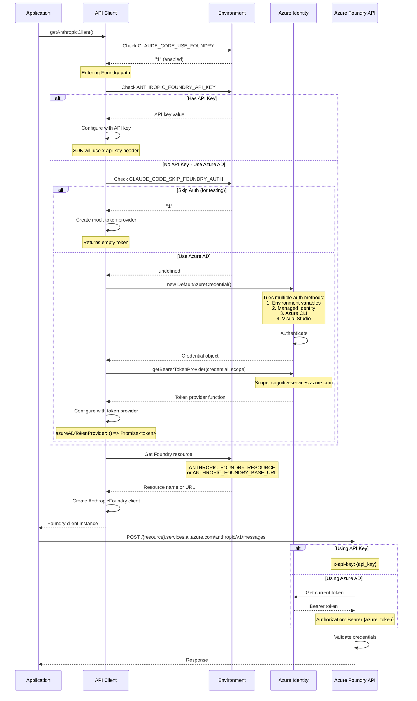

# Authentication Flow Diagrams

This document shows detailed sequence diagrams for all authentication methods supported by Claude Code.

## Table of Contents

- [Authentication Decision Flow](#authentication-decision-flow)
- [Method 1: OAuth Token (Claude.ai)](#method-1-oauth-token-claudeai)
- [Method 2: API Key (x-api-key)](#method-2-api-key-x-api-key)
- [Method 3: Bearer Token](#method-3-bearer-token)
- [Method 4: AWS Bedrock](#method-4-aws-bedrock)
- [Method 5: GCP Vertex AI](#method-5-gcp-vertex-ai)
- [Method 6: Azure Foundry](#method-6-azure-foundry)

---

## Authentication Decision Flow

This diagram shows how Claude Code decides which authentication method to use.



---

## Method 1: OAuth Token (Claude.ai)

For users with Claude.ai subscriptions.



**Key Points:**
- Automatic token refresh
- Tokens stored securely
- No manual API key needed
- Requires Claude.ai subscription

**Environment Variables:**
- None (uses stored tokens)

**Log Output:**
```log
[AUTH] OAuth token check starting
[AUTH] Token expires in 3600 seconds, no refresh needed
[AUTH] OAuth token check complete
[CLIENT] Creating client with OAuth token
```

---

## Method 2: API Key (x-api-key)

Standard Anthropic API key authentication.



**Key Points:**
- Simplest method
- API key sent in `x-api-key` header
- Direct to Anthropic API
- No token refresh needed

**Environment Variables:**
```bash
ANTHROPIC_API_KEY=sk-ant-xxxxxxxxxxxxx
```

**Log Output:**
```log
[CLIENT] getAnthropicClient called
[CLIENT] Creating client with API key
[CLIENT] Client configuration complete
```

---

## Method 3: Bearer Token

For custom gateways and proxies.



**Key Points:**
- Uses `Authorization: Bearer` header
- Supports custom auth schemes
- Can read from helper/settings
- Good for proxies and gateways

**Environment Variables:**
```bash
ANTHROPIC_AUTH_TOKEN=your-bearer-token
```

**Log Output:**
```log
[AUTH] Using ANTHROPIC_AUTH_TOKEN
[CLIENT] Authorization header configured
[CLIENT] Creating client with Bearer auth
```

---

## Method 4: AWS Bedrock

For AWS Bedrock with IAM or bearer token.



**Key Points:**
- Three auth options: Bearer token, Auth token fallback, IAM credentials
- Automatic credential refresh for IAM
- Regional configuration
- AWS SDK integration

**Environment Variables:**
```bash
# Option A: Bearer token
CLAUDE_CODE_USE_BEDROCK=1
AWS_BEARER_TOKEN_BEDROCK=your-token

# Option B: Auth token fallback
CLAUDE_CODE_USE_BEDROCK=1
CLAUDE_CODE_SKIP_BEDROCK_AUTH=1
ANTHROPIC_AUTH_TOKEN=your-token

# Option C: AWS IAM credentials
CLAUDE_CODE_USE_BEDROCK=1
AWS_ACCESS_KEY_ID=xxx
AWS_SECRET_ACCESS_KEY=xxx
AWS_SESSION_TOKEN=xxx  # Optional
AWS_REGION=us-east-1
```

**Log Output:**
```log
[CLIENT] Entering BEDROCK path - AWS_BEARER_TOKEN_BEDROCK: true, ANTHROPIC_AUTH_TOKEN: false
[AUTH] Using AWS_BEARER_TOKEN_BEDROCK
[CLIENT] Creating AnthropicBedrock client - has Authorization header: true
```

Or with IAM:
```log
[CLIENT] Entering BEDROCK path
[AUTH] Using AWS credentials refresh
[AUTH] AWS credentials refreshed successfully
[CLIENT] Creating AnthropicBedrock client with IAM credentials
```

---

## Method 5: GCP Vertex AI

For Google Cloud Vertex AI.



**Key Points:**
- Uses Google Cloud authentication
- Automatic credential refresh
- Regional model routing
- Service account support

**Environment Variables:**
```bash
CLAUDE_CODE_USE_VERTEX=1
ANTHROPIC_VERTEX_PROJECT_ID=your-gcp-project
CLOUD_ML_REGION=us-east5

# Credentials via:
export GOOGLE_APPLICATION_CREDENTIALS=/path/to/service-account.json
# Or use Application Default Credentials
```

**Log Output:**
```log
[CLIENT] Entering VERTEX path
[AUTH] Checking GCP credentials
[AUTH] GCP credentials valid, no refresh needed
[CLIENT] Creating AnthropicVertex client - region: us-east5, project: my-project
```

---

## Method 6: Azure Foundry

For Microsoft Azure Foundry.



**Key Points:**
- Two auth options: API key or Azure AD
- DefaultAzureCredential tries multiple methods
- Automatic token refresh for Azure AD
- Resource-based URL configuration

**Environment Variables:**
```bash
# Option A: API Key
CLAUDE_CODE_USE_FOUNDRY=1
ANTHROPIC_FOUNDRY_RESOURCE=my-resource
ANTHROPIC_FOUNDRY_API_KEY=your-api-key

# Option B: Azure AD
CLAUDE_CODE_USE_FOUNDRY=1
ANTHROPIC_FOUNDRY_RESOURCE=my-resource
# Azure credentials via:
# - AZURE_CLIENT_ID, AZURE_CLIENT_SECRET, AZURE_TENANT_ID
# - Managed Identity
# - Azure CLI (az login)
```

**Log Output:**
```log
[CLIENT] Entering FOUNDRY path
[CLIENT] Using Azure AD authentication
[AUTH] DefaultAzureCredential initialized
[CLIENT] Creating AnthropicFoundry client with token provider
```

---

## Authentication Flow Summary

| Method | Header Type | Token Source | Refresh | Platform |
|--------|-------------|--------------|---------|----------|
| **OAuth** | Bearer | Token storage | Auto | Claude.ai |
| **API Key** | x-api-key | Environment | N/A | Anthropic |
| **Bearer Token** | Bearer | Environment/Helper | Manual | Custom |
| **Bedrock** | Varies | AWS SDK / Bearer | Auto | AWS |
| **Vertex AI** | Bearer | Google Auth | Auto | GCP |
| **Foundry** | Varies | Azure AD / API Key | Auto | Azure |

---

## Quick Reference

### Check Which Method is Used

```bash
# View auth logs
grep "\[AUTH\]" ~/.claude/logs/debug.log | tail -10

# See client creation
grep "\[CLIENT\]" ~/.claude/logs/debug.log | grep -i "auth\|token\|key"
```

### Common Auth Issues

```bash
# Token expired
[ERROR] [AUTH] OAuth token expired and refresh failed

# Invalid API key
[ERROR] [CLIENT] Authentication failed: invalid x-api-key

# AWS credentials not found
[ERROR] [AUTH] Unable to load AWS credentials

# GCP credentials missing
[ERROR] [CLIENT] Could not load Application Default Credentials
```

---

## Related Documentation

- [ARCHITECTURE.md](../ARCHITECTURE.md) - Complete architecture overview
- [Request Lifecycle Diagram](sequence-diagram.md) - Full request flow
- [Example Queries](../examples/) - Real usage examples

---

## Testing Authentication

To test your authentication setup:

```bash
# Set your credentials
export ANTHROPIC_API_KEY=sk-ant-xxx

# Run a simple query
echo "test" | ./bin/claude-code-insideout -p

# Check auth logs
grep "\[AUTH\]" ~/.claude/logs/debug.log | tail -5
grep "\[CLIENT\]" ~/.claude/logs/debug.log | tail -5
```

Expected output:
```log
[AUTH] OAuth token check starting
[AUTH] OAuth token check complete
[CLIENT] getAnthropicClient called
[CLIENT] Creating client with API key
```
