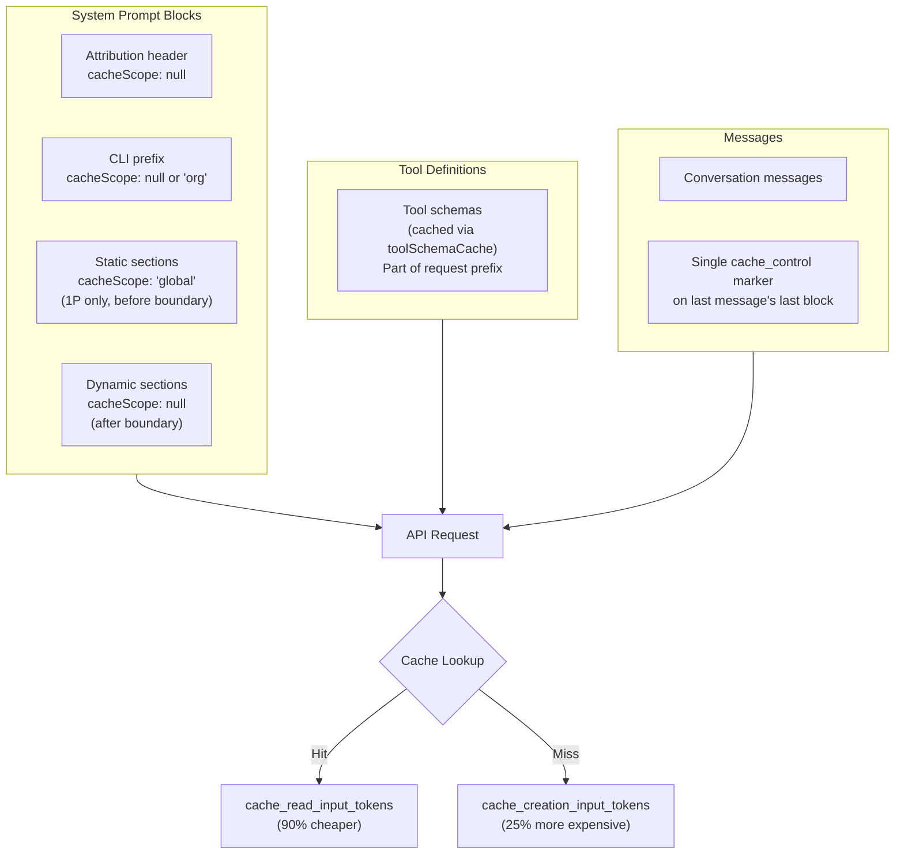
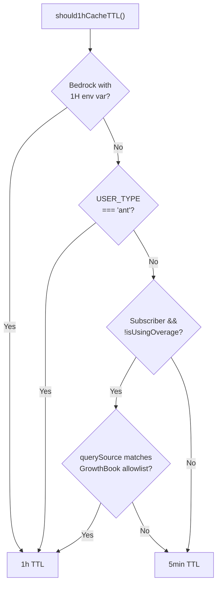
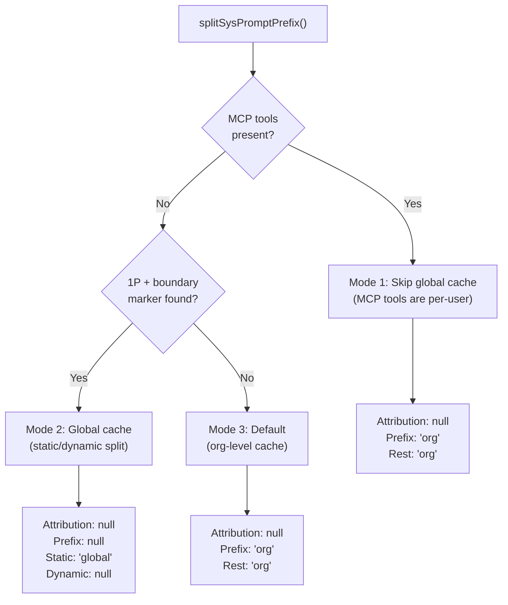
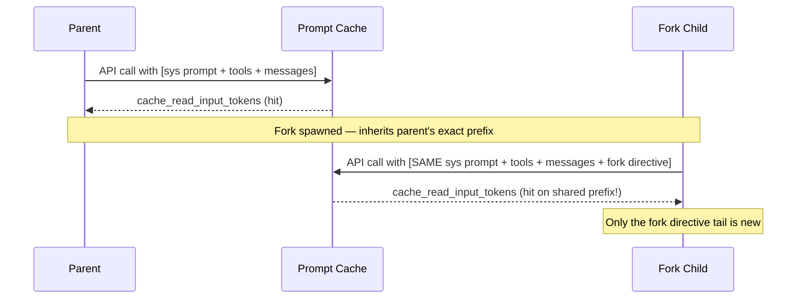

# Caching Behavior

How Claude Code leverages Anthropic's prompt caching system — cache scopes, TTL tiers, breakpoint placement, cache stability mechanisms, and cache break detection.

---

## Table of Contents

1. [Architecture Overview](#architecture-overview)
2. [When Caching Kicks In](#when-caching-kicks-in)
3. [Cache Breakpoint Placement](#cache-breakpoint-placement)
4. [Cache Scopes & TTL Tiers](#cache-scopes--ttl-tiers)
5. [Cache Stability Mechanisms](#cache-stability-mechanisms)
6. [Fork Subagent Cache Sharing](#fork-subagent-cache-sharing)
7. [Cache Break Detection](#cache-break-detection)
8. [Cache Metrics & Monitoring](#cache-metrics--monitoring)
9. [Cache-Busting Scenarios](#cache-busting-scenarios)
10. [Key Source Files](#key-source-files)

---

## Architecture Overview



The caching system optimizes at three levels:
1. **System prompt blocks** — split by scope (global vs org) with strategic cache_control placement
2. **Tool definitions** — session-stable via schema caching
3. **Messages** — single cache breakpoint on the last message

---

## When Caching Kicks In

### cache_control on System Prompt

**File:** `src/services/api/claude.ts:3256-3279`

`buildSystemPromptBlocks()` decorates system prompt blocks with `cache_control` based on their `cacheScope`:

```typescript
// Blocks with cacheScope: null → NO cache_control (not cached)
// Blocks with cacheScope: 'org' or 'global' → cache_control added
{
  type: 'text',
  text: block.text,
  cache_control: {
    type: 'ephemeral',
    ttl: '1h',        // if eligible
    scope: 'global',  // if global block
  }
}
```

### cache_control on Messages

**File:** `src/services/api/claude.ts:3106-3253`

`addCacheBreakpoints()` places exactly **ONE** `cache_control` marker across all messages:

| Scenario | Marker Position | Why |
|----------|----------------|-----|
| Normal request | Last message, last content block | Cache the full prefix |
| Fire-and-forget fork (`skipCacheWrite=true`) | Second-to-last message | Don't pollute cache with fork's tail |

Only one marker is used because with two markers, the API's KV page manager unnecessarily pins pages at the second-to-last position. One marker = more efficient page freeing.

Blocks that **never** get cache_control: `thinking`, `redacted_thinking`, `connector_text`.

### 5-Minute vs 1-Hour TTL

**File:** `src/services/api/claude.ts:360-436`

| TTL | Duration | Cost | Eligibility |
|-----|----------|------|-------------|
| Default (5min) | Entries expire after 5 min of no use | Standard pricing | Everyone |
| Extended (1h) | Entries kept alive for 1 hour | Higher creation cost | Ant employees, paid subscribers not in overage, Bedrock with env flag |

`should1hCacheTTL()` gates eligibility (latched per session to prevent mid-session flips):



Usage is tracked separately per tier:
```typescript
cache_creation: {
  ephemeral_1h_input_tokens: 0,
  ephemeral_5m_input_tokens: 0,
}
```

---

## Cache Breakpoint Placement

### `splitSysPromptPrefix()`

**File:** `src/utils/api.ts:321-435`

Splits the system prompt array into cache-annotated blocks. Three modes:



Block identification is by **content matching**:
- Attribution header: starts with `'x-anthropic-billing-header'`
- Prefix: matches one of `CLI_SYSPROMPT_PREFIXES` (3 known strings from `src/constants/system.ts`)

### The Dynamic Boundary

**File:** `src/constants/prompts.ts:106-115`

```typescript
export const SYSTEM_PROMPT_DYNAMIC_BOUNDARY = '__SYSTEM_PROMPT_DYNAMIC_BOUNDARY__'
```

Inserted into the system prompt when `shouldUseGlobalCacheScope()` is true (1P only):

| Before Boundary (Static) | After Boundary (Dynamic) |
|--------------------------|-------------------------|
| Identity, tools guidance, actions, style | Memory, env info, language, MCP instructions, scratchpad |
| `cacheScope: 'global'` | `cacheScope: null` |
| Shared across ALL users | Per-session content |

### Tool Schema Caching

Tool schemas are NOT individually annotated with `cache_control`. They're cached as part of the overall request prefix.

**Session stability:** `toolSchemaCache.ts` (`src/utils/toolSchemaCache.ts`) memoizes tool schemas (name, description, input_schema) per session. GrowthBook flag flips mid-session don't change tool bytes.

---

## Cache Scopes & TTL Tiers

### Global vs Org Scope

**File:** `src/utils/betas.ts:228-233`

| Scope | Sharing | When Used | Requirement |
|-------|---------|-----------|-------------|
| `'global'` | Across ALL users/orgs | Static system prompt (before boundary) | 1P only, `prompt-caching-scope-2026-01-05` beta |
| `'org'` | Within same org/user | Everything else | Default |
| `null` | Not cached | Attribution header, dynamic content | — |

```typescript
function shouldUseGlobalCacheScope(): boolean {
  return getAPIProvider() === 'firstParty' &&
    !isEnvTruthy(process.env.CLAUDE_CODE_DISABLE_EXPERIMENTAL_BETAS)
}
```

---

## Cache Stability Mechanisms

Claude Code employs multiple mechanisms to ensure byte-identical prefixes for cache hits:

### 1. System Prompt Section Memoization

**File:** `src/constants/systemPromptSections.ts`

Dynamic sections are computed once and cached until `/clear` or `/compact`. Only `DANGEROUS_uncachedSystemPromptSection()` (used for MCP instructions) recomputes every turn.

### 2. Tool Schema Cache

**File:** `src/utils/toolSchemaCache.ts`

Tool schemas are cached in a session-scoped Map on first render. Prevents GrowthBook flag flips from changing tool bytes mid-session.

### 3. Beta Header Latching

**File:** `src/services/api/claude.ts:1408-1459`

Dynamic beta headers (AFK mode, fast mode, cache editing) are "sticky-on" — once first sent, they keep being sent for the session. Prevents toggles from changing the server-side cache key.

### 4. 1h TTL Eligibility Latching

**File:** `src/services/api/claude.ts:408-414`, `src/bootstrap/state.ts`

Both `promptCache1hEligible` and `promptCache1hAllowlist` are latched per session. Prevents mid-session overage state flips from changing cache_control TTL.

### 5. Agent List in Messages

**File:** `src/tools/AgentTool/prompt.ts:48-64`

The dynamic agent list (which changes when MCP connects or permission modes change) was moved from the inline tool description to an `agent_listing_delta` attachment in messages:

> The dynamic agent list was ~10.2% of fleet cache_creation tokens: MCP async connect, /reload-plugins, or permission-mode changes mutate the list → description changes → full tool-schema cache bust.

### 6. ContentReplacementState

**File:** `src/utils/toolResultStorage.ts:372-412`

Ensures byte-identical tool result replacements across turns:

```typescript
type ContentReplacementState = {
  seenIds: Set<string>       // Results whose fate is frozen (no re-evaluation)
  replacements: Map<string, string>  // Persisted results → exact preview strings
}
```

**Key invariant:** Once a tool result has been seen by the model unreplaced, it can NEVER be replaced later (that would change the prefix). Once replaced, the exact same preview string is re-applied every turn via Map lookup (zero I/O, byte-identical).

### 7. Deferred Tools Delta

When `isDeferredToolsDeltaEnabled()`, deferred tool names are announced via persisted attachments instead of ephemeral prepended messages — preventing prefix changes.

---

## Fork Subagent Cache Sharing

### CacheSafeParams

**File:** `src/utils/forkedAgent.ts:57-68`

```typescript
type CacheSafeParams = {
  systemPrompt: SystemPrompt           // Parent's exact system prompt
  userContext: { [k: string]: string }  // CLAUDE.md, git status
  systemContext: { [k: string]: string } // Billing headers
  toolUseContext: ToolUseContext         // Tool definitions
  forkContextMessages: Message[]        // Parent's full conversation
}
```

All five must be IDENTICAL between fork and parent for cache sharing.

### How Fork Cache Sharing Works



**Key details:**
- `contentReplacementState` is CLONED (not fresh) for forks — a fresh state would make divergent replacement decisions, breaking prefix identity
- `skipCacheWrite` moves the cache marker to the second-to-last message for fire-and-forget forks
- `saveCacheSafeParams()` / `getLastCacheSafeParams()` let post-turn hooks share the main loop's cache prefix

---

## Cache Break Detection

**File:** `src/services/api/promptCacheBreakDetection.ts`

A sophisticated two-phase detection system:

### Phase 1: `recordPromptState()` (before API call)

Snapshots the current state: hashes of system prompt, tool schemas, model, betas, fast mode, global cache strategy, effort, etc. Compares to previous snapshot and records pending changes.

### Phase 2: `checkResponseForCacheBreak()` (after API call)

Detects a break when:
- Cache read dropped **>5%** from previous AND
- Absolute drop exceeds **2,000 tokens** (`MIN_CACHE_MISS_TOKENS`)

When detected, correlates with pending changes to explain WHY:

| Cause | Detection |
|-------|-----------|
| System prompt changed | Hash comparison |
| Tool schemas changed | Per-tool + aggregate hash |
| Model changed | Model string diff |
| Beta headers changed | Set diff |
| cache_control changed | Scope/TTL diff |
| Effort level changed | Value diff |
| TTL expiration (5min/1h) | Time gap > TTL threshold with no client changes |
| Server-side eviction | No client changes, gap < TTL |

Events fired: `tengu_prompt_cache_break` with detailed attribution. Also writes a diff file for debugging.

`notifyCompaction()` and `notifyCacheDeletion()` reset baselines so expected drops don't trigger false positives.

---

## Cache Metrics & Monitoring

### Per-Response Tracking

**File:** `src/services/api/claude.ts:2967-3029`

`updateUsage()` captures:
- `cache_creation_input_tokens` — tokens written to cache
- `cache_read_input_tokens` — tokens read from cache
- `cache_creation.ephemeral_1h_input_tokens` / `ephemeral_5m_input_tokens` — by TTL tier

### Cache Hit Rate

**File:** `src/utils/forkedAgent.ts:647-654`

```
totalInput = input_tokens + cache_creation + cache_read
cacheHitRate = cache_read / totalInput
```

### Analytics Events

| Event | Key Fields | When |
|-------|-----------|------|
| `tengu_api_success` | `cachedInputTokens`, `uncachedInputTokens`, `globalCacheStrategy` | Every API call |
| `tengu_fork_agent_query` | `cacheReadInputTokens`, `cacheCreationInputTokens`, `cacheHitRate` | Every fork agent call |
| `tengu_api_cache_breakpoints` | `totalMessageCount`, `cachingEnabled`, `skipCacheWrite` | Cache breakpoint placement |
| `tengu_prompt_cache_break` | Detailed attribution (cause, hashes, diffs) | When break detected |
| Cost tracker | `cacheReadInputTokens`, `cacheCreationInputTokens` per model | Accumulated per session |

---

## Cache-Busting Scenarios

| Scenario | Impact | Mitigation |
|----------|--------|------------|
| MCP server connects late | System prompt changes | Delta mode: instructions as message attachments |
| MCP tools connect/disconnect | Tool list changes | Global cache disabled when MCP tools present |
| Agent list changes | Tool description changes | `agent_listing_delta`: list moved to message attachment |
| GrowthBook flag flip | Tool schema/prompt change | Tool schema cache + section memoization |
| Permission mode change | Tool pool changes | Agent list in messages optimization |
| TTL expiration | Cache entry evicted | 1h TTL for eligible users |
| Beta header toggle | Server-side cache key change | Beta header latching (sticky-on) |
| Overage state change | TTL eligibility flip | 1h eligibility latching per session |
| Compaction | Message prefix changes | Expected — baseline reset in detection |
| Deferred tool discovery | Tool definitions added | `defer_loading` tools excluded from cache break hash |

---

## Key Source Files

| File | Purpose |
|------|---------|
| `src/services/api/claude.ts` | `buildSystemPromptBlocks()`, `addCacheBreakpoints()`, `getCacheControl()`, `should1hCacheTTL()`, beta latching, `updateUsage()` |
| `src/utils/api.ts` | `splitSysPromptPrefix()` — block splitting by cache scope |
| `src/services/api/promptCacheBreakDetection.ts` | Two-phase cache break detection and attribution |
| `src/utils/forkedAgent.ts` | `CacheSafeParams`, fork cache sharing, cache hit rate |
| `src/utils/toolResultStorage.ts` | `ContentReplacementState` — byte-identical replacements |
| `src/utils/toolSchemaCache.ts` | Session-scoped tool schema memoization |
| `src/constants/prompts.ts` | `SYSTEM_PROMPT_DYNAMIC_BOUNDARY`, static/dynamic split |
| `src/constants/systemPromptSections.ts` | Section memoization, `DANGEROUS_uncachedSystemPromptSection` |
| `src/utils/betas.ts` | `shouldUseGlobalCacheScope()` |
| `src/constants/system.ts` | `CLI_SYSPROMPT_PREFIXES` |
| `src/bootstrap/state.ts` | Latched session state (1h eligible, beta headers) |
| `src/services/api/emptyUsage.ts` | `EMPTY_USAGE` with per-TTL-tier breakdown |
| `src/services/api/logging.ts` | `tengu_api_success` with cache metrics |
| `src/tools/AgentTool/prompt.ts` | `shouldInjectAgentListInMessages()` — cache bust fix |
