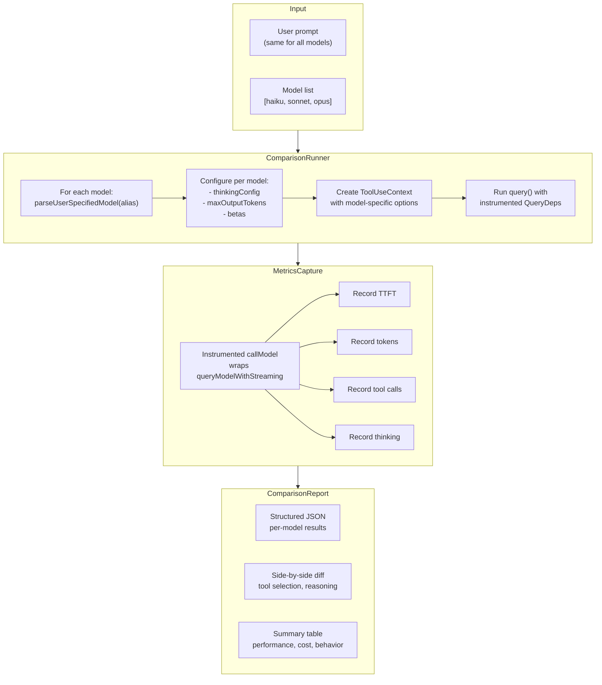

# Comparison Tool Design

Architecture and design for a tool that compares Claude Code behavior across different models (Haiku vs Sonnet vs Opus) — same prompt, different models, showing how tool selection, reasoning, and output differ.

---

## Table of Contents

1. [Goal](#goal)
2. [Model Configuration Landscape](#model-configuration-landscape)
3. [What Differs Across Models](#what-differs-across-models)
4. [Proposed Architecture](#proposed-architecture)
5. [Metrics to Capture](#metrics-to-capture)
6. [Leveraging Existing Infrastructure](#leveraging-existing-infrastructure)
7. [Implementation Plan](#implementation-plan)
8. [Output Format](#output-format)
9. [Key Source Files](#key-source-files)

---

## Goal

Send the same prompt to multiple Claude models and produce a structured comparison of:
- **Performance**: TTFT, duration, tokens/second
- **Cost**: Token usage, cache efficiency, USD cost
- **Behavior**: Tool selection, reasoning (thinking), response content
- **Quality**: Task completion, turn count, tool choice appropriateness

---

## Model Configuration Landscape

### Available Models

**File:** `src/utils/model/configs.ts`

| Alias | First-Party ID | Family | Cost (input/output per Mtok) |
|-------|---------------|--------|------------------------------|
| `haiku` | `claude-haiku-4-5-20251001` | Haiku | $1 / $5 |
| `sonnet` | `claude-sonnet-4-6` | Sonnet | $3 / $15 |
| `opus` | `claude-opus-4-7` | Opus | $5 / $25 |

Also available: older versions (sonnet-4-5, opus-4-6, etc.) and cross-region variants (Bedrock, Vertex, Foundry).

### Model Selection Priority

**File:** `src/utils/model/model.ts:93`

`getMainLoopModel()` resolves with this chain:
1. `/model` command override
2. `--model` CLI flag
3. `ANTHROPIC_MODEL` env var
4. User settings (`settings.model`)
5. Built-in default (Opus 4.7 for Max/Team Premium, Sonnet 4.6 for others)

### Model Aliases

**File:** `src/utils/model/aliases.ts`

`parseUserSpecifiedModel()` resolves: `sonnet` → `claude-sonnet-4-6`, `opus` → `claude-opus-4-7`, `haiku` → `claude-haiku-4-5-20251001`, plus `best`, `opusplan`, and `[1m]` variants.

---

## What Differs Across Models

### Capability Matrix

| Capability | Haiku 4.5 | Sonnet 4.6 | Opus 4.7 |
|-----------|-----------|------------|----------|
| **Thinking** | Budget-based (1P/Foundry only) | Adaptive | Adaptive |
| **Effort levels** | Not supported | Supported | Supported (incl. max) |
| **Tool search** | Limited (no `tool_reference`) | Full | Full |
| **1M context** | No | Yes | Yes |
| **Fast mode** | No | No | Yes (Opus 4.6 only) |
| **Context window** | 200K | 200K (or 1M) | 200K (or 1M) |
| **Max output** | 32K (upper 64K) | 32K (upper 128K) | 64K (upper 128K) |

### Thinking Configuration

**File:** `src/utils/thinking.ts`

```mermaid
flowchart TD
    A{"Model?"} -->|Opus 4.6/4.7, Sonnet 4.6| B["Adaptive thinking\n(model decides budget)"]
    A -->|Sonnet 4.0/4.5, Opus 4.0-4.5| C["Budget-based thinking\n(up to maxOutputTokens - 1)"]
    A -->|Haiku 4.5 on Bedrock/Vertex| D["Thinking disabled"]
    A -->|Haiku 4.5 on 1P| C
    A -->|Subagents (non-fork)| D
```

### Tool Search Differences

- **Haiku**: Does NOT get `tool_reference` blocks — ToolSearchTool filtered out
- **Sonnet/Opus**: Full tool search with deferred tool loading
- Impact: Haiku sees all tool schemas inline (more context consumption)

---

## Proposed Architecture



### Core Strategy: QueryDeps Injection

**File:** `src/query/deps.ts`

The `QueryDeps` type provides injectable dependencies — the key extension point:

```typescript
type QueryDeps = {
  callModel: typeof queryModelWithStreaming
  microcompact: typeof microcompactMessages
  autocompact: typeof autoCompactIfNeeded
  uuid: () => string
}
```

The comparison tool injects a custom `callModel` that records detailed metrics:

```typescript
function createInstrumentedDeps(modelName: string): QueryDeps {
  const metrics = new MetricsCollector()
  return {
    callModel: async function* (...args) {
      const start = Date.now()
      for await (const event of queryModelWithStreaming(...args)) {
        metrics.record(event, modelName)
        yield event
      }
    },
    microcompact: microcompactMessages,
    autocompact: autoCompactIfNeeded,
    uuid: randomUUID,
  }
}
```

### What Stays Same Across Models

- Messages (the prompt)
- System prompt
- User context / system context
- Tool pool (same tools available)
- `canUseTool` function
- Permission mode
- Query source

### What Differs Per Model

- Model ID string
- Thinking config (adaptive vs budget vs disabled)
- Beta headers
- Max output tokens
- Effort level support
- Tool search availability

---

## Metrics to Capture

### Performance Metrics

| Metric | Source | How |
|--------|--------|-----|
| TTFT (ms) | `message_start` event | Timestamp delta from request start |
| Total duration (ms) | Start/end timestamps | `Date.now()` delta |
| Output tokens/sec | output_tokens / duration | Calculated |

### Token Economics

| Metric | Source |
|--------|--------|
| Input tokens | `usage.input_tokens` |
| Output tokens | `usage.output_tokens` |
| Thinking tokens | Extracted from thinking content blocks |
| Cache read tokens | `usage.cache_read_input_tokens` |
| Cache creation tokens | `usage.cache_creation_input_tokens` |
| Cost (USD) | `calculateUSDCost()` from `src/utils/modelCost.ts` |

### Behavioral Metrics

| Metric | Source |
|--------|--------|
| Tool calls (names, order, count) | `tool_use` content blocks |
| Thinking content | `thinking` content blocks |
| Response text | `text` content blocks |
| Stop reason | `stop_reason` from API |
| Turn count | Number of query iterations |
| Text-to-tool ratio | Text length vs tool_use count |

### Quality Indicators

- Did the model complete the task in one turn or multiple?
- Did it use thinking before tool selection?
- Did it choose the right tools for the task?
- How verbose was the response vs action-oriented?

---

## Leveraging Existing Infrastructure

### Dashboard Metrics System

**Files:** `src/services/dashboard/types.ts`, `metrics.ts`, `integration.ts`

The existing `MetricsCollector` already tracks per-query, per-API-call, and per-tool metrics. Create separate instances per model.

### Subagent Pattern

**File:** `src/tools/AgentTool/runAgent.ts`

`runAgent()` demonstrates running a query loop with a different model:

```typescript
const resolvedAgentModel = getAgentModel(
  'haiku',                               // agent definition model
  toolUseContext.options.mainLoopModel,   // parent model
  model,                                 // override
  permissionMode,
)
const agentOptions = {
  ...toolUseContext.options,
  mainLoopModel: resolvedAgentModel,
  thinkingConfig: { type: 'disabled' },
}
```

This pattern can be directly adapted for the comparison tool.

### Transcript Storage

**File:** `src/utils/sessionStorage.ts`

`recordSidechainTranscript()` writes agent transcripts to disk per `agentId`. The comparison tool could use this to persist per-model results.

### API Client

**File:** `src/services/api/client.ts`

`getAnthropicClient()` creates SDK clients parameterized by model — multiple clients for different models can coexist. The client handles all providers (1P, Bedrock, Vertex, Foundry).

---

## Implementation Plan

### Phase 1: Core Runner Script

Create `scripts/compare-models.ts`:

```typescript
interface ComparisonConfig {
  prompt: string
  models: string[]           // ['haiku', 'sonnet', 'opus']
  maxTurns?: number          // default 1 (single-turn comparison)
  systemPrompt?: string      // custom or default
  tools?: string[]           // tool subset, default all
}

async function runComparison(config: ComparisonConfig): Promise<ComparisonResult> {
  const results: Record<string, ModelResult> = {}

  // Run models in parallel
  await Promise.allSettled(
    config.models.map(async alias => {
      const resolvedModel = parseUserSpecifiedModel(alias)
      const thinkingConfig = getThinkingConfigForModel(resolvedModel)
      const deps = createInstrumentedDeps(alias)

      const modelResult = await runQueryWithCapture({
        prompt: config.prompt,
        model: resolvedModel,
        thinkingConfig,
        deps,
        maxTurns: config.maxTurns,
      })

      results[alias] = modelResult
    })
  )

  return { prompt: config.prompt, timestamp: new Date().toISOString(), models: results }
}
```

### Phase 2: CLI Integration

Add a `/compare` command or `--compare` flag:

```bash
# Compare models on a single prompt
claude --compare "Find all TODO comments in this codebase"

# Compare specific models
claude --compare --models haiku,sonnet,opus "Explain the auth system"
```

### Phase 3: Report Generation

Generate both JSON and human-readable output:
- Structured JSON for programmatic analysis
- Markdown table for terminal display
- Side-by-side diff for tool selection comparison

### Phase 4: Dashboard Integration

Feed results into the existing dashboard for visualization:
- Model-prefixed query IDs for per-model filtering
- Comparative charts (TTFT, cost, tool selection patterns)

---

## Output Format

### Structured JSON

```typescript
interface ComparisonResult {
  prompt: string
  timestamp: string
  models: {
    [alias: string]: {
      modelId: string
      performance: {
        ttftMs: number
        totalDurationMs: number
        outputTokensPerSecond: number
      }
      tokens: {
        input: number
        output: number
        thinking: number
        cacheRead: number
        cacheCreation: number
        costUSD: number
      }
      behavior: {
        toolCalls: Array<{ name: string; input: object; order: number }>
        thinkingContent: string | null
        responseText: string
        stopReason: string
        turnCount: number
      }
    }
  }
}
```

### Human-Readable Summary

```
┌──────────────────────────────────────────────────────────────┐
│  Model Comparison: "Find all TODO comments"                  │
├──────────┬──────────┬──────────┬──────────────────────────────┤
│ Metric   │ Haiku    │ Sonnet   │ Opus                        │
├──────────┼──────────┼──────────┼──────────────────────────────┤
│ TTFT     │ 0.3s     │ 1.2s     │ 2.1s                        │
│ Duration │ 1.8s     │ 5.4s     │ 8.2s                        │
│ Cost     │ $0.002   │ $0.012   │ $0.035                      │
│ Tools    │ Grep(1)  │ Grep(2), │ Grep(3), Read(2)            │
│          │          │ Read(1)  │                              │
│ Turns    │ 1        │ 2        │ 2                            │
│ Thinking │ None     │ 245 tok  │ 892 tok                     │
└──────────┴──────────┴──────────┴──────────────────────────────┘
```

---

## Key Source Files

| File | Purpose | Relevance |
|------|---------|-----------|
| `src/utils/model/configs.ts` | All model IDs and provider variants | Model resolution |
| `src/utils/model/model.ts` | `getMainLoopModel()`, `parseUserSpecifiedModel()` | Model selection |
| `src/utils/model/aliases.ts` | Model alias resolution | `haiku`→ID mapping |
| `src/utils/model/agent.ts` | `getAgentModel()` — subagent model resolution | Pattern for per-model setup |
| `src/utils/thinking.ts` | `modelSupportsThinking()`, `modelSupportsAdaptiveThinking()` | Per-model thinking config |
| `src/utils/effort.ts` | `modelSupportsEffort()`, `modelSupportsMaxEffort()` | Per-model effort support |
| `src/utils/context.ts` | Context window sizes, `modelSupports1M()` | Per-model limits |
| `src/utils/modelCost.ts` | `calculateUSDCost()` per model | Cost comparison |
| `src/query.ts` | `query()` — main query loop | Core execution |
| `src/query/deps.ts` | `QueryDeps` — injectable dependencies | Instrumentation hook |
| `src/services/api/claude.ts` | `queryModelWithStreaming()` | API call to wrap |
| `src/services/api/client.ts` | `getAnthropicClient()` | Client per model |
| `src/services/dashboard/metrics.ts` | `MetricsCollector` | Metrics capture |
| `src/services/dashboard/types.ts` | Metric type definitions | Data structures |
| `src/utils/sessionStorage.ts` | `recordSidechainTranscript()` | Result persistence |
| `src/tools/AgentTool/runAgent.ts` | `runAgent()` pattern | Reference for per-model setup |
