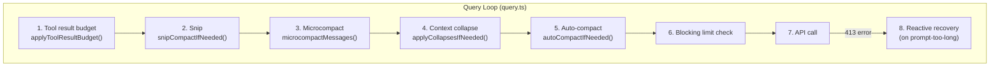
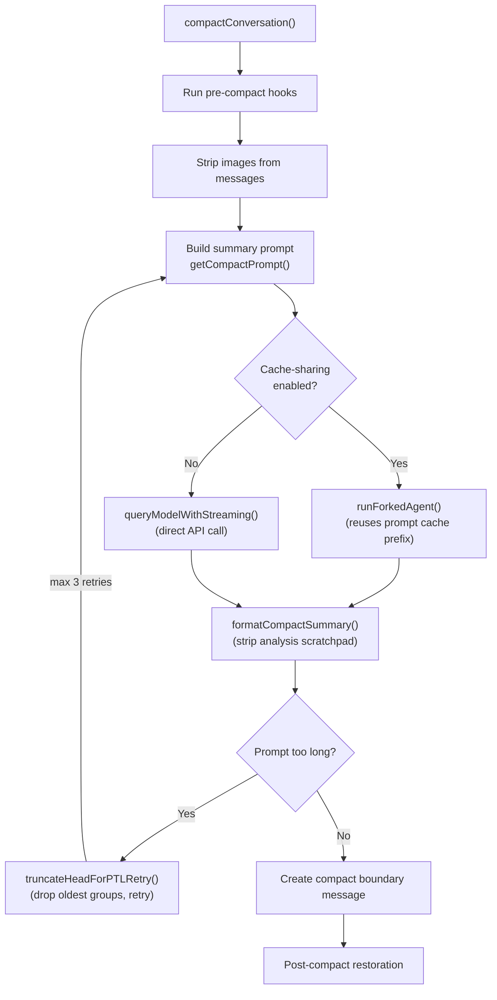
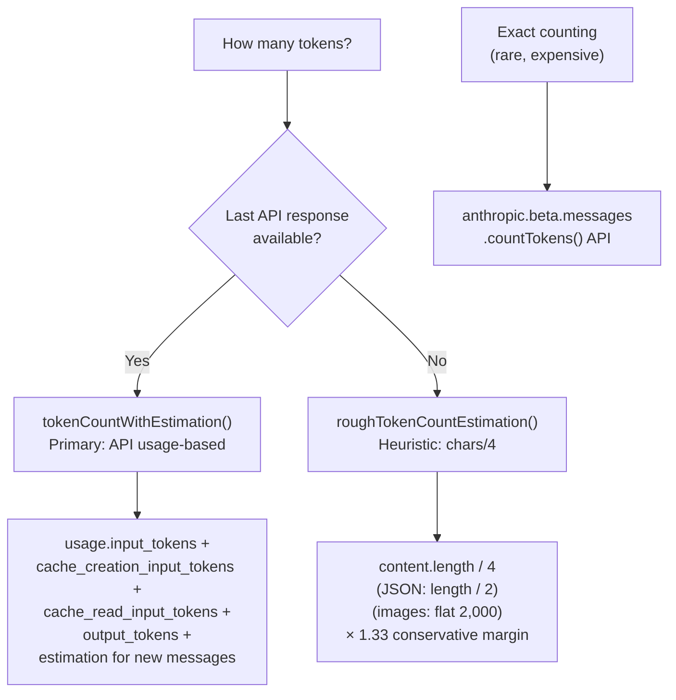
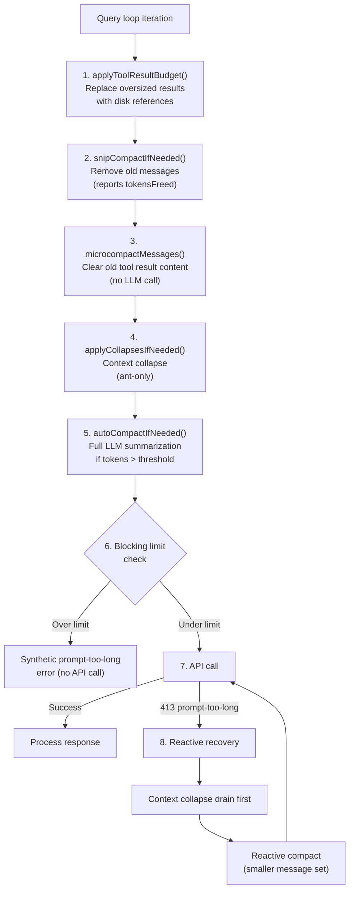

# Context Window Management

How Claude Code manages conversation context — compression triggers, message eviction, token counting, and overflow recovery.

---

## Table of Contents

1. [Architecture Overview](#architecture-overview)
2. [Compaction: When and How](#compaction-when-and-how)
3. [The Compaction Summary](#the-compaction-summary)
4. [What Survives Compaction](#what-survives-compaction)
5. [Microcompact: Lightweight Clearing](#microcompact-lightweight-clearing)
6. [Token Counting & Budgets](#token-counting--budgets)
7. [The Full Defense Chain](#the-full-defense-chain)
8. [Manual Compact & Partial Compact](#manual-compact--partial-compact)
9. [Key Constants](#key-constants)
10. [Key Source Files](#key-source-files)

---

## Architecture Overview



The context management system is a **layered defense chain** — each layer is progressively more expensive. Lightweight clearing runs first; full LLM-based compaction is the last resort.

| Layer | Method | LLM Call? | Cost |
|-------|--------|-----------|------|
| Tool result budget | Replace oversized results with disk references | No | Free |
| Snip | Remove old messages | No | Free |
| Microcompact | Clear old tool result content | No | Free |
| Context collapse | Collapse older context into summaries | Varies | Low |
| Auto-compact | Full LLM-based summarization | **Yes** | High |
| Blocking limit | Synthetic error before API call | No | Free |
| Reactive recovery | Compact + retry on 413 error | **Yes** | High |

---

## Compaction: When and How

### Auto-Compact Trigger

**File:** `src/services/compact/autoCompact.ts:160`

Auto-compact is checked at the start of every query loop iteration. It triggers when:

1. Not a recursive query source (not `session_memory` or `compact`)
2. `isAutoCompactEnabled()` returns true (checks `DISABLE_COMPACT`, `DISABLE_AUTO_COMPACT` env vars)
3. Token count exceeds the threshold

### The Threshold Formula

**File:** `src/services/compact/autoCompact.ts:72`

```
effectiveContextWindow = contextWindow - min(maxOutputTokens, 20,000)
autoCompactThreshold  = effectiveContextWindow - AUTOCOMPACT_BUFFER_TOKENS (13,000)
```

For a 200K context window model:
```
effectiveContextWindow = 200,000 - 20,000 = 180,000
autoCompactThreshold   = 180,000 - 13,000 = 167,000 tokens
```

When the conversation exceeds **167,000 tokens**, auto-compact fires.

### Environment Overrides

| Env Var | Effect |
|---------|--------|
| `CLAUDE_CODE_AUTO_COMPACT_WINDOW` | Caps the context window size |
| `CLAUDE_AUTOCOMPACT_PCT_OVERRIDE` | Percentage-based threshold override |
| `CLAUDE_CODE_BLOCKING_LIMIT_OVERRIDE` | Override the hard blocking limit |

### Circuit Breaker

After `MAX_CONSECUTIVE_AUTOCOMPACT_FAILURES = 3` consecutive failures, auto-compact stops trying for the session.

---

## The Compaction Summary

**Yes, compaction calls the LLM.** The flow in `compactConversation()` (`src/services/compact/compact.ts:387`):



### The Summary Prompt

**File:** `src/services/compact/prompt.ts:293`

The LLM is instructed to produce a structured summary with 9 sections:

1. Primary Request and Intent
2. Key Technical Concepts
3. Files and Code Sections
4. Errors and Fixes
5. Problem Solving
6. All User Messages
7. Pending Tasks
8. Current Work
9. Optional Next Step

The prompt includes a `NO_TOOLS_PREAMBLE` telling the model to respond with text only (no tool calls). An `<analysis>` scratchpad block is used for reasoning and stripped from the final output.

**Output budget:** `COMPACT_MAX_OUTPUT_TOKENS = 20,000`

---

## What Survives Compaction

### Metadata on the Boundary Message

The `compactMetadata` object preserves:

| Field | Purpose |
|-------|---------|
| `trigger` | `'manual'` or `'auto'` |
| `preTokens` | Pre-compaction token count |
| `preCompactDiscoveredTools` | Tool names discovered via ToolSearch (critical for deferred tool loading) |
| `preservedSegment` | Head/anchor/tail UUIDs for partial compact |
| `userContext` | User feedback from partial compact |
| `messagesSummarized` | Count of messages summarized |

### Post-Compact Restoration

**File:** `src/services/compact/compact.ts:532-585`

After compaction, Claude Code automatically restores:

| Restored Item | Budget | Per-Item Limit |
|---------------|--------|----------------|
| Recently-read files | 50,000 tokens | 5,000 per file (max 5 files) |
| Invoked skills | 25,000 tokens | 5,000 per skill |
| Plan files | Preserved as-is | — |
| Plan mode instructions | Re-injected if active | — |
| Deferred tools delta | Re-announced | — |
| Agent listing delta | Re-announced | — |
| MCP instructions delta | Re-announced | — |
| SessionStart hooks | Re-executed | — |

### Messages Protected from Eviction

- **Compact boundary messages** act as fences — only messages AFTER the last boundary are sent to the API
- **Tool use/result pairs** are never split (`adjustIndexToPreserveAPIInvariants()`)
- **Thinking blocks** sharing the same `message.id` stay together
- **Compact summary** messages (`isCompactSummary: true`)
- **Transcript-only messages** (`isVisibleInTranscriptOnly`) — hidden from UI but sent to API

---

## Microcompact: Lightweight Clearing

Microcompact clears old tool result content **without calling the LLM**. Three paths:

### A. Time-Based Microcompact

**File:** `src/services/compact/microCompact.ts:446`

- Triggers when gap since last assistant message exceeds `gapThresholdMinutes` (default 60 min)
- Clears all but the most recent N (`keepRecent`, default 5) compactable tool results
- Replaces content with `[Old tool result content cleared]`
- Only runs for main thread queries

### B. Cached Microcompact (ant-only)

Behind `CACHED_MICROCOMPACT` feature flag:
- Uses the API's `cache_edits` mechanism to delete tool results from server cache
- Doesn't invalidate the cached prefix
- Tracks tool results in global state, queues deletions when threshold exceeded

### C. API-Based Microcompact

**File:** `src/services/compact/apiMicrocompact.ts`

Uses native context management strategies:
- `clear_tool_uses_20250919` — clears old tool use/result pairs
- `clear_thinking_20251015` — clears old thinking blocks
- Trigger threshold: `DEFAULT_MAX_INPUT_TOKENS = 180,000`
- Keep target: `DEFAULT_TARGET_INPUT_TOKENS = 40,000`

### Compactable Tools

Tool results eligible for clearing:
- FileRead, Bash/Shell, Grep, Glob, WebSearch, WebFetch, FileEdit, FileWrite

---

## Token Counting & Budgets

### Token Counting Methods



**Primary** — `tokenCountWithEstimation()` (`src/utils/tokens.ts:226`):
- Uses last API response's `usage` data
- Adds rough estimation for messages added since last API call

**Heuristic** — `roughTokenCountEstimation()` (`src/utils/tokenEstimation.ts:203`):
- `Math.round(content.length / 4)` (4 bytes per token)
- JSON: 2 bytes per token (denser)
- Images/documents: flat 2,000 tokens
- Message-level: padded by 33% margin

**Exact** — `countMessagesTokensWithAPI()` (`src/utils/tokenEstimation.ts:143`):
- Uses `anthropic.beta.messages.countTokens()` API
- Bedrock: `CountTokensCommand`
- Haiku fallback for cheaper counting

### Context Window Limits

**File:** `src/constants/context.ts`

| Model | Context Window | Default Max Output | Upper Max Output |
|-------|---------------|-------------------|-----------------|
| opus-4-6 | 200K (1M opt-in) | 64K | 128K |
| sonnet-4-6 | 200K (1M opt-in) | 32K | 128K |
| opus-4-5 / sonnet-4 / haiku-4 | 200K | 32K | 64K |
| Older models | varies | 4K-8K | — |

1M context can be enabled via `[1m]` suffix or beta header.

Override: `CLAUDE_CODE_MAX_CONTEXT_TOKENS` env var.

### Buffer Zones

```
|←————————————————— Context Window (200K) ——————————————————→|
|                                                             |
|  Messages + System Prompt + Tools                          |
|  ├─────── Auto-compact fires here (167K) ──────┤          |
|  |                                    13K buffer|          |
|  ├─── Warning threshold (160K) ──┤    20K buffer|          |
|  |                                              |          |
|  ├─ Blocking limit (177K) ────────────────────┤ 3K buffer |
|  |                                              |  20K     |
|  └──────────────────────────────────────────────┘ reserved |
|                                                   for output|
```

---

## The Full Defense Chain

**File:** `src/query.ts` (query loop)



### Auto-Compact Decision

In `autoCompactIfNeeded()` (`autoCompact.ts:241`):

1. Check circuit breaker (max 3 consecutive failures)
2. Check `shouldAutoCompact()` — token count vs threshold
3. **Try session memory compaction first** (experimental, no LLM call)
4. If unavailable/fails → run full `compactConversation()`
5. On success: yield post-compact messages, reset tracking
6. On failure: increment `consecutiveFailures`

### Session Memory Compaction (Experimental)

**File:** `src/services/compact/sessionMemoryCompact.ts`

An alternative path that uses a pre-built session memory file instead of calling the LLM:
- Preserves at minimum: `minTokens: 10,000`, `minTextBlockMessages: 5`
- Cap: `maxTokens: 40,000` on preserved messages
- Falls back to legacy compaction if session memory is empty
- Gated behind `tengu_session_memory` AND `tengu_sm_compact` feature flags

---

## Manual Compact & Partial Compact

### `/compact [instructions]` Command

**File:** `src/commands/compact/compact.ts`

1. Tries session memory compaction first (if no custom instructions)
2. If reactive-only mode is active, routes through reactive compact
3. Otherwise runs microcompact + full `compactConversation()`
4. Supports custom instructions passed as argument

### Partial Compact

**File:** `src/services/compact/compact.ts:772`

`partialCompactConversation()` supports two directions:

| Direction | Behavior | Cache Impact |
|-----------|----------|-------------|
| `'from'` | Summarize messages AFTER pivot, keep earlier | Preserves prompt cache prefix |
| `'up_to'` | Summarize messages BEFORE pivot, keep later | Invalidates cache (summary precedes kept messages) |

---

## Key Constants

| Constant | Value | File |
|----------|-------|------|
| `MODEL_CONTEXT_WINDOW_DEFAULT` | 200,000 | `context.ts:9` |
| `COMPACT_MAX_OUTPUT_TOKENS` | 20,000 | `context.ts:12` |
| `AUTOCOMPACT_BUFFER_TOKENS` | 13,000 | `autoCompact.ts:63` |
| `WARNING_THRESHOLD_BUFFER_TOKENS` | 20,000 | `autoCompact.ts:64` |
| `MANUAL_COMPACT_BUFFER_TOKENS` | 3,000 | `autoCompact.ts:65` |
| `MAX_CONSECUTIVE_AUTOCOMPACT_FAILURES` | 3 | `autoCompact.ts:70` |
| `POST_COMPACT_MAX_FILES_TO_RESTORE` | 5 | `compact.ts:122` |
| `POST_COMPACT_TOKEN_BUDGET` | 50,000 | `compact.ts:123` |
| `POST_COMPACT_MAX_TOKENS_PER_FILE` | 5,000 | `compact.ts:124` |
| `POST_COMPACT_SKILLS_TOKEN_BUDGET` | 25,000 | `compact.ts:130` |
| `POST_COMPACT_MAX_TOKENS_PER_SKILL` | 5,000 | `compact.ts:129` |
| `MAX_PTL_RETRIES` | 3 | `compact.ts:227` |
| Time-based MC `gapThresholdMinutes` | 60 | `timeBasedMCConfig.ts:31` |
| Time-based MC `keepRecent` | 5 | `timeBasedMCConfig.ts:33` |
| Token estimation ratio | 4 chars/token | `tokenEstimation.ts:206` |
| JSON token ratio | 2 chars/token | `tokenEstimation.ts:222` |
| Image/document estimate | 2,000 tokens | `tokenEstimation.ts:402` |

---

## Key Source Files

| File | Purpose |
|------|---------|
| `src/services/compact/compact.ts` | Main compaction: `compactConversation()`, `partialCompactConversation()`, post-compact restoration |
| `src/services/compact/autoCompact.ts` | Auto-compact triggers, thresholds, circuit breaker |
| `src/services/compact/prompt.ts` | LLM prompt templates for generating summaries |
| `src/services/compact/microCompact.ts` | Lightweight tool-result clearing (no LLM) |
| `src/services/compact/apiMicrocompact.ts` | API-based context management (clear_tool_uses, clear_thinking) |
| `src/services/compact/sessionMemoryCompact.ts` | Session-memory-based compaction (experimental) |
| `src/services/compact/grouping.ts` | Groups messages by API round-trip for truncation |
| `src/services/compact/postCompactCleanup.ts` | Cache/state cleanup after compaction |
| `src/services/compact/timeBasedMCConfig.ts` | Time-gap-based microcompact config |
| `src/utils/tokens.ts` | `tokenCountWithEstimation()` — primary token counting |
| `src/utils/tokenEstimation.ts` | Heuristic and API-based token counting |
| `src/constants/context.ts` | Context window sizes, max output tokens per model |
| `src/query.ts` | Query loop: defense chain orchestration |
