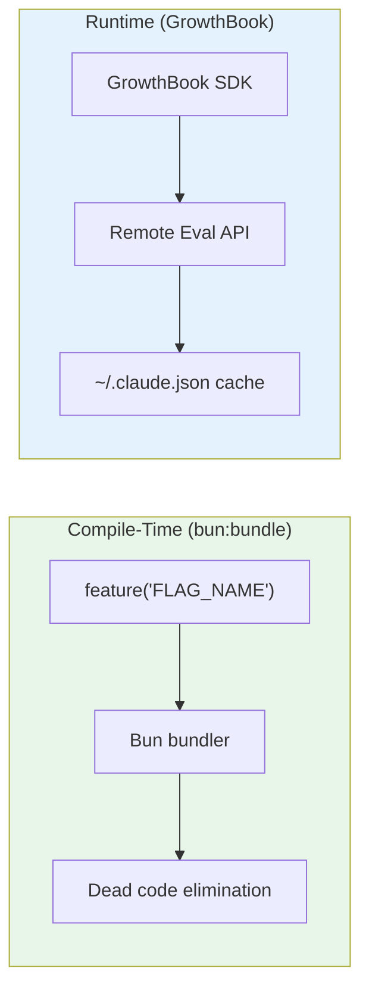
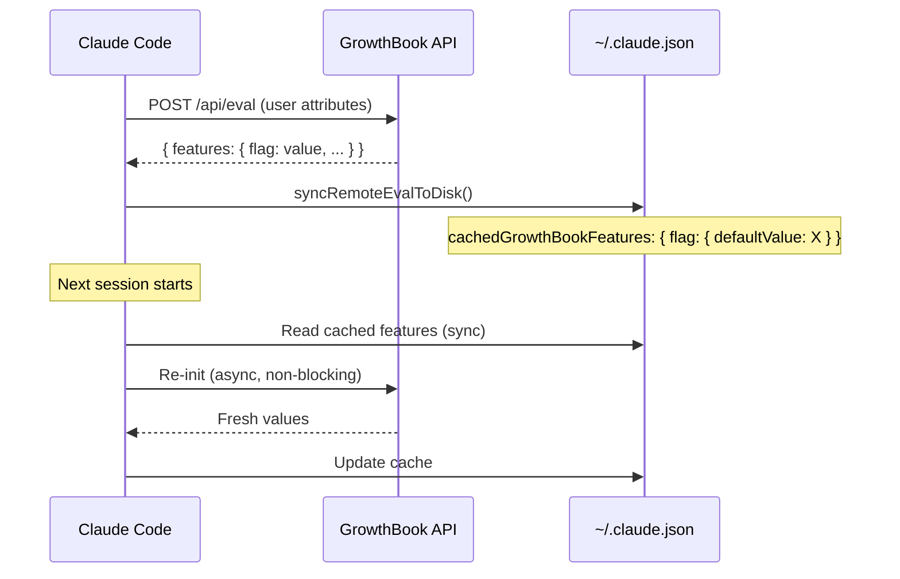
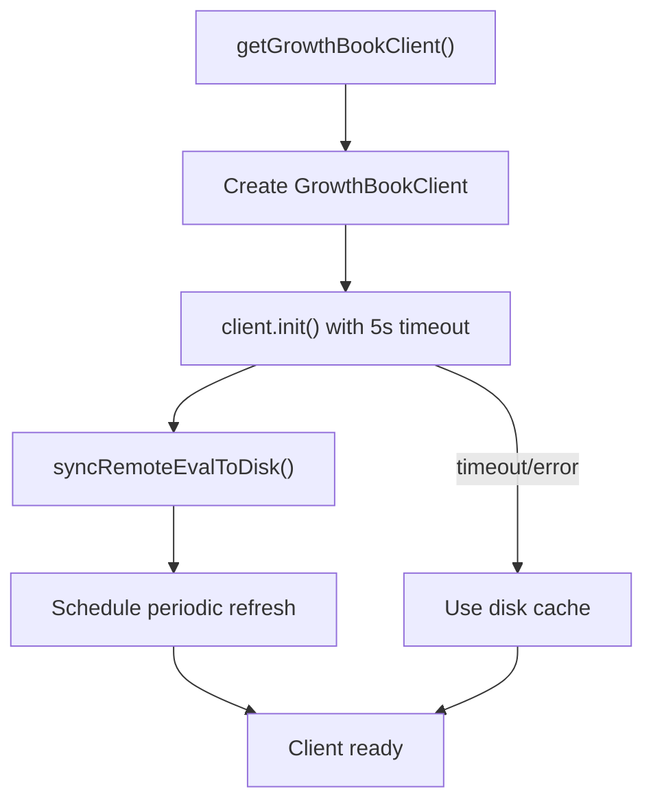
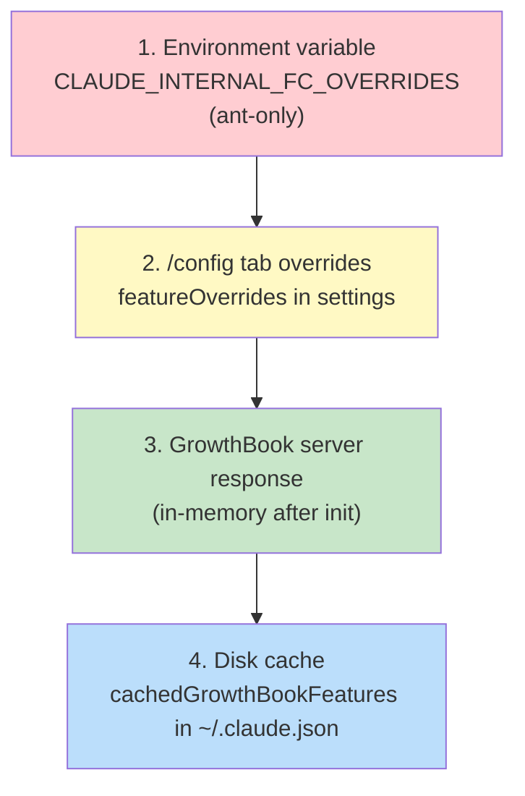

# Feature Flag System

How Claude Code uses two distinct feature flag mechanisms — compile-time `feature()` flags via `bun:bundle` for dead code elimination, and runtime GrowthBook flags for dynamic experiment gating — including override hierarchies, caching, refresh intervals, and security gates.

---

## Table of Contents

1. [Architecture Overview](#architecture-overview)
2. [Compile-Time Feature Flags](#compile-time-feature-flags)
3. [Runtime GrowthBook Flags](#runtime-growthbook-flags)
4. [GrowthBook Client Initialization](#growthbook-client-initialization)
5. [Override Hierarchy](#override-hierarchy)
6. [Caching & Refresh](#caching--refresh)
7. [Reading Flag Values](#reading-flag-values)
8. [Security Restriction Gates](#security-restriction-gates)
9. [Experiment Exposure Logging](#experiment-exposure-logging)
10. [Statsig Migration](#statsig-migration)
11. [Catalog of Compile-Time Flags](#catalog-of-compile-time-flags)
12. [Key Source Files](#key-source-files)

---

## Architecture Overview

Claude Code operates two completely independent feature flag systems:



| Aspect | Compile-Time `feature()` | Runtime GrowthBook |
|--------|-------------------------|--------------------|
| **When resolved** | Build time | Session startup + periodic refresh |
| **Mechanism** | `bun:bundle` import, returns `true`/`false` literal | GrowthBook SDK remote eval |
| **Purpose** | Gate entire code paths; strip from external builds | A/B experiments, dynamic rollouts |
| **Flag naming** | `SCREAMING_SNAKE_CASE` (e.g., `KAIROS`, `VOICE_MODE`) | `tengu_snake_case` (e.g., `tengu_context_collapse_model`) |
| **Persistence** | Baked into bundle at compile | Cached to `~/.claude.json`, refreshed on interval |
| **Override** | Not overridable at runtime | Env var → config tab → server → disk cache |

---

## Compile-Time Feature Flags

### How They Work

The `feature()` function is imported from `bun:bundle`, a Bun-specific module that resolves flags at bundle time:

```typescript
import { feature } from 'bun:bundle'

if (feature('VOICE_MODE')) {
  // This entire block is tree-shaken out of external builds
  const voiceModule = require('../voice/voiceMode.js')
  voiceModule.activate()
}
```

When a flag evaluates to `false`, the bundler removes the dead branch entirely — the code never ships in the output binary. This is the primary mechanism for separating internal (Anthropic employee / "ants") features from the external public release.

### Build Variants

Two primary build variants exist:

- **Internal ("ants") build**: Most flags are `true` — includes Kairos, voice mode, coordinator mode, etc.
- **External build**: Flags like `KAIROS`, `VOICE_MODE`, `COORDINATOR_MODE` evaluate to `false` — those code paths are stripped.

### Flag Usage Pattern

Because `feature()` returns a boolean literal after bundling, it works seamlessly with TypeScript:

```typescript
// Conditional require — module is never loaded in external builds
const BRIEF_TOOL_NAME: string | null =
  feature('KAIROS') || feature('KAIROS_BRIEF')
    ? (require('../tools/BriefTool/prompt.js')).BRIEF_TOOL_NAME
    : null

// Guard entire feature areas
if (feature('COORDINATOR_MODE')) {
  modeWarning = context.modeApi?.matchSessionMode(result.mode)
}
```

### Top Compile-Time Flags by Usage

| Flag | Usage Count | Purpose |
|------|-------------|---------|
| `KAIROS` | ~154 | Kairos platform features (brief mode, send-user-file, etc.) |
| `TRANSCRIPT_CLASSIFIER` | ~107 | Transcript classification system |
| `TEAMMEM` | ~51 | Team member / multi-agent coordination |
| `VOICE_MODE` | ~46 | Voice interaction mode |
| `BASH_CLASSIFIER` | ~45 | Bash command classification |
| `REACTIVE_COMPACT` | ~30 | Reactive context compaction |
| `CONTEXT_COLLAPSE` | ~25 | Context collapse (marble-origami) system |
| `COORDINATOR_MODE` | ~20 | Multi-agent coordinator mode |
| `BG_SESSIONS` | ~15 | Background session support |
| `MCP_SKILLS` | ~12 | MCP-based skill system |
| `EXPERIMENTAL_SKILL_SEARCH` | ~8 | Skill search/discovery |
| `BRIDGE_MODE` | ~8 | Bridge mode for cross-process communication |
| `MONITOR_TOOL` | ~5 | Monitoring/observability tool |
| `HISTORY_SNIP` | ~5 | History snipping for context management |
| `CACHED_MICROCOMPACT` | ~4 | Cached micro-compaction |
| `TOKEN_BUDGET` | ~3 | Token budget management |
| `CHICAGO_MCP` | ~3 | Chicago MCP server integration |

---

## Runtime GrowthBook Flags

### Remote Evaluation Architecture

Claude Code uses GrowthBook in **remote evaluation mode** (`remoteEval: true`). Instead of downloading all flag definitions and evaluating locally, the client sends user attributes to GrowthBook's API and receives pre-evaluated results:



### User Attributes

The GrowthBook client sends these attributes for targeting:

```typescript
type GrowthBookUserAttributes = {
  id: string                    // Stable device ID
  sessionId: string             // Current session UUID
  deviceID: string              // Same as id (legacy compat)
  platform: string              // 'darwin' | 'linux' | 'win32'
  organizationUUID?: string     // Org membership
  accountUUID?: string          // User account
  userType: string              // 'ant' | 'external'
  subscriptionType: string      // 'free' | 'pro' | 'max' | 'enterprise'
  version: string               // Claude Code version
  sessionCount: number          // Session count for this user
  isTestRun?: boolean           // Test detection
}
```

---

## GrowthBook Client Initialization

### Startup Sequence



The client is initialized lazily on first access:

1. **Create**: `new GrowthBook({ remoteEval: true, apiHost, clientKey })`
2. **Init**: `client.init({ timeout: 5000 })` — blocks up to 5 seconds for first evaluation
3. **Sync to disk**: Writes evaluated features to `~/.claude.json` under `cachedGrowthBookFeatures`
4. **Schedule refresh**: Sets up periodic re-evaluation

### Auth Headers

For Anthropic-internal users, the client injects auth headers via `GrowthBookFetchInterceptor`:

```typescript
class GrowthBookFetchInterceptor {
  // Wraps the global fetch to inject Authorization header
  // for GrowthBook API requests from internal builds
}
```

---

## Override Hierarchy

Flag values are resolved in priority order (highest wins):



### 1. Environment Variable Overrides (Ant-Only)

```bash
# JSON map of flag → value, only in internal builds
CLAUDE_INTERNAL_FC_OVERRIDES='{"tengu_some_flag": true}'
```

Parsed at module load from `process.env.CLAUDE_INTERNAL_FC_OVERRIDES`. Only available when `feature('FEATURE_CONTROLS')` is true (internal builds).

### 2. Config Tab Overrides

Users can override flags via the `/config` settings tab. These are stored in the settings object under `featureOverrides`.

### 3. Server Response (In-Memory)

After `client.init()`, GrowthBook holds the server-evaluated features in memory. These are the "canonical" values for the current session.

### 4. Disk Cache

The `cachedGrowthBookFeatures` key in `~/.claude.json` stores the last-known server response. This enables **instant startup** — values are available synchronously before the network round-trip completes.

```json
{
  "cachedGrowthBookFeatures": {
    "tengu_context_collapse_model": { "defaultValue": "claude-sonnet-4-20250514" },
    "tengu_some_experiment": { "defaultValue": true }
  }
}
```

### Disk Sync Mechanism

`syncRemoteEvalToDisk()` performs a **wholesale replacement** of the cached features:

```typescript
// Workaround: API returns `value` instead of `defaultValue`
// processRemoteEvalPayload normalizes this before caching
function processRemoteEvalPayload(features: Record<string, unknown>) {
  // Renames `value` → `defaultValue` in each feature definition
}
```

---

## Caching & Refresh

### Refresh Intervals

| User Type | Refresh Interval | Constant |
|-----------|-----------------|----------|
| Internal ("ants") | 20 minutes | `GROWTHBOOK_REFRESH_INTERVAL_ANTS_MS` |
| External | 6 hours | `GROWTHBOOK_REFRESH_INTERVAL_MS` |

The refresh is triggered by a `setInterval` that calls `client.refreshFeatures()` and then `syncRemoteEvalToDisk()`.

### Session-Level Latching

Feature values are **not** latched at the session level by default. The GrowthBook SDK refreshes features on the configured interval, and `getFeatureValue_CACHED_MAY_BE_STALE()` reads the latest in-memory value. However, the `_CACHED_MAY_BE_STALE` suffix in the function name signals that callers should not depend on real-time freshness — the value may be up to one refresh interval old.

### Disk Cache Staleness

On cold start (before `client.init()` resolves), values come from the disk cache which could be hours or days old. The `checkGate_CACHED_OR_BLOCKING` function handles this:

```typescript
// Fast path: if disk cache says true, return immediately
// Slow path: if disk cache says false/missing, block on init
async function checkGate_CACHED_OR_BLOCKING(key: string): Promise<boolean> {
  const cached = getFeatureValue_CACHED_MAY_BE_STALE(key)
  if (cached) return true  // Optimistic: trust disk cache for true
  await ensureInitialized()
  return getFeatureValue_CACHED_MAY_BE_STALE(key)
}
```

This asymmetry is intentional: a stale `true` lets users keep using a feature they've been using, while a stale `false` triggers a blocking init to check if they should now have access.

---

## Reading Flag Values

### Sync Read (Non-Blocking)

```typescript
getFeatureValue_CACHED_MAY_BE_STALE(key: string): unknown
```

Resolution order:
1. Environment overrides (`CLAUDE_INTERNAL_FC_OVERRIDES`)
2. Config tab overrides (`featureOverrides`)
3. In-memory GrowthBook map (populated after init)
4. Disk cache (`cachedGrowthBookFeatures` in `~/.claude.json`)

Returns `null` if the flag is not found in any layer.

### Async Read (Blocking)

```typescript
checkGate_CACHED_OR_BLOCKING(key: string): Promise<boolean>
```

For critical gates that must be authoritative. Fast-paths on cached `true`, blocks on init otherwise.

### Boolean Gate Check

```typescript
checkStatsigFeatureGate_CACHED_MAY_BE_STALE(gateName: string): boolean
```

Migration wrapper from the legacy Statsig system. Maps gate names to GrowthBook feature keys and returns boolean values.

---

## Security Restriction Gates

Security-critical flags use a special function that **always blocks on init**:

```typescript
async function checkSecurityRestrictionGate(key: string): Promise<boolean> {
  await reinitializeIfStale()  // Forces fresh eval
  return getFeatureValue_CACHED_MAY_BE_STALE(key)
}
```

Unlike `checkGate_CACHED_OR_BLOCKING` (which optimistically trusts cached `true`), security gates force a re-initialization to get an authoritative answer. This prevents scenarios where a stale cache grants access that should have been revoked.

---

## Experiment Exposure Logging

When a feature flag is read, GrowthBook tracks "exposure" events for experiment analysis:

```typescript
// GrowthBook SDK internally fires trackingCallback
// when a feature in an active experiment is evaluated
const client = new GrowthBook({
  trackingCallback: (experiment, result) => {
    logEvent('tengu_experiment_exposure', {
      experimentId: experiment.key,
      variationId: result.variationId,
    })
  }
})
```

Exposure logging only fires for flags that are part of active experiments (not simple feature toggles).

---

## Statsig Migration

Claude Code previously used Statsig for feature gating. The migration path:

1. `checkStatsigFeatureGate_CACHED_MAY_BE_STALE()` wraps the old Statsig API
2. Internally, it maps Statsig gate names to GrowthBook feature keys
3. Reads from GrowthBook's cache/server instead of Statsig
4. The function name is preserved for backward compatibility across the codebase

The migration is transparent to callers — they continue using Statsig-named functions while the backend queries GrowthBook.

---

## Catalog of Compile-Time Flags

### Agent & Coordination

| Flag | Description |
|------|-------------|
| `COORDINATOR_MODE` | Multi-agent coordinator mode with task delegation |
| `TEAMMEM` | Team member features for multi-agent workflows |
| `BRIDGE_MODE` | Cross-process bridge for IDE integration |
| `BG_SESSIONS` | Background/daemon session support |

### Context Management

| Flag | Description |
|------|-------------|
| `REACTIVE_COMPACT` | Reactive context compaction triggered by token pressure |
| `CONTEXT_COLLAPSE` | Context collapse (marble-origami) for surgical history pruning |
| `HISTORY_SNIP` | History snipping to remove old conversation segments |
| `CACHED_MICROCOMPACT` | Cached micro-compaction for incremental compression |
| `TOKEN_BUDGET` | Token budget management and enforcement |

### Platform Features

| Flag | Description |
|------|-------------|
| `KAIROS` | Kairos platform features (brief mode, file sending, etc.) |
| `KAIROS_BRIEF` | Brief mode subset of Kairos |
| `VOICE_MODE` | Voice interaction mode |
| `MCP_SKILLS` | MCP server-provided skills |
| `EXPERIMENTAL_SKILL_SEARCH` | Skill search and discovery |
| `MONITOR_TOOL` | Monitoring/observability tool |

### Classification & Analysis

| Flag | Description |
|------|-------------|
| `TRANSCRIPT_CLASSIFIER` | Transcript classification for analytics |
| `BASH_CLASSIFIER` | Bash command safety classification |

### Infrastructure

| Flag | Description |
|------|-------------|
| `FEATURE_CONTROLS` | Internal feature controls (enables env var overrides) |
| `CHICAGO_MCP` | Chicago MCP server integration |

---

## Key Source Files

| File | Purpose |
|------|---------|
| `src/services/analytics/growthbook.ts` | Core GrowthBook integration — client init, caching, sync, all read functions |
| `src/services/analytics/growthbook.ts:32-47` | `GrowthBookUserAttributes` type definition |
| `src/services/analytics/growthbook.ts:490` | `getGrowthBookClient()` — lazy client creation |
| `src/services/analytics/growthbook.ts:734` | `getFeatureValue_CACHED_MAY_BE_STALE()` — sync flag read |
| `src/services/analytics/growthbook.ts:804` | `checkStatsigFeatureGate_CACHED_MAY_BE_STALE()` — Statsig compat |
| `src/services/analytics/growthbook.ts:851` | `checkSecurityRestrictionGate()` — blocking security gates |
| `src/services/analytics/growthbook.ts:904` | `checkGate_CACHED_OR_BLOCKING()` — async gate check |
| `src/services/analytics/growthbook.ts:327` | `processRemoteEvalPayload()` — API response normalization |
| `src/services/analytics/growthbook.ts:407` | `syncRemoteEvalToDisk()` — disk cache persistence |
| `src/services/analytics/growthbook.ts:162-192` | `CLAUDE_INTERNAL_FC_OVERRIDES` env var parsing |
| Various `*.ts` files | `import { feature } from 'bun:bundle'` — compile-time flag usage |
