# Hook System Internals

Deep dive into Claude Code's hook system — from event definitions and configuration schemas through the execution pipeline, security model, and the protocol hooks use to communicate decisions back to the runtime.

---

## Table of Contents

1. [Architecture Overview](#architecture-overview)
2. [Hook Events](#hook-events)
3. [Hook Types](#hook-types)
4. [Hook Configuration Structure](#hook-configuration-structure)
5. [Hook Sources & Merging](#hook-sources--merging)
6. [Hook Execution Pipeline](#hook-execution-pipeline)
7. [Hook JSON Output Protocol](#hook-json-output-protocol)
8. [Command Hook Execution](#command-hook-execution)
9. [Security Model](#security-model)
10. [Hook Event Broadcasting](#hook-event-broadcasting)
11. [Session Hooks](#session-hooks)
12. [Key Integration Points](#key-integration-points)
13. [Key Source Files](#key-source-files)

---

## Architecture Overview

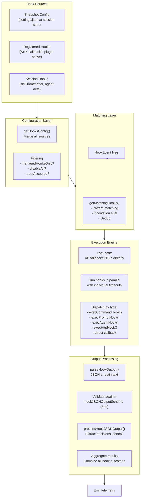

The hook system is Claude Code's extensibility layer — a powerful mechanism that allows external processes, LLM prompts, HTTP endpoints, and internal callbacks to observe and influence every stage of the agent lifecycle. It spans approximately 3,700 lines in the main execution engine alone.

---

## Hook Events

Hook events represent specific moments in the Claude Code lifecycle where external code can observe or intervene. Defined in `src/types/hooks.ts` and `src/entrypoints/agentSdkTypes.js`.

### Tool Lifecycle Events

| Event | When It Fires | Can Intervene? |
|-------|---------------|----------------|
| **PreToolUse** | Before a tool executes | Yes — approve, block, or modify input |
| **PostToolUse** | After successful tool execution | Yes — add context or modify MCP output |
| **PostToolUseFailure** | When a tool execution fails | Observational |

### Session Lifecycle Events

| Event | When It Fires | Can Intervene? |
|-------|---------------|----------------|
| **SessionStart** | When a session begins | Yes — inject context, set initial message, set watch paths |
| **SessionEnd** | During shutdown or clear | Tight 1.5s default timeout (configurable via `CLAUDE_CODE_SESSIONEND_HOOKS_TIMEOUT_MS`) |
| **Setup** | During setup phase | Yes |

### Agent Lifecycle Events

| Event | When It Fires | Can Intervene? |
|-------|---------------|----------------|
| **SubagentStart** | When a subagent starts | Observational |
| **SubagentStop** | When a subagent stops | Observational |
| **TaskCreated** | Task is created | Observational |
| **TaskCompleted** | Task finishes | Observational |
| **TeammateIdle** | Teammate mode idle detection | Observational |

### Turn Boundary Events

| Event | When It Fires | Can Intervene? |
|-------|---------------|----------------|
| **Stop** | Model finishes a turn (no tool_use) | Yes — can block and force retry |
| **StopFailure** | Stop hooks themselves fail | Observational |

### User Interaction Events

| Event | When It Fires | Can Intervene? |
|-------|---------------|----------------|
| **UserPromptSubmit** | User submits a prompt | Yes — can add context |
| **Notification** | On notifications | Observational |

### Permission Events

| Event | When It Fires | Can Intervene? |
|-------|---------------|----------------|
| **PermissionRequest** | Permission decision needed | Yes — auto-approve or deny |
| **PermissionDenied** | Permission is denied | Observational |

### MCP Elicitation Events

| Event | When It Fires | Can Intervene? |
|-------|---------------|----------------|
| **Elicitation** | MCP elicitation flow starts | Yes |
| **ElicitationResult** | MCP elicitation completes | Observational |

### File System Events

| Event | When It Fires | Can Intervene? |
|-------|---------------|----------------|
| **FileChanged** | File system watcher fires | Observational |
| **CwdChanged** | Working directory changes | Observational |

### Configuration & Context Events

| Event | When It Fires | Can Intervene? |
|-------|---------------|----------------|
| **WorktreeCreate** | Git worktree is created | Observational |
| **ConfigChange** | Settings change | Observational |
| **InstructionsLoaded** | CLAUDE.md files are loaded | Observational |

---

## Hook Types

Four persistable hook types are defined as a discriminated union on the `type` field in `src/schemas/hooks.ts`. Two additional non-persistable types exist for internal use.

### Persistable Types

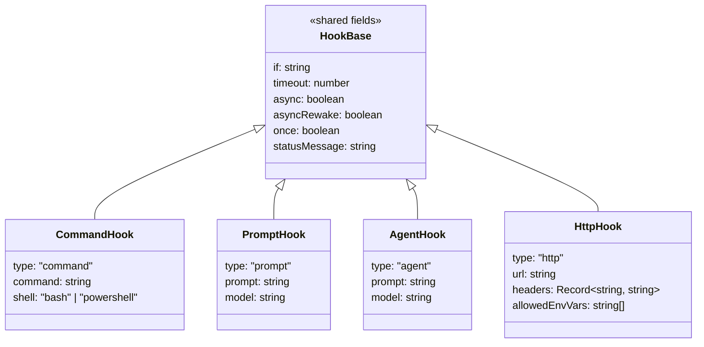

#### 1. Command Hook (`BashCommandHookSchema`)

Shell command execution — the most common hook type.

| Field | Type | Description |
|-------|------|-------------|
| `type` | `"command"` | Discriminator |
| `command` | `string` | Shell command to execute |
| `shell` | `"bash" \| "powershell"` | Shell selection (default: bash) |
| `if` | `string` | Permission rule syntax filter (e.g., `"Bash(git *)"`) |
| `timeout` | `number` | Per-hook timeout in seconds |
| `async` | `boolean` | Run in background without blocking |
| `asyncRewake` | `boolean` | Run in background, wake model on exit code 2 |
| `once` | `boolean` | Run once then remove |
| `statusMessage` | `string` | Custom spinner text |

#### 2. Prompt Hook (`PromptHookSchema`)

LLM prompt evaluation — sends context to a small/fast model for a decision.

| Field | Type | Description |
|-------|------|-------------|
| `type` | `"prompt"` | Discriminator |
| `prompt` | `string` | Prompt string with `$ARGUMENTS` placeholder |
| `model` | `string` | Model override (default: small fast model) |

#### 3. Agent Hook (`AgentHookSchema`)

Agentic verifier — a more capable version of prompt hooks with tool access.

| Field | Type | Description |
|-------|------|-------------|
| `type` | `"agent"` | Discriminator |
| `prompt` | `string` | Verification prompt with `$ARGUMENTS` |
| `model` | `string` | Model override (default: Haiku) |

#### 4. HTTP Hook (`HttpHookSchema`)

HTTP webhook — POSTs hook context to an external endpoint.

| Field | Type | Description |
|-------|------|-------------|
| `type` | `"http"` | Discriminator |
| `url` | `string` | POST endpoint URL |
| `headers` | `Record<string, string>` | Headers with env var interpolation (`$VAR_NAME`) |
| `allowedEnvVars` | `string[]` | Explicit allowlist for env var interpolation |

### Non-Persistable Types (Internal)

#### 5. Callback Hook (`HookCallback`)

Internal TypeScript callbacks used by SDK hooks and session hooks. Not serializable — lives only in memory.

#### 6. Function Hook (`FunctionHook`)

Session-scoped function hooks with callbacks. Used for structured output enforcement and similar runtime-only concerns.

---

## Hook Configuration Structure

### Schema

```typescript
// The top-level configuration shape
HooksSettings = Partial<Record<HookEvent, HookMatcher[]>>

// Each matcher contains a pattern and its associated hooks
HookMatcher = {
  matcher?: string    // Pattern to match against (tool name, etc.)
  hooks: HookCommand[]  // Hooks to execute when matched
}
```

### Matcher Pattern Syntax

The `matcher` field supports multiple pattern formats:

| Format | Example | Behavior |
|--------|---------|----------|
| Exact match | `"Bash"` | Matches tool name exactly |
| Pipe-separated list | `"Read\|Write\|Edit"` | Matches any listed name |
| Regex | `/^mcp_.*$/` | Full regex match |
| Wildcard / empty | `"*"` or omitted | Matches everything |

### Example Configuration

```json
{
  "hooks": {
    "PreToolUse": [
      {
        "matcher": "Bash",
        "hooks": [
          {
            "type": "command",
            "command": "echo '{\"decision\": \"approve\"}' # auto-approve Bash",
            "if": "Bash(git *)"
          }
        ]
      },
      {
        "matcher": "Write|Edit",
        "hooks": [
          {
            "type": "http",
            "url": "https://my-server.example/validate",
            "headers": { "Authorization": "Bearer $API_TOKEN" },
            "allowedEnvVars": ["API_TOKEN"]
          }
        ]
      }
    ],
    "Stop": [
      {
        "hooks": [
          {
            "type": "prompt",
            "prompt": "Did the agent complete the task? Context: $ARGUMENTS"
          }
        ]
      }
    ]
  }
}
```

---

## Hook Sources & Merging

Hooks are collected from multiple sources and merged by `getHooksConfig()` (in `src/utils/hooks.ts:1492`).

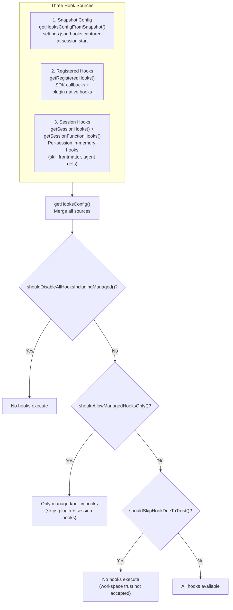

### Source Priority

| Source | When Added | Lifetime | Examples |
|--------|-----------|----------|----------|
| **Snapshot config** | Session start | Immutable for session | User `settings.json` hooks |
| **Registered hooks** | SDK init / plugin load | Process lifetime | SDK `onPreToolUse` callbacks |
| **Session hooks** | During execution | Until session end | Skill frontmatter hooks, agent-defined hooks |

### Filtering Guards

Three guard functions control which hooks are eligible to run:

1. **`shouldAllowManagedHooksOnly()`** — Restricts to managed/policy hooks only. Skips plugin hooks and session hooks. Active in restricted environments.

2. **`shouldDisableAllHooksIncludingManaged()`** — Nuclear option. Kills everything. Used in extreme security lockdowns.

3. **`shouldSkipHookDueToTrust()`** — Requires workspace trust dialog acceptance before any hooks run. Security defense-in-depth that prevents RCE in untrusted workspaces.

---

## Hook Execution Pipeline

The core execution flow lives in `executeHooks()` at line 1952 of `src/utils/hooks.ts`.

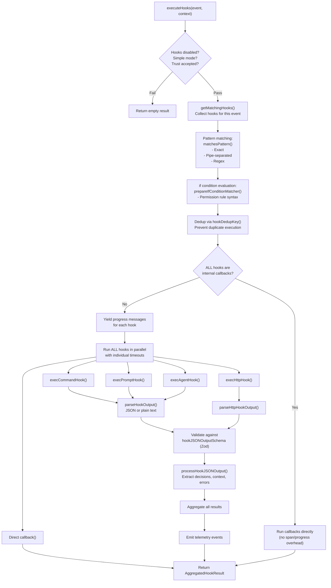

### Step-by-Step Breakdown

1. **Check guards** — Is the hook system disabled? Is simple mode active? Has workspace trust been accepted?
2. **`getMatchingHooks()`** — Collect and filter hooks registered for this specific event
3. **Pattern matching** via `matchesPattern()` — supports exact match, pipe-separated lists, and regex
4. **`if` condition evaluation** via `prepareIfConditionMatcher()` — uses permission rule syntax (e.g., `"Bash(git *)"`)
5. **Dedup** via `hookDedupKey()` — prevents the same hook from executing multiple times in one event
6. **Fast-path optimization** — if ALL hooks are internal callbacks, run them directly without span/progress overhead
7. **Yield progress messages** — shows spinner/status for each executing hook
8. **Run all hooks in parallel** — each with its own timeout
9. **Dispatch by type** — route to the appropriate executor
10. **Parse output** — JSON or plain text via `parseHookOutput()` / `parseHttpHookOutput()`
11. **Validate** — against `hookJSONOutputSchema` (Zod schema)
12. **Process results** via `processHookJSONOutput()` — extract decisions, context, errors
13. **Aggregate** — combine all hook outcomes into a single `AggregatedHookResult`
14. **Emit telemetry** — log hook execution events for observability

---

## Hook JSON Output Protocol

Hooks communicate decisions back to the runtime via stdout JSON. The protocol has three response shapes.

### Sync Response (`SyncHookJSONOutput`)

The primary response format for hooks that make synchronous decisions:

| Field | Type | Description |
|-------|------|-------------|
| `continue` | `boolean` | Whether to continue execution (false = stop) |
| `suppressOutput` | `boolean` | Hide stdout from transcript |
| `stopReason` | `string` | Message when `continue=false` |
| `decision` | `"approve" \| "block"` | Permission decision (PreToolUse, PermissionRequest) |
| `reason` | `string` | Explanation for the decision |
| `systemMessage` | `string` | Warning shown to user |
| `hookSpecificOutput` | `object` | Discriminated union by `hookEventName` |

**Example — PreToolUse approval:**
```json
{
  "decision": "approve",
  "reason": "Git commands are pre-approved by policy"
}
```

**Example — Stop hook blocking:**
```json
{
  "continue": false,
  "stopReason": "Task verification failed: tests not passing"
}
```

### Async Response (`AsyncHookJSONOutput`)

For hooks that want to run in the background:

| Field | Type | Description |
|-------|------|-------------|
| `async` | `true` | Signals background execution |
| `asyncTimeout` | `number` | Optional timeout for the background task |

### Prompt Elicitation Protocol

Hooks can interactively ask the user questions:

**Request (hook outputs):**
```json
{
  "prompt": "request-id-123",
  "message": "Which branch should I deploy to?",
  "options": ["staging", "production", "cancel"]
}
```

**Response (runtime provides back to hook):**
```json
{
  "prompt_response": {
    "selected": "staging"
  }
}
```

---

## Command Hook Execution

`execCommandHook()` (at line 747) handles the complex shell execution logic with cross-platform support.

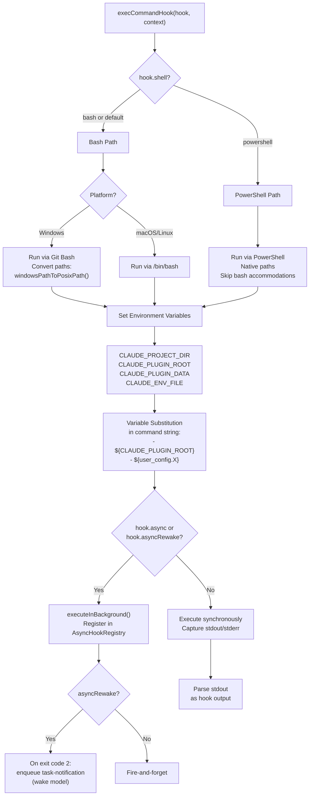

### Environment Variables Available to Command Hooks

| Variable | Value |
|----------|-------|
| `CLAUDE_PROJECT_DIR` | Project root directory |
| `CLAUDE_PLUGIN_ROOT` | Plugin installation directory |
| `CLAUDE_PLUGIN_DATA` | Plugin data directory |
| `CLAUDE_ENV_FILE` | Path to environment file |

### Variable Substitution in Command Strings

Command strings support template substitution:
- `${CLAUDE_PLUGIN_ROOT}` — replaced with the plugin's root path
- `${user_config.X}` — replaced with user configuration values

### Async Hook Behavior

- **`async: true`** — Hook runs in background via `executeInBackground()`, registered in `AsyncHookRegistry`. Does not block the main execution flow.
- **`asyncRewake: true`** — Same as async, but if the hook exits with code 2, it enqueues a blocking error as a task-notification, effectively waking the model to process the result.

### Prompt Elicitation in Command Hooks

Command hooks can ask interactive questions using the elicitation protocol. The hook writes a prompt request to stdout, the runtime presents it to the user, and pipes the response back to the hook's stdin.

---

## Security Model

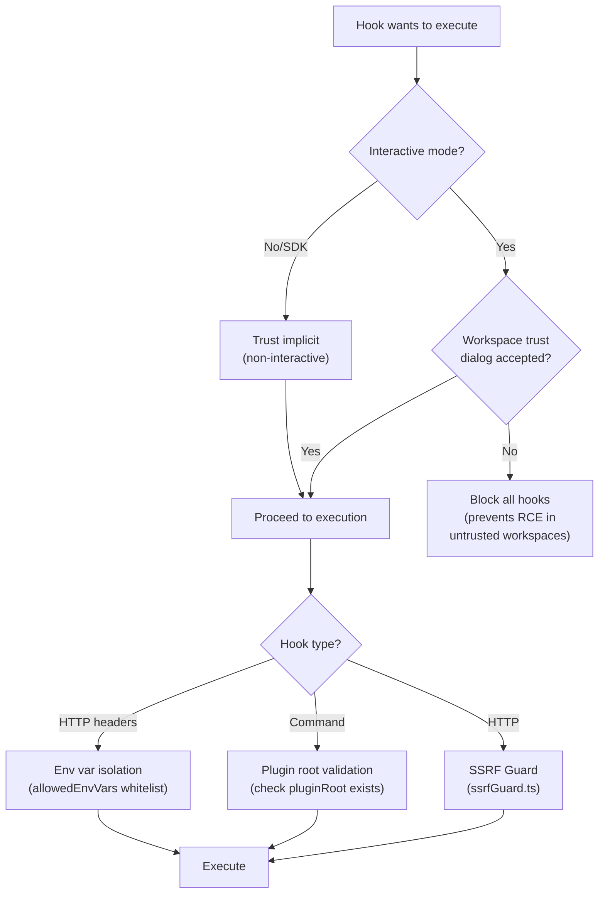

### Security Layers

| Layer | Protection | Mechanism |
|-------|-----------|-----------|
| **Workspace trust** | Prevents RCE in untrusted workspaces | All hooks require trust dialog acceptance in interactive mode |
| **SDK mode trust** | Implicit trust for non-interactive use | SDK consumers are assumed trusted |
| **SSRF guard** | Prevents server-side request forgery | `src/utils/hooks/ssrfGuard.ts` validates HTTP hook URLs |
| **Plugin root validation** | Prevents orphan GC race | Checks `pluginRoot` exists before execution |
| **Env var isolation** | Prevents credential leakage | `allowedEnvVars` whitelist for HTTP header interpolation |

### Trust Flow

The workspace trust requirement is a defense-in-depth measure. When a user opens a project for the first time:

1. Claude Code detects hook configurations in the project's settings
2. A trust dialog is presented asking the user to acknowledge the hooks
3. Until accepted, NO hooks (including project-defined ones) execute
4. This prevents a malicious repository from executing arbitrary code simply by being opened

---

## Hook Event Broadcasting

A separate event system in `src/utils/hooks/hookEvents.ts` broadcasts hook lifecycle events for SDK consumers.

### Event Functions

| Function | Purpose |
|----------|---------|
| `emitHookStarted()` | Fires when a hook begins execution |
| `emitHookProgress()` | Fires during hook execution (status updates) |
| `emitHookResponse()` | Fires when a hook returns a result |

### Buffering Behavior

The system buffers up to **100 pending events** before a handler is registered. This ensures early hook events (during startup) are not lost if the SDK consumer registers its handler slightly late.

### Event Gating

| Category | Behavior |
|----------|----------|
| **Always emitted** (`ALWAYS_EMITTED_HOOK_EVENTS`) | `SessionStart`, `Setup` — always broadcast regardless of configuration |
| **Gated events** | All other events require `allHookEventsEnabled` flag (set by SDK `includeHookEvents` option or `CLAUDE_CODE_REMOTE` mode) |

---

## Session Hooks

Per-session, in-memory hooks managed in `src/utils/hooks/sessionHooks.ts`.

### Architecture

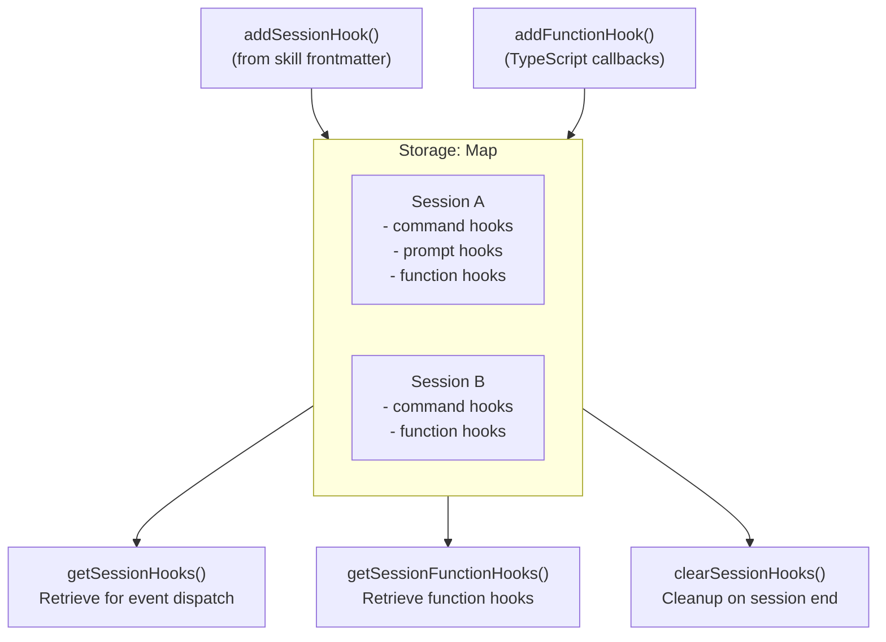

### Key Design Decisions

- **`Map` instead of `Record`** — Uses `Map<string, SessionStore>` for O(1) mutation under high-concurrency workflows. This matters when multiple agents are adding/removing hooks simultaneously.
- **Session-scoped isolation** — Each session gets its own hook store. Hooks from one agent cannot leak to another.
- **Sources** — Session hooks come from skill frontmatter (`registerFrontmatterHooks.ts`) and skill-specific registration (`registerSkillHooks.ts`).

### Lifecycle

1. **Creation**: `addSessionHook()` or `addFunctionHook()` called during skill/agent initialization
2. **Execution**: Retrieved by `getSessionHooks()` during `getHooksConfig()` merging
3. **Cleanup**: `clearSessionHooks()` removes all hooks for a session when it ends

---

## Key Integration Points

### PreToolUse in the Permission Pipeline

PreToolUse hooks form an outer permission layer that runs before the standard permission system:

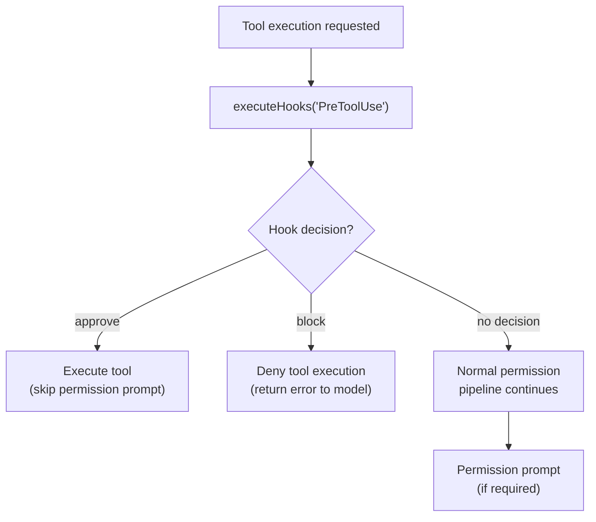

### Stop Hooks at Turn Boundaries

`handleStopHooks()` in `src/query/stopHooks.ts` runs at the end of each model turn:

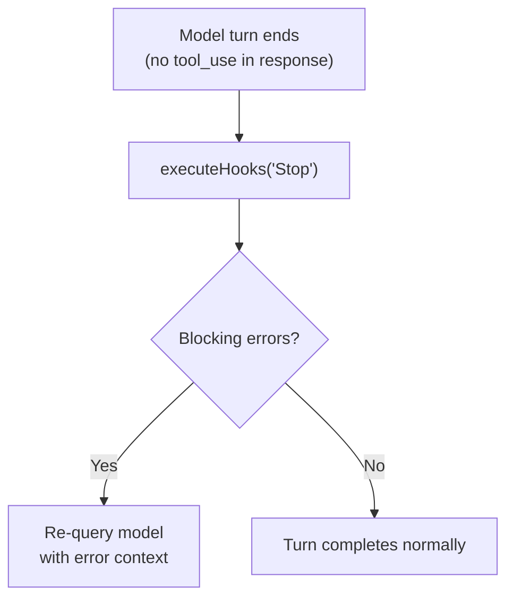

This enables verification hooks that can force the model to retry if the output does not meet quality criteria.

### UserPromptSubmit Context Injection

Runs before the model sees the user's prompt, enabling context augmentation:

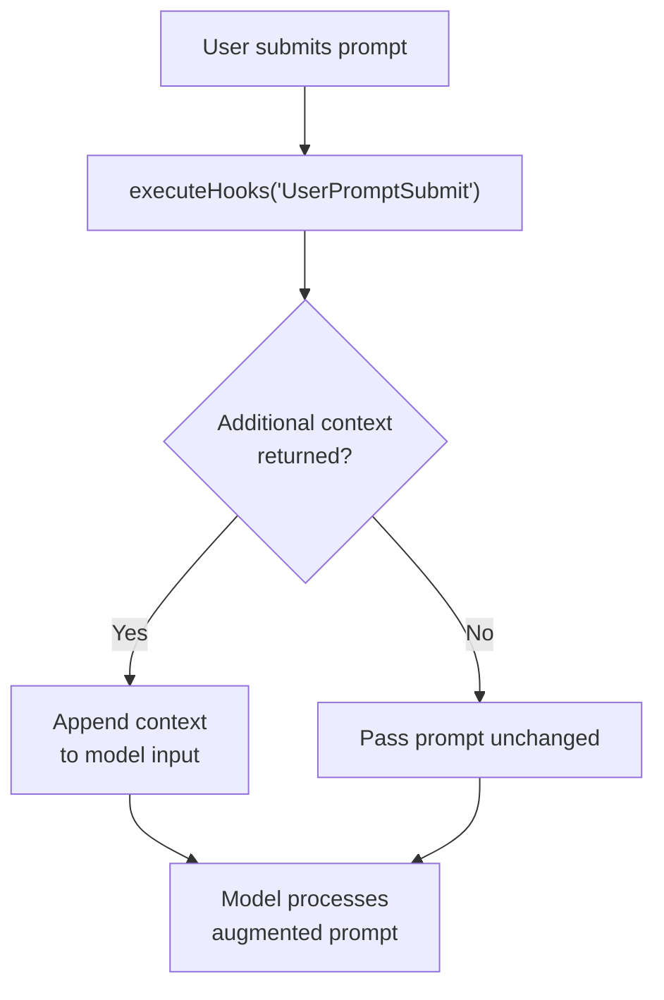

### Post-Sampling Hooks

`executePostSamplingHooks()` in `src/utils/hooks/postSamplingHooks.ts` fires after the model generates a response. These are non-blocking — they observe but do not modify the response.

### PermissionRequest Auto-Decision

PermissionRequest hooks can short-circuit the permission dialog entirely:

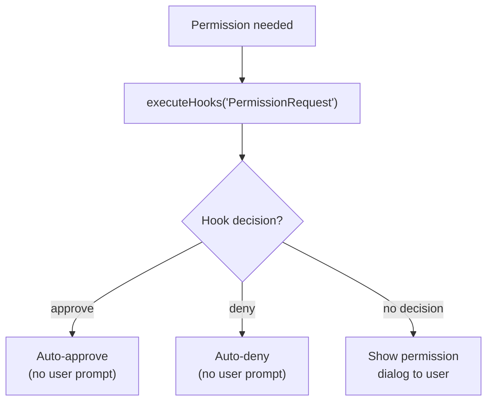

---

## Key Source Files

| File | Purpose |
|------|---------|
| `src/types/hooks.ts` | Type definitions: HookCallback, HookResult, AggregatedHookResult, JSON output schemas |
| `src/schemas/hooks.ts` | Zod schemas for hook configuration: BashCommandHook, PromptHook, AgentHook, HttpHook |
| `src/utils/hooks.ts` | Main execution engine (~3,700 lines): `executeHooks()`, `execCommandHook()`, pattern matching, all `executeXxxHooks()` functions |
| `src/utils/hooks/hookEvents.ts` | Hook event broadcasting system for SDK consumers |
| `src/utils/hooks/sessionHooks.ts` | Per-session in-memory hook storage (Map-based for O(1) mutation) |
| `src/utils/hooks/AsyncHookRegistry.ts` | Background async hook tracking and lifecycle management |
| `src/utils/hooks/hooksConfigSnapshot.ts` | Settings snapshot captured at session start (immutable for session lifetime) |
| `src/utils/hooks/hooksConfigManager.ts` | Hook configuration management and merging logic |
| `src/utils/hooks/execPromptHook.ts` | LLM prompt hook execution (sends to small/fast model) |
| `src/utils/hooks/execAgentHook.ts` | Agentic verifier hook execution (Haiku-based) |
| `src/utils/hooks/execHttpHook.ts` | HTTP webhook execution with SSRF protection |
| `src/utils/hooks/ssrfGuard.ts` | SSRF protection for HTTP hook URLs |
| `src/utils/hooks/postSamplingHooks.ts` | Post-model-response hooks (non-blocking observation) |
| `src/utils/hooks/registerFrontmatterHooks.ts` | Hook registration from skill frontmatter YAML |
| `src/utils/hooks/registerSkillHooks.ts` | Skill-specific hook registration |
| `src/query/stopHooks.ts` | Stop hook execution at turn boundaries (`handleStopHooks()`) |
| `src/commands/hooks/hooks.tsx` | `/hooks` command UI for inspecting active hooks |
| `src/components/hooks/HooksConfigMenu.tsx` | Hook configuration menu UI component |
