# Multi-Agent / Subagent Internals

Deep dive into how Claude Code's multi-agent system works — from agent definition loading through prompt construction, context isolation, fork subagents, worktree management, and the full spawn-to-cleanup lifecycle.

---

## Table of Contents

1. [Architecture Overview](#architecture-overview)
2. [Agent Definition System](#agent-definition-system)
3. [Subagent Prompt Construction](#subagent-prompt-construction)
4. [Context Passing vs Stripping](#context-passing-vs-stripping)
5. [Fork Subagent Mechanics](#fork-subagent-mechanics)
6. [Tool Filtering & Permissions](#tool-filtering--permissions)
7. [Worktree Management](#worktree-management)
8. [Sync vs Async Execution](#sync-vs-async-execution)
9. [Agent Lifecycle: Spawn to Cleanup](#agent-lifecycle-spawn-to-cleanup)
10. [Key Source Files](#key-source-files)

---

## Architecture Overview

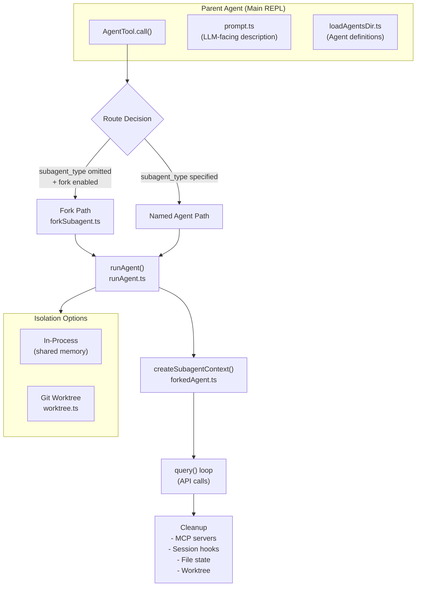

The multi-agent system is implemented across several files in `src/tools/AgentTool/`:

| Component | File | Role |
|-----------|------|------|
| **AgentTool** | `AgentTool.tsx` | LLM-facing tool; routes between fork and named agent paths |
| **runAgent** | `runAgent.ts` | Core execution: system prompt, tools, MCP, query loop, cleanup |
| **forkSubagent** | `forkSubagent.ts` | Fork path: cache-identical message construction |
| **forkedAgent** | `forkedAgent.ts` | `createSubagentContext()`, `CacheSafeParams`, `runForkedAgent()` |
| **loadAgentsDir** | `loadAgentsDir.ts` | Agent definition loading from built-in, plugins, markdown |
| **agentToolUtils** | `agentToolUtils.ts` | Tool filtering, result finalization, async lifecycle |
| **prompt** | `prompt.ts` | LLM-facing Agent tool description with agent list |
| **worktree** | `src/utils/worktree.ts` | Git worktree creation, setup, cleanup |

---

## Agent Definition System

### Three Agent Types

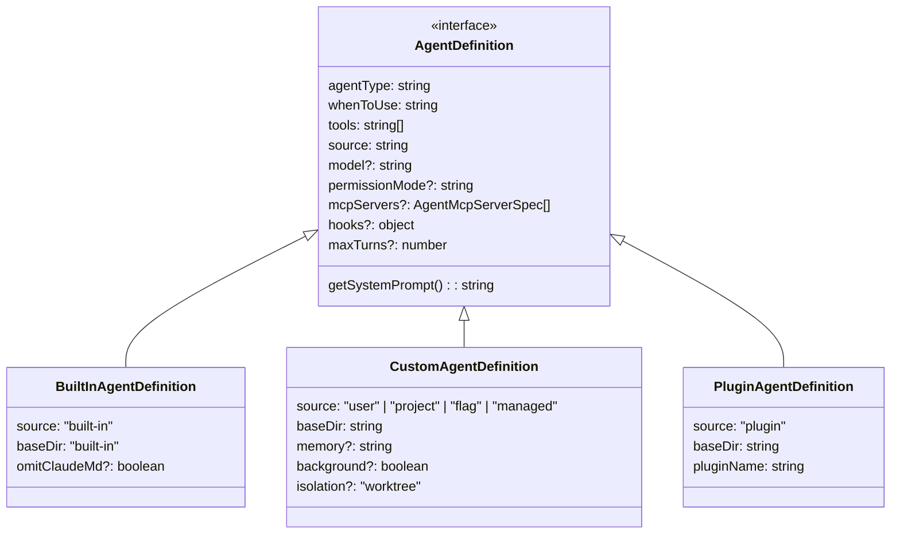

### Built-In Agents

| Agent | Type | Model | Read-Only | Key Trait |
|-------|------|-------|-----------|-----------|
| **general-purpose** | `general-purpose` | default subagent | No | Full tool access, `tools: ['*']` |
| **Explore** | `Explore` | `haiku` (external), `inherit` (ant) | Yes | Fast codebase search; `omitClaudeMd: true` |
| **Plan** | `Plan` | `inherit` | Yes | Architecture planning; `omitClaudeMd: true` |
| **claude-code-guide** | `claude-code-guide` | — | Yes | Answers questions about Claude Code |
| **statusline-setup** | `statusline-setup` | — | No | Configures status line settings |
| **verification** | `verification` | — | Yes | Verifies agent work output |

### Definition Loading Priority

`getAgentDefinitionsWithOverrides()` loads definitions with this override order (later wins):

```
built-in < plugin < user (~/.claude/agents/) < project (.claude/agents/) < flag < managed
```

**Custom agents** are parsed from markdown files with YAML frontmatter:

```markdown
---
name: my-researcher
description: Research agent for internal docs
tools: [Read, Grep, Glob, WebFetch]
model: sonnet
permissionMode: acceptEdits
mcpServers:
  - docs-server
  - name: inline-server
    config: { command: "node", args: ["server.js"] }
maxTurns: 50
isolation: worktree
---

You are a research specialist...
(body becomes the system prompt)
```

Parsed by `parseAgentFromMarkdown()` in `loadAgentsDir.ts:541-755`.

---

## Subagent Prompt Construction

### Named Agent Path

For named agents (e.g., `subagent_type: "general-purpose"`), prompt construction follows this flow:

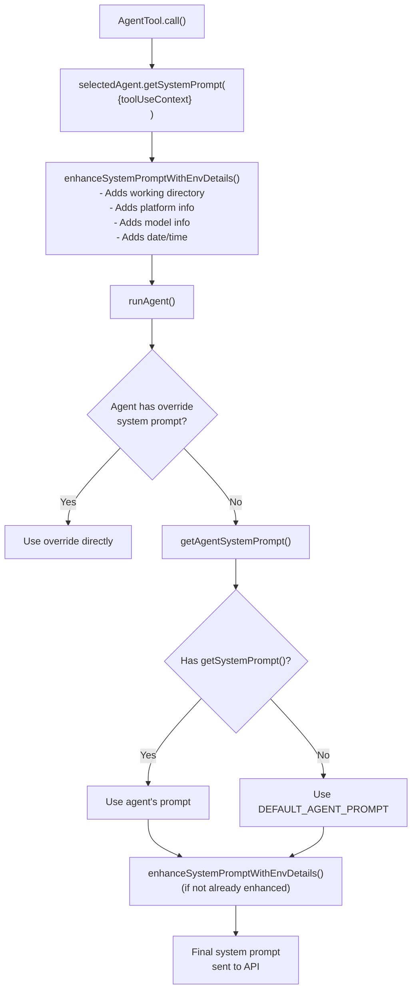

**Key decisions in `runAgent.ts`:**

- `shouldOmitClaudeMd` — Explore and Plan agents skip CLAUDE.md injection (saves tokens; they're read-only and can read it manually if needed)
- `shouldOmitGitStatus` — Same agents skip git status context
- `thinkingConfig` — Disabled for regular subagents, but **preserved** for fork children (they inherit parent's exact config for cache sharing)

### User Message Construction

For named agents, the user message is simply the `prompt` string wrapped in `createUserMessage()`:

```typescript
promptMessages = [createUserMessage({ content: prompt })]
```

### Fork Path (see Fork Subagent Mechanics below)

Fork children receive the parent's **entire conversation history** with carefully constructed placeholder messages.

---

## Context Passing vs Stripping

### What Gets Passed to Subagents

```mermaid
flowchart LR
    subgraph Parent["Parent Context"]
        SP["System Prompt"]
        CM["CLAUDE.md"]
        GS["Git Status"]
        TH["Thinking Config"]
        TL["Tools"]
        MC["MCP Clients"]
        PM["Permission Mode"]
        FS["File State\n(readFileState)"]
        AC["AbortController"]
    end

    subgraph Named["Named Agent Gets"]
        SP2["Own system prompt\n(from definition)"]
        CM2["CLAUDE.md\n(unless omitClaudeMd)"]
        GS2["Git Status\n(unless omitClaudeMd)"]
        TH2["Thinking: DISABLED"]
        TL2["Filtered tools\n(agent.tools + disallowed sets)"]
        MC2["Parent MCP + agent MCP"]
        PM2["agent.permissionMode\nor parent's"]
        FS2["Cloned readFileState"]
        AC2["Child AbortController\n(linked to parent)"]
    end

    subgraph Fork["Fork Child Gets"]
        SP3["Parent's EXACT\nsystem prompt"]
        CM3["CLAUDE.md\n(inherited)"]
        GS3["Git Status\n(inherited)"]
        TH3["Parent's thinking\nconfig (preserved)"]
        TL3["Parent's EXACT\ntool array"]
        MC3["Parent MCP clients"]
        PM3["'bubble' mode"]
        FS3["Cloned readFileState"]
        AC3["Child AbortController"]
    end

    Parent --> Named
    Parent --> Fork
```

### `createSubagentContext()` — The Isolation Boundary

Defined in `forkedAgent.ts:345-462`, this function creates a `ToolUseContext` clone with:

**Always cloned (isolated):**
- `readFileState` — deep clone, prevents cross-agent file cache pollution
- `AbortController` — child controller linked to parent (parent cancel kills child)
- `toolUseId` — fresh ID for the subagent
- `contentReplacementState` — independent replacement tracking
- Collections: `pendingUpdates`, `permissionRequestQueue`, `pendingPermissionRequests`

**Default: no-op (stripped):**
- `setAppState` — no-op by default (subagent can't mutate parent state)
- `setResponseLength` — no-op
- `setToolJSX` — null (no UI rendering)
- Various callbacks: `reportCostData`, `onToolEnd`, `onQueryEnd`

**Opt-in sharing:**
- `shareSetAppState` — enables state mutation (used by some async paths)
- `shareSetResponseLength` — enables spinner token counting
- `shareAbortController` — reuses parent's controller instead of creating child

### What Gets Stripped for Read-Only Agents

Explore and Plan agents get additional stripping:

```typescript
// In runAgent.ts, context preparation:
const shouldOmitClaudeMd = selectedAgent.omitClaudeMd === true
const shouldOmitGitStatus = shouldOmitClaudeMd  // same gate

// Effects:
// - CLAUDE.md content not injected into system prompt
// - Git status not included in user context
// - Saves significant tokens for fast read-only operations
```

---

## Fork Subagent Mechanics

The fork path is Claude Code's most sophisticated subagent feature — it creates a child agent that **shares the parent's exact prompt cache** for maximum efficiency.

### When Fork Is Used

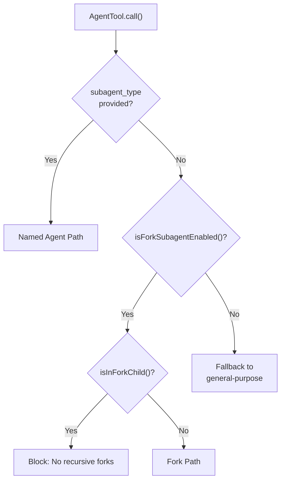

`isForkSubagentEnabled()` checks:
- Feature flag `FORK_SUBAGENT` is enabled
- NOT in coordinator mode
- NOT non-interactive (SDK without human)

### Fork Message Construction

The key insight: **fork children must receive byte-identical API prefixes** to the parent for prompt cache sharing.

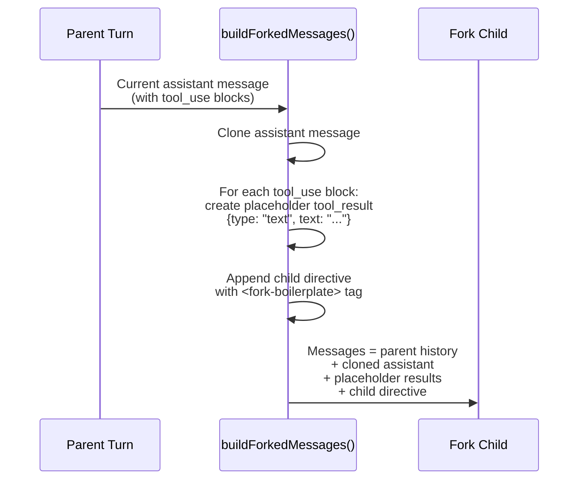

**`buildForkedMessages()` (forkSubagent.ts:107-169):**

1. Takes the parent's current `assistantMessage` (containing the `tool_use` for the Agent call)
2. Clones it as-is (preserving thinking blocks, all tool_use blocks)
3. Creates a `tool_result` for **every** `tool_use` block — not just the fork's — with placeholder text
4. Appends the child's specific task directive wrapped in `<fork-boilerplate>` tags

**`buildChildMessage()` (forkSubagent.ts:171-198):**

Injects strict rules for the fork child:
```xml
<fork-boilerplate>
You were dispatched as a subagent to handle a specific task.
Rules:
- Do NOT fork again (no recursive forks)
- Stay focused on your assigned task
- Return structured output: scope, result, key-files, files-changed, issues
</fork-boilerplate>
```

### CacheSafeParams

The `CacheSafeParams` type (`forkedAgent.ts:57-68`) defines everything that must be byte-identical between parent and fork for cache hits:

```typescript
type CacheSafeParams = {
  systemPrompt: SystemPrompt        // Parent's exact system prompt
  userContext: UserContext           // CLAUDE.md, git status, etc.
  systemContext: SystemContext       // Billing headers, etc.
  toolUseContext: ToolUseContext     // Tool definitions
  forkContextMessages: Message[]    // Parent's full conversation
}
```

### `FORK_AGENT` Definition

```typescript
const FORK_AGENT: AgentDefinition = {
  agentType: 'fork',
  tools: ['*'],              // All parent tools
  permissionMode: 'bubble',  // Permissions bubble up to parent
  model: 'inherit',          // Same model as parent
  maxTurns: 200,             // High limit
}
```

### Recursive Fork Prevention

`isInForkChild()` scans message history for the `<fork-boilerplate>` tag. If found, the Agent tool blocks the spawn with an error — no fork-of-fork chains.

---

## Tool Filtering & Permissions

### Disallowed Tool Sets

Three sets control which tools subagents can access:

```typescript
// ALL subagents (both built-in and custom) cannot use:
ALL_AGENT_DISALLOWED_TOOLS = {
  'Agent',           // No recursive agent spawning (for named agents)
  'EnterPlanMode',   // Plan mode is parent-only
  'EnterWorktree',   // Worktree entry is parent-only
  'ExitWorktree',    // Worktree exit is parent-only
}

// Custom agents additionally cannot use:
CUSTOM_AGENT_DISALLOWED_TOOLS = {
  // (varies — generally more restrictive)
}

// Async agents are restricted to:
ASYNC_AGENT_ALLOWED_TOOLS = {
  'Read', 'Edit', 'Write', 'Bash', 'Glob', 'Grep',
  'NotebookEdit', 'TaskCreate', 'TaskUpdate', ...
  // No Agent tool (prevents async-spawning-async chains)
}
```

### Resolution Flow

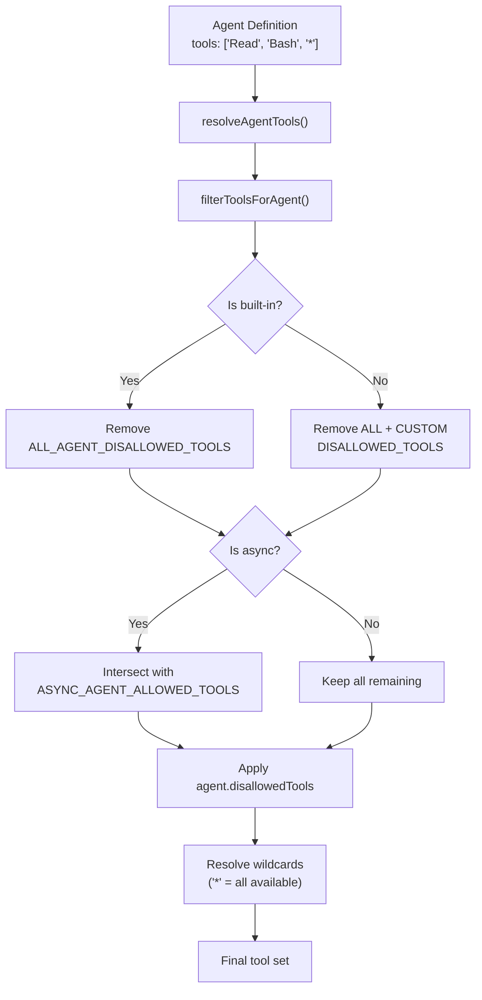

**MCP tools always pass through** — they're never in the disallowed sets, so custom agents can always use their MCP server tools.

### Permission Mode Override

Agents can define their own `permissionMode`, but parent settings always win:

```
bypassPermissions > acceptEdits > auto > agent.permissionMode
```

Async agents additionally get `shouldAvoidPermissionPrompts` to prevent blocking on user input.

---

## Worktree Management

### Creating Agent Worktrees

When an agent specifies `isolation: "worktree"` or the parent requests it:

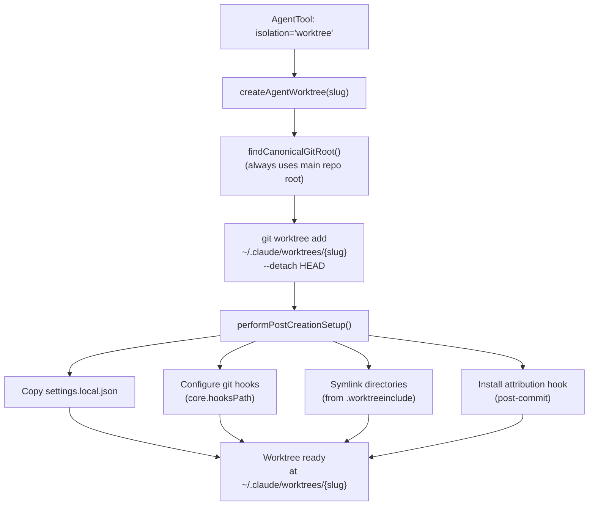

**Key details from `worktree.ts`:**

- **`createAgentWorktree(slug)`** (lines 902-952): Lightweight wrapper that always lands worktrees in the main repo's `.claude/worktrees/` directory
- **`findCanonicalGitRoot()`**: Traverses up to find the true git root, even when called from within a worktree
- Worktree slug pattern: `agent-a{7 hex chars}` (from `earlyAgentId.slice(0, 8)`)

### Post-Creation Setup

`performPostCreationSetup()` (lines 510-624) makes the worktree functional:

1. **Settings**: Copies `settings.local.json` so IDE extensions work
2. **Git hooks**: Sets `core.hooksPath` to point at the main repo's hooks, or copies hooks directly
3. **Symlinks**: Reads `.worktreeinclude` to symlink directories (e.g., `node_modules`) instead of duplicating
4. **Attribution hook**: Installs a `post-commit` hook that tags commits with the agent's identity

### Worktree Cleanup

Two cleanup mechanisms:

**1. Immediate cleanup** (when agent finishes):

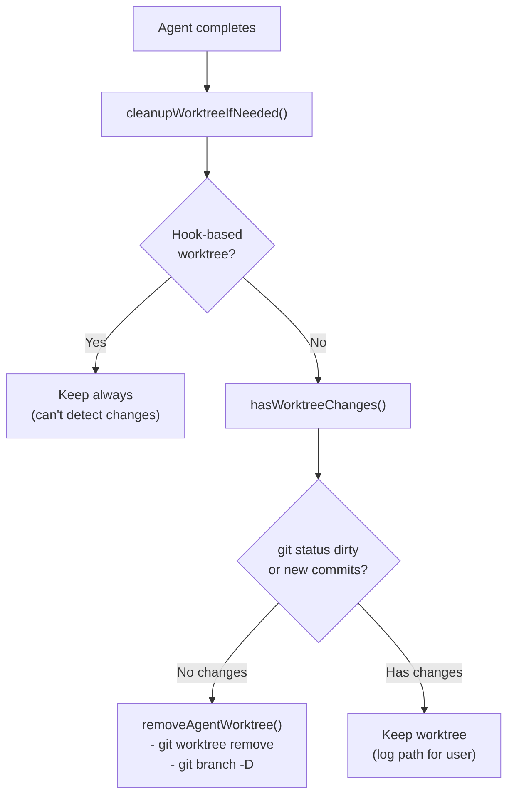

**`hasWorktreeChanges()`** (lines 1144-1173): Checks both `git status --porcelain` (uncommitted changes) and `git rev-list` (new commits since worktree creation).

**2. Stale worktree cleanup** (periodic sweep):

`cleanupStaleAgentWorktrees()` (lines 1058-1136):
- Scans `~/.claude/worktrees/` for ephemeral patterns: `agent-a*`, `wf_*`, `bridge-*`, `job-*`
- Removes worktrees older than 30-day cutoff
- **Fail-closed safety**: Only removes if the directory name matches known ephemeral patterns

### Path Translation for Fork + Worktree

When a fork child runs in a worktree, `buildWorktreeNotice()` injects a message telling it to translate paths:

```
Your working directory is /path/to/worktree (not /path/to/main/repo).
File paths from the parent's context refer to the main repo.
Translate them to your worktree path before reading/writing.
```

---

## Sync vs Async Execution

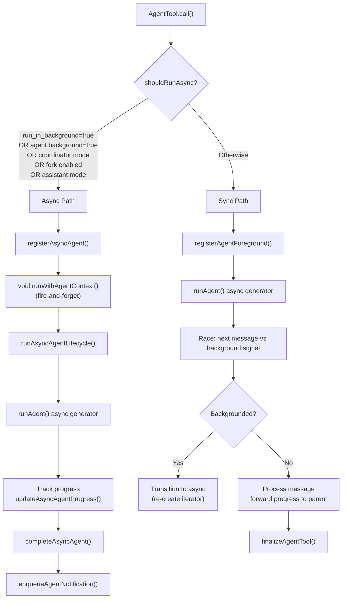

### Sync Path Details

- **Progress forwarding**: Each subagent message is forwarded to the parent via `onProgress` callbacks
- **Background hint**: After `PROGRESS_THRESHOLD_MS`, a UI hint appears suggesting the user can background the agent
- **Mid-execution backgrounding**: Sync agents can be backgrounded at any time — the iterator is cleanly closed and a new one created in the background

### Async Path Details

- **Fire-and-forget**: Returns `{ status: 'async_launched', agentId }` immediately
- **Independent abort**: Background agents get their own `AbortController`, surviving parent ESC
- **Progress tracking**: `updateAsyncAgentProgress()` updates the task list UI
- **Notifications**: On completion/failure/kill, `enqueueAgentNotification()` alerts the parent

### Agent Name Registry

Named agents (via the `name` parameter) are registered in `appState.agentNameRegistry`:

```typescript
// Maps name → agentId for SendMessage routing
agentNameRegistry.set(name, agentId)
```

This enables `SendMessage` to route follow-up messages to a specific named agent.

---

## Agent Lifecycle: Spawn to Cleanup

### Complete Flow

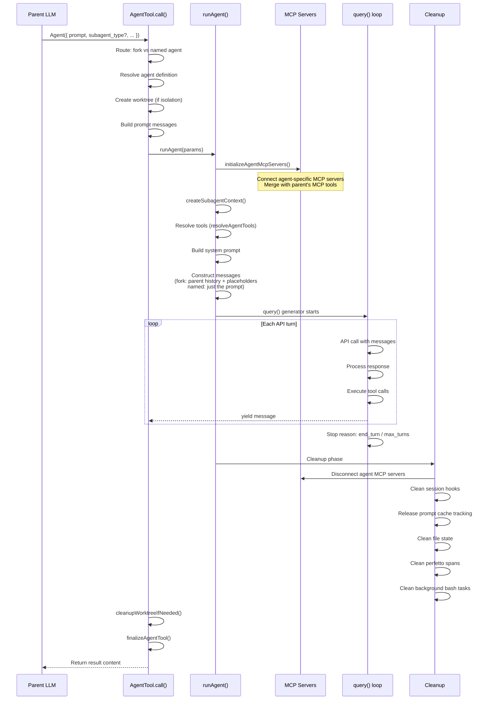

### Agent MCP Servers

Agents can define their own MCP servers (in frontmatter or agent definition). `initializeAgentMcpServers()` (`runAgent.ts:95-218`):

1. Resolves MCP server specs (string references or inline configs)
2. Connects each server (same process as main MCP connection)
3. Fetches tools from connected servers
4. Returns merged tool list and a cleanup function

The cleanup function disconnects agent-specific servers when the agent finishes — parent MCP connections are unaffected.

### Agent Resume

`resumeAgent.ts` handles resuming interrupted agents:

1. Reads the agent's transcript from disk (`getAgentTranscript()`)
2. Reads metadata (agent type, worktree path)
3. Filters incomplete messages (orphaned tool_use, whitespace-only, etc.)
4. Reconstructs content replacement state
5. Verifies worktree still exists (falls back to parent cwd if not)
6. Re-registers as async agent and continues execution

### Metrics & Analytics

Key analytics events logged throughout the lifecycle:

| Event | When | Key Fields |
|-------|------|------------|
| `tengu_agent_tool_completed` | Agent finishes | agent_type, model, duration_ms, total_tool_uses, total_tokens |
| `tengu_agent_tool_terminated` | Agent killed/cancelled | reason (user_kill_async, user_cancel_sync, user_cancel_background) |
| `tengu_fork_agent_query` | Fork child API call | (usage tracking) |
| `tengu_cache_eviction_hint` | Agent ends | last_request_id (signals cache can be freed) |
| `tengu_agent_memory_loaded` | Agent with memory starts | scope, source |
| `tengu_auto_mode_decision` | Handoff classifier runs | decision (allowed/blocked/unavailable) |

---

## Key Source Files

| File | Purpose |
|------|---------|
| `src/tools/AgentTool/AgentTool.tsx` | Main Agent tool: routing, worktree setup, sync/async execution |
| `src/tools/AgentTool/runAgent.ts` | Core execution: MCP init, context prep, query loop, cleanup |
| `src/tools/AgentTool/forkSubagent.ts` | Fork path: feature gate, message construction, child directive |
| `src/tools/AgentTool/prompt.ts` | LLM-facing tool description with agent list |
| `src/tools/AgentTool/agentToolUtils.ts` | Tool filtering, `resolveAgentTools()`, `finalizeAgentTool()`, async lifecycle |
| `src/tools/AgentTool/loadAgentsDir.ts` | Agent definition types, loading, markdown parsing |
| `src/tools/AgentTool/resumeAgent.ts` | Agent resume from disk transcript |
| `src/tools/AgentTool/built-in/generalPurposeAgent.ts` | General-purpose agent definition |
| `src/tools/AgentTool/built-in/exploreAgent.ts` | Explore agent (fast, read-only, omits CLAUDE.md) |
| `src/tools/AgentTool/built-in/planAgent.ts` | Plan agent (architecture, read-only, omits CLAUDE.md) |
| `src/utils/worktree.ts` | Git worktree creation, setup, cleanup, stale sweep |
| `src/utils/forkedAgent.ts` | `createSubagentContext()`, `CacheSafeParams`, `runForkedAgent()` |

---

## Debug Logging

Agent operations log via `logForDebugging()` to `~/.claude/logs/debug.log`:

```bash
# Watch agent activity in real-time
tail -f ~/.claude/logs/debug.log | grep -E "\[Agent|worktree|subagent|fork"
```

Key patterns to watch for:
```
Failed to get system prompt for agent {type}: {error}
Hook-based agent worktree kept at: {path}
Agent worktree has changes, keeping: {path}
Resumed worktree {path} no longer exists; falling back to parent cwd
Sync agent error: {error}
Handoff classifier flagged sub-agent output: {reason}
```
