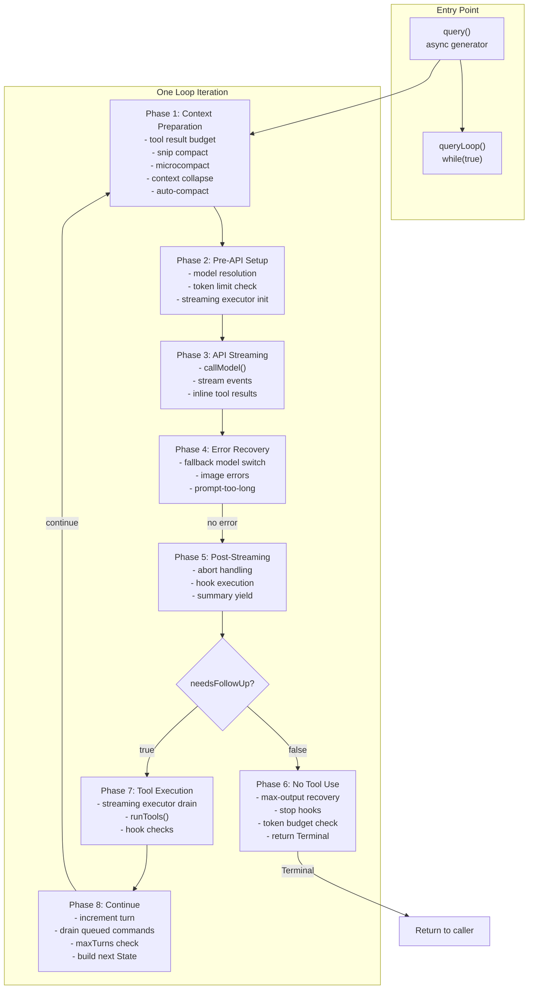
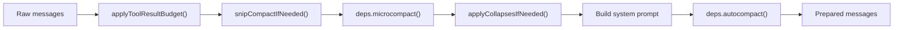
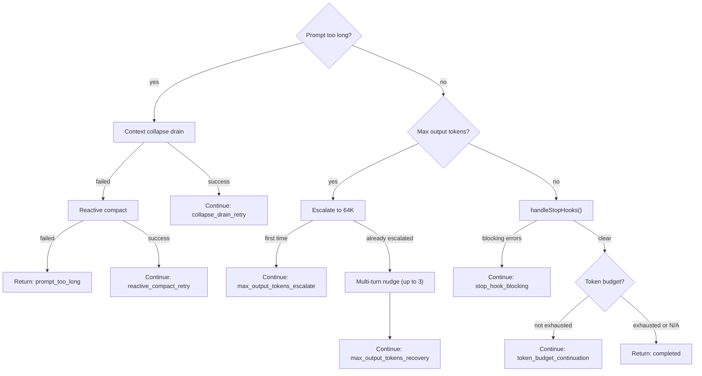
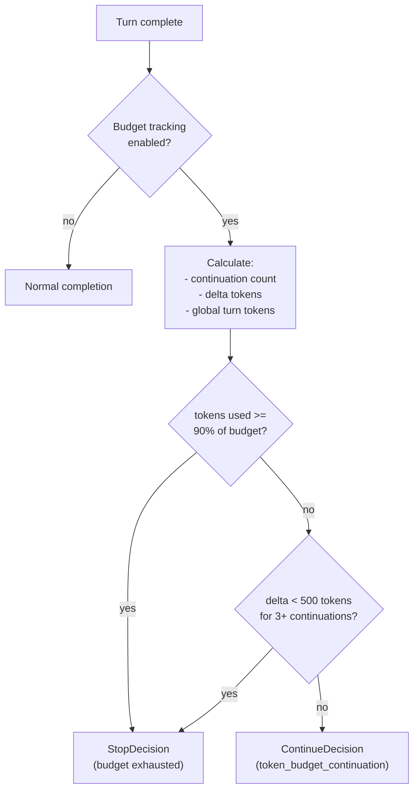
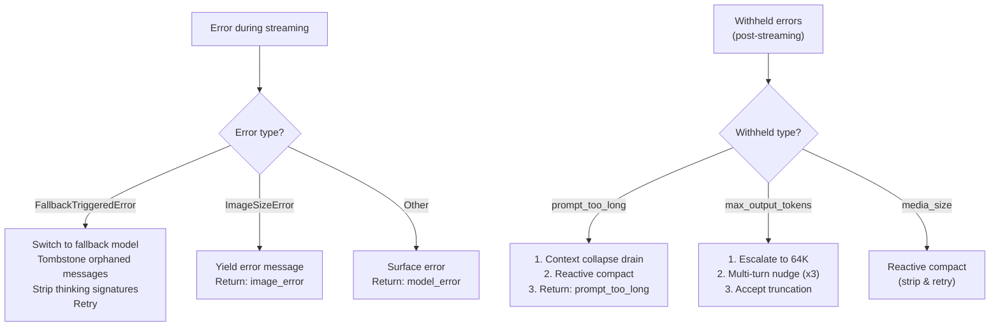

# Query Loop Internals

Deep dive into Claude Code's core query loop — the async generator that orchestrates model calls, streaming, tool execution, error recovery, and context management across multi-turn conversations.

---

## Table of Contents

1. [Architecture Overview](#architecture-overview)
2. [Entry Point: query()](#entry-point-query)
3. [QueryParams & Configuration](#queryparams--configuration)
4. [Injectable Dependencies (QueryDeps)](#injectable-dependencies-querydeps)
5. [QueryConfig: Immutable Snapshot](#queryconfig-immutable-snapshot)
6. [Loop State](#loop-state)
7. [Main Loop Phases](#main-loop-phases)
8. [Continue Transitions](#continue-transitions)
9. [Terminal Reasons](#terminal-reasons)
10. [Streaming Tool Execution](#streaming-tool-execution)
11. [Token Budget System](#token-budget-system)
12. [Error Recovery](#error-recovery)
13. [Key Source Files](#key-source-files)

---

## Architecture Overview



The query loop is the heart of Claude Code's execution engine. Every user turn, every tool-use cycle, and every error recovery pass flows through this single `while(true)` loop in `src/query.ts`.

---

## Entry Point: query()

**File:** `src/query.ts:219`

```typescript
export async function* query(params: QueryParams): AsyncGenerator<
  StreamEvent | RequestStartEvent | Message | TombstoneMessage | ToolUseSummaryMessage,
  Terminal
>
```

`query()` is an async generator that wraps the internal `queryLoop()`. It provides:

1. **Lifecycle tracking** — maintains a `consumedCommandUuids` set across iterations
2. **Completion notification** — notifies command lifecycle on normal completion
3. **Event yielding** — forwards all events from the inner loop to callers (REPL, subagents, etc.)

Callers iterate the generator to receive streaming events and eventually get the `Terminal` return value indicating why the loop stopped.

---

## QueryParams & Configuration

**File:** `src/query.ts:181`

```typescript
type QueryParams = {
  messages: Message[]
  systemPrompt: SystemPrompt
  userContext: { [k: string]: string }
  systemContext: { [k: string]: string }
  canUseTool: CanUseToolFn
  toolUseContext: ToolUseContext
  fallbackModel?: string
  querySource: QuerySource
  maxOutputTokensOverride?: number
  maxTurns?: number
  skipCacheWrite?: boolean
  taskBudget?: { total: number }
  deps?: QueryDeps
}
```

| Parameter | Purpose |
|-----------|---------|
| `messages` | Full conversation history at entry |
| `systemPrompt` | Pre-built system prompt (with identity, tools, context) |
| `userContext` / `systemContext` | Additional context appended to system prompt |
| `canUseTool` | Permission callback for tool gating |
| `toolUseContext` | Shared mutable context for tool execution |
| `fallbackModel` | Model to switch to on `FallbackTriggeredError` |
| `querySource` | Origin of query (REPL, subagent, headless, etc.) |
| `maxOutputTokensOverride` | Override default output token limit |
| `maxTurns` | Cap on loop iterations (prevents runaway agents) |
| `skipCacheWrite` | Skip writing prompt cache (for ephemeral queries) |
| `taskBudget` | Total token budget for the entire task |
| `deps` | Injectable dependencies (see below) |

---

## Injectable Dependencies (QueryDeps)

**File:** `src/query/deps.ts`

```typescript
type QueryDeps = {
  callModel: typeof queryModelWithStreaming  // API call
  microcompact: typeof microcompactMessages  // context compaction
  autocompact: typeof autoCompactIfNeeded    // auto compaction
  uuid: () => string                         // ID generation
}
```

The dependency injection pattern enables testing without hitting real APIs:

| Dependency | Production Implementation | Test Override |
|------------|--------------------------|---------------|
| `callModel` | `queryModelWithStreaming()` — streams API response | Fake that yields predetermined messages |
| `microcompact` | `microcompactMessages()` — time/cache/API-based compaction | Identity function or mock |
| `autocompact` | `autoCompactIfNeeded()` — LLM-based summarization | No-op or immediate return |
| `uuid` | `crypto.randomUUID()` | Deterministic counter |

`productionDeps()` provides the real implementations and is the default when `deps` is omitted from `QueryParams`.

---

## QueryConfig: Immutable Snapshot

**File:** `src/query/config.ts`

Snapshotted **once** at `query()` entry to prevent mid-loop behavior changes:

```typescript
type QueryConfig = {
  sessionId: string
  gates: {
    streamingToolExecution: boolean   // Statsig gate (tengu_streaming_tool_execution2)
    emitToolUseSummaries: boolean     // Environment variable toggle
    isAnt: boolean                    // Internal user detection
    fastModeEnabled: boolean          // Fast mode toggle
  }
}
```

**Design decision:** `QueryConfig` intentionally excludes `feature()` gates. Feature flags evaluated via `feature()` are tree-shaking boundaries — they control which code paths exist at build time, not runtime behavior within a single query.

---

## Loop State

**File:** `src/query.ts:203`

Mutable state carried between loop iterations:

```typescript
type State = {
  messages: Message[]
  toolUseContext: ToolUseContext
  autoCompactTracking: AutoCompactTrackingState | undefined
  maxOutputTokensRecoveryCount: number
  hasAttemptedReactiveCompact: boolean
  maxOutputTokensOverride: number | undefined
  pendingToolUseSummary: Promise<ToolUseSummaryMessage | null> | undefined
  stopHookActive: boolean | undefined
  turnCount: number
  transition: Continue | undefined
}
```

| Field | Purpose |
|-------|---------|
| `messages` | Current conversation (may be compacted between turns) |
| `toolUseContext` | Shared tool context (updated each iteration with processed messages) |
| `autoCompactTracking` | Tracks token usage to know when auto-compact should trigger |
| `maxOutputTokensRecoveryCount` | Counter for multi-turn max-output recovery (max 3) |
| `hasAttemptedReactiveCompact` | Guards against re-attempting reactive compact |
| `maxOutputTokensOverride` | Dynamically escalated output limit (64K on recovery) |
| `pendingToolUseSummary` | Async Haiku-generated summary from previous turn |
| `stopHookActive` | Whether stop hooks are currently active |
| `turnCount` | Number of iterations completed |
| `transition` | Tagged reason for the previous `continue` (for debugging) |

---

## Main Loop Phases

The `while(true)` loop at line 309 processes one full iteration per cycle. Each iteration is divided into eight phases:

### Phase 1: Context Preparation



1. **Destructure state** — extract all fields from current `State`
2. **Skill discovery prefetch** — starts in parallel with model call (non-blocking)
3. **Yield `stream_request_start`** — signals a new API request is beginning
4. **Query tracking** — initialize/increment `chainId` and `depth` for telemetry
5. **Get messages after compact boundary** — only process messages beyond the last compaction point
6. **Tool result budget** (`applyToolResultBudget()`) — replaces oversized tool results with disk file references, per-message content replacement
7. **Snip compact** (`snipCompactIfNeeded()`) — feature-gated `HISTORY_SNIP`, removes old messages entirely
8. **Microcompact** (`deps.microcompact()`) — time-based, cached, or API-based lightweight clearing of old tool result content
9. **Context collapse** (`applyCollapsesIfNeeded()`) — feature-gated `CONTEXT_COLLAPSE`, collapses older context into summaries
10. **Build full system prompt** — append system context entries
11. **Auto-compact** (`deps.autocompact()`) — LLM-based summarization if token threshold exceeded
12. **Post-compact handling** — if compacted: yield post-compact messages, reset tracking, recalculate task budget remaining

### Phase 2: Pre-API Setup

1. **Update toolUseContext** — inject processed messages into shared context
2. **Initialize arrays** — `assistantMessages`, `toolResults`, `toolUseBlocks`
3. **Create `StreamingToolExecutor`** — if `gates.streamingToolExecution` is enabled
4. **Resolve model** — `getRuntimeMainLoopModel()` determines the current model
5. **Create `dumpPromptsFetch`** — for internal users (`isAnt`), enables prompt debugging
6. **Blocking token limit check** — skip if just compacted, or if reactive compact / context collapse are enabled as fallbacks

### Phase 3: API Streaming

```mermaid
sequenceDiagram
    participant Loop as Query Loop
    participant API as deps.callModel()
    participant STE as StreamingToolExecutor
    participant Caller as Caller (REPL/Agent)

    Loop->>API: Stream request
    loop For each streamed message
        API-->>Loop: Message chunk
        Loop->>Loop: Handle fallback/errors
        Loop->>Loop: Backfill tool_use inputs
        Loop->>Loop: Track assistant messages
        alt Streaming tool execution enabled
            Loop->>STE: addTool(block)
            STE-->>Loop: Completed results
            Loop->>Caller: Yield inline results
        end
        Loop->>Caller: Yield stream event
    end
    Loop->>Caller: Yield deferred microcompact boundary
```

1. **Call `deps.callModel()`** — passes messages, system prompt, thinking config, tools, model params
2. **For each streamed message:**
   - Handle streaming fallback (model switch): tombstone orphaned messages, reset state
   - Backfill tool_use inputs via `backfillObservableInput` (for SDK stream/transcript visibility)
   - Withhold recoverable errors: prompt-too-long (for reactive compact), media-size, max-output-tokens
   - Track assistant messages and tool_use blocks
   - If streaming tool execution enabled: `streamingToolExecutor.addTool()` for each tool block
   - Yield completed streaming tool results inline
3. **Yield deferred microcompact boundary** — cached microcompact with actual API token deletion count

### Phase 4: Error Recovery

If the API call throws an exception:

| Error Type | Action |
|------------|--------|
| `FallbackTriggeredError` | Switch to fallback model, tombstone orphaned messages, strip thinking signatures, retry |
| `ImageSizeError` / `ImageResizeError` | Yield error message, return immediately |
| Other errors | Yield missing tool results, surface error to user, return |

### Phase 5: Post-Streaming

1. **Post-sampling hooks** — executed non-blocking (fire-and-forget)
2. **Abort handling** — if user aborted during streaming: consume remaining streaming results or yield interruption messages
3. **Yield pending tool use summary** — the async summary generated from the *previous* turn

### Phase 6: No Tool Use (Turn Complete)

When `needsFollowUp === false` (no tool calls in the response):



1. **Prompt-too-long recovery**: try context collapse drain, then reactive compact
2. **Max output tokens recovery**: escalate to 64K, then multi-turn recovery (up to 3 retries with nudge message)
3. **Stop hooks**: `handleStopHooks()` — if blocking errors returned, inject them and re-query
4. **Token budget**: check if budget continuation needed (feature-gated `TOKEN_BUDGET`)
5. **Return** `{ reason: 'completed' }` if no recovery or continuation needed

### Phase 7: Tool Execution

When `needsFollowUp === true` (model made tool calls):

1. **Get tool results**: `streamingToolExecutor.getRemainingResults()` (if streaming enabled) or `runTools()`
2. **Yield each tool result message** — individual messages for each tool's output
3. **Check hook attachment** — look for `hook_stopped_continuation` attachment (hook blocked continuation)
4. **Generate tool use summary** — async, non-blocking, Haiku-based summarization of tool results
5. **Handle abort** — if user aborted during tool execution
6. **Handle hook-prevented continuation** — return `hook_stopped` if a hook blocked further iteration

### Phase 8: Continue

1. **Increment turn counter** — in query tracking for telemetry
2. **Get attachment messages** — memory prefetch, skill discovery results, queued commands
3. **Drain queued commands** — priority-based, agent-scoped (e.g., slash commands typed during execution)
4. **Check `maxTurns` limit** — if exceeded, return without continuing
5. **Build next State** — assemble new `State` with updated messages, tool context, and transition tag
6. **`continue`** — jump back to loop top

---

## Continue Transitions

State transitions are tagged with a `reason` string for debugging and telemetry. The `transition` field in `State` records why the previous iteration triggered a `continue`:

| Transition | Meaning |
|------------|---------|
| `collapse_drain_retry` | Context collapse drained staged collapses, retrying API call |
| `reactive_compact_retry` | Reactive compact succeeded after prompt-too-long, retrying |
| `max_output_tokens_escalate` | Escalated output limit to 64K tokens |
| `max_output_tokens_recovery` | Multi-turn recovery attempt (nudge message injected) |
| `stop_hook_blocking` | Stop hook returned blocking error, re-querying with error |
| `token_budget_continuation` | Token budget not yet exhausted, continuing generation |

These transitions are distinct from normal tool-use continuations (which have no special tag).

---

## Terminal Reasons

The loop returns a `Terminal` object with a `reason` field indicating why execution stopped:

| Reason | Meaning | Recoverable? |
|--------|---------|--------------|
| `completed` | Normal completion — model finished without tool calls | N/A |
| `blocking_limit` | Token limit reached and auto-compact is off | No |
| `prompt_too_long` | Unrecoverable prompt-too-long after all recovery attempts | No |
| `image_error` | Image size/resize error | No |
| `model_error` | Unrecoverable API error | No |
| `aborted_streaming` | User abort during API streaming | User-initiated |
| `aborted_tools` | User abort during tool execution | User-initiated |
| `hook_stopped` | Hook prevented continuation | By design |
| `stop_hook_prevented` | Stop hook with `preventContinuation` flag | By design |

---

## Streaming Tool Execution

**Gate:** `tengu_streaming_tool_execution2` (Statsig)

When enabled, tools begin executing *while the model is still streaming*:

```mermaid
sequenceDiagram
    participant API as Model API
    participant Loop as Query Loop
    participant STE as StreamingToolExecutor
    participant T1 as Tool A
    participant T2 as Tool B

    API->>Loop: tool_use block A (complete)
    Loop->>STE: addTool(A)
    STE->>T1: Execute (async)
    API->>Loop: tool_use block B (complete)
    Loop->>STE: addTool(B)
    STE->>T2: Execute (async)
    T1-->>STE: Result A
    STE-->>Loop: getCompletedResults()
    Loop->>Loop: Yield result A inline
    API->>Loop: Stream complete
    Loop->>STE: getRemainingResults()
    T2-->>STE: Result B
    STE-->>Loop: Result B
```

| Method | When Called | Purpose |
|--------|------------|---------|
| `addTool(block)` | As each tool_use block arrives | Starts tool execution immediately |
| `getCompletedResults()` | During streaming | Yields already-finished tools inline |
| `getRemainingResults()` | After streaming ends | Drains all remaining in-flight tools |

Benefits:
- Read-only tools (file reads, searches) complete during streaming, reducing total turn time
- Write tools still respect permission checks before execution
- Concurrency-safe tools can run in parallel with each other

---

## Token Budget System

**File:** `src/query/tokenBudget.ts`  
**Feature gate:** `TOKEN_BUDGET`

The token budget system enables bounded generation for task-scoped queries (e.g., subagents with a cost cap):



| Constant | Value | Purpose |
|----------|-------|---------|
| `COMPLETION_THRESHOLD` | `0.9` | Continue until 90% of budget consumed |
| `DIMINISHING_THRESHOLD` | `500` | Stop if generating fewer than 500 new tokens |
| Diminishing window | 3 continuations | Require 3 consecutive low-delta turns before stopping |

The system returns either a `ContinueDecision` (loop continues with `token_budget_continuation` transition) or a `StopDecision` (loop returns `completed`).

---

## Error Recovery

The query loop implements a layered error recovery strategy, attempting progressively more aggressive fixes:

### Recovery Chain



### Error Recovery Summary

| Error | Recovery Strategy | Max Retries |
|-------|-------------------|-------------|
| Prompt too long | Context collapse drain, then reactive compact | 1 each |
| Media size error | Reactive compact (strip & retry) | 1 |
| Max output tokens | Escalate to 64K, then multi-turn nudge | 1 escalation + 3 nudges |
| Model fallback | Switch to fallback model | 1 |
| Stop hook blocking | Inject errors, re-query | Unlimited (until `preventContinuation`) |

### Max Output Tokens Recovery Detail

The multi-turn recovery for max-output-tokens is particularly interesting:

1. **First hit**: Escalate `maxOutputTokensOverride` to 64K and retry immediately
2. **Second hit** (already at 64K): Inject a "nudge" user message asking the model to continue, increment `maxOutputTokensRecoveryCount`
3. **Third/Fourth hit**: Continue nudging (up to 3 total nudges)
4. **After 3 nudges**: Accept the truncation, return `completed`

---

## Key Source Files

| File | Purpose |
|------|---------|
| `src/query.ts` | Main query loop (~1600 lines): `query()`, `queryLoop()`, streaming, tool execution, error recovery |
| `src/query/deps.ts` | `QueryDeps` injectable dependencies for testability |
| `src/query/config.ts` | `QueryConfig` immutable snapshot of gates and session config |
| `src/query/tokenBudget.ts` | Token budget tracking and continuation decisions |
| `src/query/stopHooks.ts` | Stop hook execution at turn boundaries |
| `src/services/api/claude.ts` | `queryModelWithStreaming()` — API streaming implementation |
| `src/services/tools/StreamingToolExecutor.ts` | Parallel tool execution during streaming |
| `src/services/tools/toolOrchestration.ts` | `runTools()` — sequential tool execution |
| `src/services/compact/autoCompact.ts` | Auto-compaction threshold and execution |
| `src/services/compact/microCompact.ts` | Microcompaction (time/cache/API-based) |
| `src/services/compact/reactiveCompact.ts` | Reactive compaction on prompt-too-long |
| `src/services/contextCollapse/index.ts` | Context collapse system |
| `src/services/compact/snipCompact.ts` | Snip compaction (`HISTORY_SNIP` feature) |
| `src/utils/messages.ts` | Message creation/normalization utilities |
| `src/utils/attachments.ts` | Attachment messages, memory prefetch, queued command draining |
