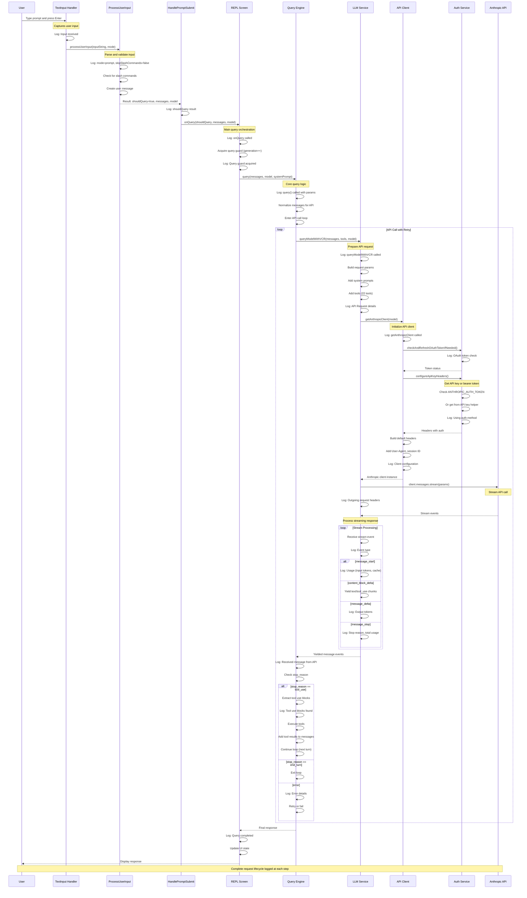

# Request Lifecycle Sequence Diagram

This diagram shows the complete flow of a user query through Claude Code's internal systems.

## Complete Request Flow



**📊 [View Authentication Flow Diagrams](authentication-flow.md)** - Detailed sequence diagrams for all 6 authentication methods (OAuth, API Key, Bearer Token, AWS Bedrock, GCP Vertex AI, Azure Foundry).

---

## Key Components Explained

### 1. **Input Layer**
- `TextInput Handler`: Captures raw user input
- Logs the input string for debugging

### 2. **Processing Layer**
- `ProcessUserInput`: Parses commands, validates input
- Creates structured messages for the API
- Logs: input mode, command detection, message creation

### 3. **Query Orchestration (REPL)**
- `REPL Screen`: Main coordinator
- Manages query state (guard, generation)
- Logs: query start, state changes, completion

### 4. **Query Engine**
- `Query`: Core request/response loop
- Handles tool execution cycle
- Logs: API call attempts, messages received, stop reasons

### 5. **LLM Service**
- `LLM Service`: Prepares API requests
- Formats parameters, adds tools
- Logs: request details, response events, streaming

### 6. **API Client**
- `API Client`: Manages HTTP client
- Handles authentication
- Logs: client creation, auth method, headers

### 7. **Authentication**
- `Auth Service`: Token management
- OAuth refresh, API key retrieval
- Logs: auth method used, token status

### 8. **External API**
- `Anthropic API`: External LLM service
- Streams responses back
- Logged via request/response capture

## Log Components and Their Roles

| Component | Log Prefix | Purpose |
|-----------|------------|---------|
| Input Handler | `INPUT` | User input capture |
| ProcessUserInput | `PROCESS_INPUT` | Input parsing and validation |
| HandlePromptSubmit | `PROMPT` | Prompt submission handling |
| REPL Screen | `REPL` | Query orchestration |
| Query Engine | `QUERY` | Request/response loop |
| LLM Service | `LLM` | API request preparation |
| API Client | `CLIENT` | HTTP client management |
| Auth Service | `AUTH` | Authentication |
| Fetch Layer | `FETCH` | HTTP request/response |

## Example Log Flow

For a simple query like "explain this code", you'll see logs in this order:

```
[INPUT] Input received: explain this code
[PROCESS_INPUT] processUserInput called - mode: prompt
[PROCESS_INPUT] Created user message
[PROMPT] handlePromptSubmit called
[PROMPT] shouldQuery=true, messages.length=1
[REPL] onQuery called - shouldQuery: true
[REPL] Query guard acquired, generation: 1
[QUERY] query() called - messages.length: 1
[QUERY] Entering API call loop
[QUERY] Starting API call iteration - turnCount: 1
[LLM] queryModelWithVCR called - tools.length: 22
[CLIENT] getAnthropicClient called
[AUTH] OAuth token check starting
[AUTH] Using ANTHROPIC_AUTH_TOKEN
[CLIENT] Creating client with auth headers
[LLM] API Request - model: claude-sonnet-4.5, max_tokens: 32000
[LLM] Streaming started
[LLM] message_start - input_tokens: 1500
[LLM] content_block_delta - text chunk received
[LLM] message_delta - output_tokens: 250
[LLM] message_stop - stop_reason: end_turn
[QUERY] Query completed successfully
[REPL] Updating UI with response
```

## Viewing the Flow in Your Logs

To see this flow in action:

```bash
# Run a query
echo "explain how authentication works" | ./bin/claude-code-insideout -p

# View the logs
tail -f ~/.claude/logs/debug.log

# Or filter by component
grep "\[QUERY\]" ~/.claude/logs/debug.log
grep "\[AUTH\]" ~/.claude/logs/debug.log
```

## Understanding Tool Use Cycles

When Claude needs to use tools, the flow loops:

```
1. Initial query → Claude responds with tool_use
2. Log: "stop_reason: tool_use"
3. Execute tools (Read, Edit, Bash, etc.)
4. Add tool results to messages
5. Send messages back to API (turnCount: 2)
6. Claude processes results → responds
7. Repeat until stop_reason: end_turn
```

Each iteration is logged, showing:
- Turn count
- Tools being called
- Tool execution results
- Next request preparation
