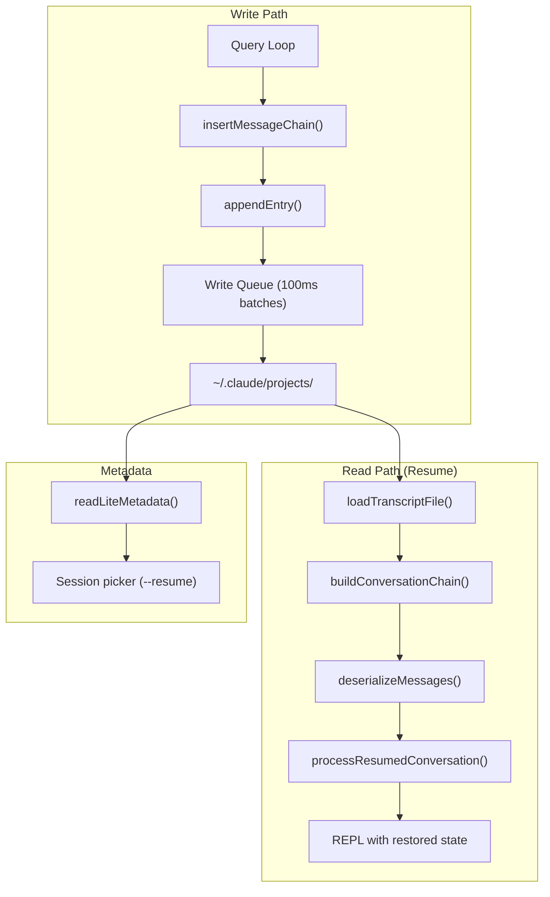
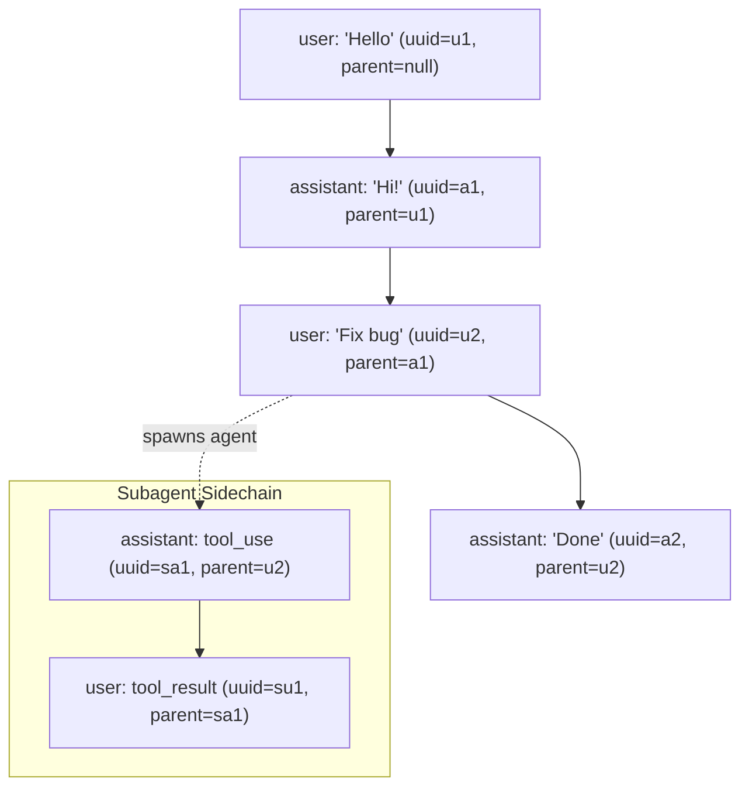
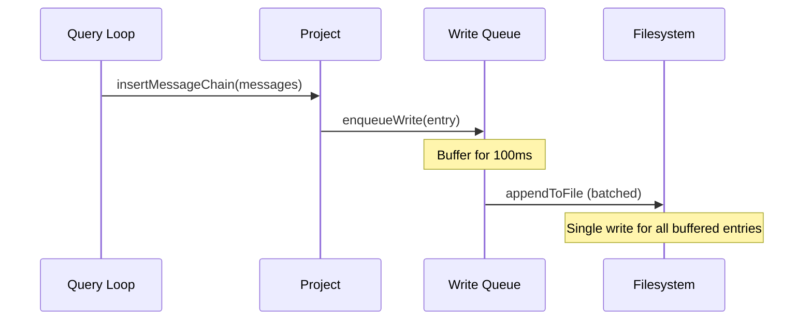
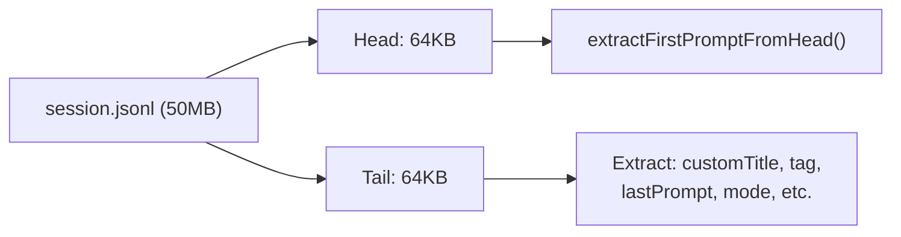
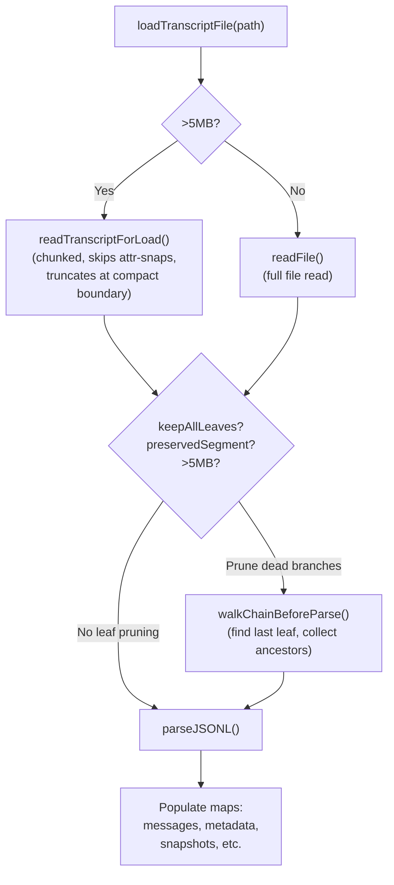
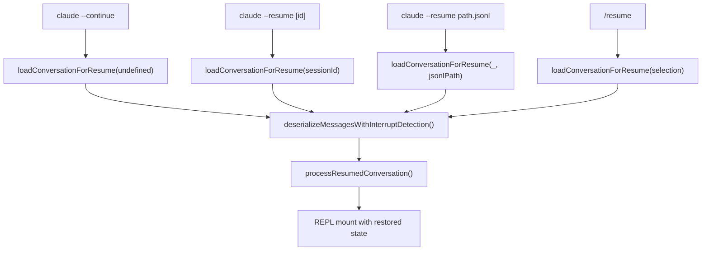
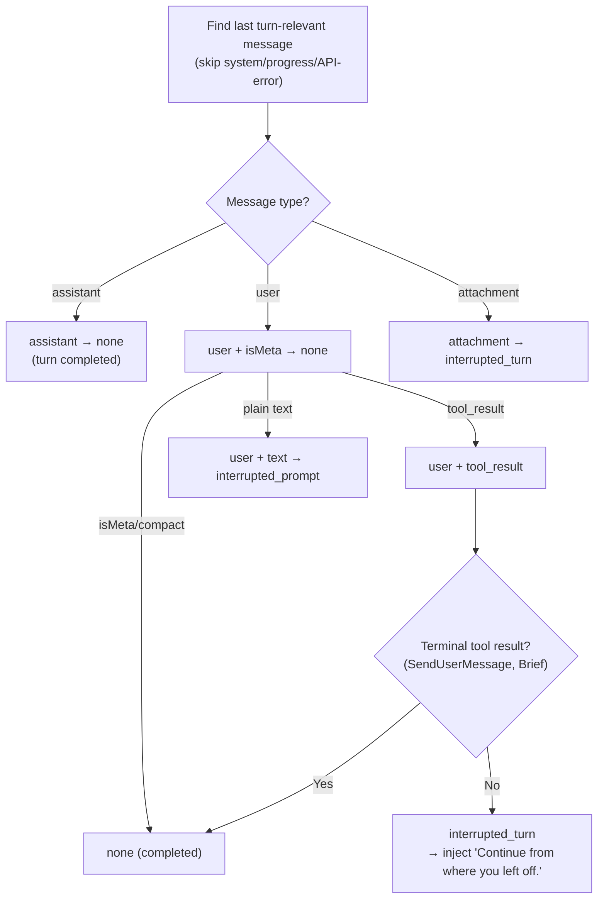

# Session Persistence & Resume

How Claude Code stores conversations to disk as JSONL transcripts, manages the parentUuid chain for conversation branching, handles subagent transcript storage, and reconstructs full session state on resume — including messages, file history, attribution, context collapse, worktrees, and skills.

---

## Table of Contents

1. [Architecture Overview](#architecture-overview)
2. [JSONL Transcript Format](#jsonl-transcript-format)
3. [Entry Types](#entry-types)
4. [The ParentUuid Chain](#the-parentuuid-chain)
5. [Write Pipeline](#write-pipeline)
6. [File Layout on Disk](#file-layout-on-disk)
7. [Subagent Transcripts](#subagent-transcripts)
8. [Lite Metadata Reads](#lite-metadata-reads)
9. [Loading Transcripts](#loading-transcripts)
10. [Compact Boundary Handling](#compact-boundary-handling)
11. [Session Resume Flow](#session-resume-flow)
12. [State Reconstruction](#state-reconstruction)
13. [Turn Interruption Detection](#turn-interruption-detection)
14. [Cross-Directory & Worktree Resume](#cross-directory--worktree-resume)
15. [Conversation Recovery](#conversation-recovery)
16. [Key Source Files](#key-source-files)

---

## Architecture Overview



---

## JSONL Transcript Format

Each session is stored as a single JSONL (JSON Lines) file where every line is a self-contained JSON object. Messages and metadata are interleaved in append order:

```jsonl
{"type":"mode","mode":"normal","sessionId":"abc-123"}
{"type":"agent-setting","agentSetting":"default","sessionId":"abc-123"}
{"type":"user","uuid":"u1","parentUuid":null,"message":{"role":"user","content":"Hello"},"sessionId":"abc-123","cwd":"/project","version":"1.0.0","timestamp":"..."}
{"type":"assistant","uuid":"a1","parentUuid":"u1","message":{"role":"assistant","content":[{"type":"text","text":"Hi!"}]},"sessionId":"abc-123","timestamp":"..."}
{"type":"file-history-snapshot","messageId":"a1","snapshot":{...}}
{"type":"user","uuid":"u2","parentUuid":"a1","message":{"role":"user","content":"Fix the bug"},...}
{"type":"custom-title","customTitle":"Bug fix session","sessionId":"abc-123"}
{"type":"last-prompt","lastPrompt":"Fix the bug","sessionId":"abc-123"}
```

### Key Properties of JSONL

- **Append-only**: Entries are only appended, never modified in-place (except `removeMessageByUuid` tombstoning)
- **Self-describing**: Each line has a `type` field identifying its entry kind
- **Session-stamped**: Messages carry `sessionId`, `cwd`, `version`, `gitBranch`
- **Interleaved**: Messages and metadata share the same file, ordered by write time
- **Compaction-safe**: Compact boundaries can appear mid-file; readers skip everything before the last boundary

---

## Entry Types

### Transcript Messages (participate in conversation chain)

| Type | Description |
|------|-------------|
| `user` | User message with content, tool_results, etc. |
| `assistant` | Assistant response with text, tool_use blocks, thinking |
| `system` | System messages (compact boundaries, notifications) |
| `attachment` | File/directory/skill attachments provided as context |

Each transcript message includes:

```typescript
interface TranscriptMessage {
  type: 'user' | 'assistant' | 'system' | 'attachment'
  uuid: UUID                    // Unique ID for this message
  parentUuid: UUID | null       // Links to parent in conversation tree
  logicalParentUuid?: UUID      // Pre-compaction parent (for compact boundaries)
  isSidechain: boolean          // Subagent conversation, not main thread
  agentId?: string              // Subagent identifier
  sessionId: string             // Session this belongs to
  cwd: string                   // Working directory at write time
  version: string               // Claude Code version
  gitBranch?: string            // Git branch at write time
  timestamp: string             // ISO timestamp
  userType: string              // 'ant' | 'external'
  message: { role: string; content: ... }
}
```

### Metadata Entries (session-scoped, not in chain)

| Type | Description |
|------|-------------|
| `custom-title` | User-assigned session name |
| `tag` | Session tag for organization |
| `last-prompt` | Last meaningful user prompt (for session picker display) |
| `agent-name` | Standalone agent name |
| `agent-color` | Agent color theme |
| `agent-setting` | Agent configuration |
| `mode` | `coordinator` or `normal` mode |
| `worktree-state` | Worktree session info (path, original cwd) |
| `pr-link` | Associated PR number, URL, repository |
| `summary` | LLM-generated session summary |

### Snapshot Entries (state snapshots for resume)

| Type | Description |
|------|-------------|
| `file-history-snapshot` | File change history keyed by message UUID |
| `attribution-snapshot` | Attribution state (who changed what) |
| `content-replacement` | Content replacement records for large tool results |
| `context-collapse-commit` | Context collapse operation log |
| `context-collapse-snapshot` | Context collapse staged state |

### Queue Operations

| Type | Description |
|------|-------------|
| `queue-operation` | Queued prompt operations (for prompt queue feature) |

---

## The ParentUuid Chain

Conversations form a tree structure via `parentUuid` links:



### Chain Walking

`buildConversationChain()` reconstructs a linear conversation from the tree:

1. Find the **leaf** message (newest non-sidechain message with no children pointing to it)
2. Walk backward via `parentUuid` links
3. Reverse to get chronological order
4. Run `recoverOrphanedParallelToolResults()` to recover sibling messages from parallel tool execution

### Parallel Tool Recovery

When the assistant uses parallel tools, streaming emits one message per `content_block_stop`. Each tool_use gets its own assistant message UUID, and each tool_result points to a different assistant. The chain walker follows only one branch — `recoverOrphanedParallelToolResults()` finds and re-inserts the missing siblings:

```
Parent → AssistantA (tool_use_1) → ToolResult_1
      ↘ AssistantB (tool_use_2) → ToolResult_2  ← orphaned by linear walk
```

### Compact Boundaries

When compaction occurs, a `system` message with `subtype: 'compact_boundary'` is written. Its `parentUuid` is set to `null` (breaking the chain), but `logicalParentUuid` preserves the pre-compaction link for debugging.

---

## Write Pipeline

### Buffered Async Writes

The `Project` class manages all writes through a batched queue:



Key design decisions:

- **100ms flush interval** (`FLUSH_INTERVAL_MS`): Batches multiple entries into one disk write
- **100MB chunk limit** (`MAX_CHUNK_BYTES`): Flushes mid-batch if accumulated data is too large
- **Lazy materialization**: Session file isn't created until the first user/assistant message — prevents metadata-only empty files
- **Pending entries buffer**: Metadata written before first message is buffered in `pendingEntries[]`, flushed when `materializeSessionFile()` runs

### Write Tracking

`trackWrite()` wraps write operations with a pending counter. `flush()` awaits all pending writes, used during cleanup to ensure no data loss on exit.

### Session Metadata Re-Append

`reAppendSessionMetadata()` re-writes all metadata entries at the end of the file. This ensures metadata stays within the **tail window** (last 64KB) that `readLiteMetadata()` reads. Called:

- **During compaction**: Before the boundary marker, so metadata survives in the pre-boundary scan
- **On session exit**: At EOF, ensuring the session picker can find title/tag without scanning the whole file

The function refreshes SDK-mutable fields (title, tag) from the tail before re-appending, preventing stale CLI values from overwriting fresher SDK-written values.

---

## File Layout on Disk

```
~/.claude/
├── projects/
│   └── -Users-jingfengli-my-project/          # sanitizePath(cwd)
│       ├── abc-123-def-456.jsonl               # Main session transcript
│       ├── abc-123-def-456/                    # Session subdirectory
│       │   ├── subagents/
│       │   │   ├── agent-agent1.jsonl          # Subagent transcript
│       │   │   └── agent-agent1.meta.json      # Subagent metadata
│       │   └── remote-agents/
│       │       └── task-xyz.meta.json          # Remote agent metadata
│       ├── ghi-789-jkl-012.jsonl               # Another session
│       └── ...
└── .claude.json                                # Config + GrowthBook cache
```

### Path Sanitization

`sanitizePath()` converts directory paths to safe filesystem names:

- All non-alphanumeric characters → hyphens
- `/Users/jingfengli/my-project` → `-Users-jingfengli-my-project`
- Paths >200 chars get truncated with a hash suffix for uniqueness
- Bun uses `Bun.hash()`, Node.js uses `djb2Hash()` — `findProjectDir()` handles cross-runtime hash mismatches via prefix scanning

### Session File Lifecycle

1. **Create**: Deferred until first user/assistant message (`materializeSessionFile()`)
2. **Append**: Entries added via `appendEntry()` → write queue
3. **Re-append metadata**: On compaction and exit
4. **Tombstone**: `removeMessageByUuid()` splices out failed streaming messages
5. **Cleanup**: Old sessions cleaned up based on `cleanupPeriodDays` setting

---

## Subagent Transcripts

Subagent conversations are stored separately from the main thread:

```typescript
function getAgentTranscriptPath(sessionId: string, agentId: string): string {
  return `<projectDir>/<sessionId>/subagents/agent-<agentId>.jsonl`
}
```

### Metadata Sidecar Files

Each subagent has a `.meta.json` file:

```json
{
  "agentType": "general-purpose",
  "worktreePath": "/tmp/worktree-abc",
  "description": "Research API patterns"
}
```

### Remote Agent Metadata

For Claude Code Remote (CCR) agents, metadata is stored in `remote-agents/`:

```typescript
interface RemoteAgentMetadata {
  taskId: string
  sessionId: string
  status: string
  // ... additional CCR-specific fields
}
```

`listRemoteAgentMetadata()` scans this directory to reconnect to still-running remote sessions on resume.

---

## Lite Metadata Reads

For the session picker (`--resume`), reading full transcripts would be too slow. Instead, `readLiteMetadata()` reads only the **first and last 64KB** of each file:



| Source | Extracted Fields |
|--------|-----------------|
| **Head (64KB)** | First meaningful user prompt, session ID |
| **Tail (64KB)** | Custom title, tag, last prompt, agent name/color/setting, mode, worktree state, PR link |

This enables listing hundreds of sessions in milliseconds without loading multi-megabyte transcripts.

### First Prompt Extraction

`extractFirstPromptFromHead()` skips:
- Tool result messages
- `isMeta` messages
- `isCompactSummary` messages
- Slash command messages (remembered as fallback)
- Auto-generated patterns (session hooks, IDE metadata, XML tags)
- Truncates to 200 chars

---

## Loading Transcripts

### Full Load Pipeline



### Pre-Compact Skip Optimization

For files >5MB (`SKIP_PRECOMPACT_THRESHOLD`), `readTranscriptForLoad()` performs a single forward chunked read that:

1. **Skips attribution-snapshot lines** at the fd level (never buffered — saves ~84% for large sessions)
2. **Truncates at compact boundaries** — resets the output buffer when a boundary is found
3. **Preserves the last attr-snap** — reordered to EOF for `restoreAttributionStateFromSnapshots()`
4. Returns `postBoundaryBuf` (only post-boundary content) + `boundaryStartOffset`

If `boundaryStartOffset > 0`, `scanPreBoundaryMetadata()` does a cheap byte-level scan of the pre-boundary bytes to recover session-scoped metadata (title, tag, mode, agent settings).

### Chain Walking Before Parse

`walkChainBeforeParse()` is a byte-level optimization for >5MB post-boundary buffers: it finds the last leaf UUID, then collects only ancestor lines by following `parentUuid` references — skipping dead fork branches without ever JSON-parsing them.

---

## Compact Boundary Handling

When context compaction occurs, a compact boundary is inserted:

```jsonl
{"type":"system","subtype":"compact_boundary","uuid":"...","parentUuid":null,"logicalParentUuid":"prev-uuid","compactMetadata":{"preservedSegment":false},...}
```

On load:
1. Everything before the **last** compact boundary is discarded (unless `preservedSegment: true`)
2. Metadata entries from the pre-boundary range are recovered via `scanPreBoundaryMetadata()`
3. `contextCollapseCommits` array is cleared at each boundary — only post-boundary commits matter
4. `preservedSegment` boundaries keep pre-boundary messages intact (for context collapse's surgical preservation)

---

## Session Resume Flow

### Entry Points



### `--continue` vs `--resume`

| Flag | Behavior |
|------|----------|
| `--continue` | Loads the most recent session, skips live `--bg`/daemon sessions |
| `--resume` | Opens session picker or loads specific session ID |
| `--resume <id>` | Loads a specific session by UUID |
| `--resume <path.jsonl>` | Loads from arbitrary JSONL file path |
| `--fork-session` | Creates a new session ID but copies messages from the source |

### loadConversationForResume()

Central function handling all resume paths:

1. **Resolve source**: Most recent session, specific ID, or JSONL path
2. **Load full log**: If lite (metadata-only), calls `loadFullLog()` to parse full transcript
3. **Copy file history**: `copyFileHistoryForResume(log)` preserves undo state
4. **Copy plans**: `copyPlanForResume(log, sessionId)` preserves plan files
5. **Restore skills**: `restoreSkillStateFromMessages()` re-populates `STATE.invokedSkills`
6. **Deserialize**: `deserializeMessagesWithInterruptDetection()` filters and normalizes
7. **Run hooks**: `processSessionStartHooks('resume', { sessionId })` fires resume hooks
8. Return messages + all state snapshots + metadata

### processResumedConversation()

Called after loading, handles:

1. **Coordinator mode matching**: Ensures current mode matches resumed session's mode
2. **Session ID switching**: `switchSession()` to reuse the resumed session's ID
3. **Recording rename**: Asciicast recording renamed to match session
4. **Cost state restoration**: `restoreCostStateForSession()` for billing continuity
5. **Content replacement seeding**: Fork sessions seed replacement records to prevent cache misses
6. **Session metadata restoration**: Title, tag, agent settings, worktree state
7. **Worktree restoration**: `restoreWorktreeForResume()` cd's back into the worktree
8. **Context collapse restoration**: Replays commit log + snapshot
9. **Agent restoration**: `restoreAgentFromSession()` re-applies agent type and model override

---

## State Reconstruction

On resume, these state components are reconstructed:

### Messages

Chain-walked and deserialized via `deserializeMessages()`:
- Filter unresolved tool uses (incomplete streaming)
- Filter orphaned thinking-only messages
- Filter whitespace-only assistant messages
- Migrate legacy attachment types (`new_file` → `file`, `new_directory` → `directory`)
- Strip invalid `permissionMode` values
- Append synthetic sentinel if conversation ends with user message

### File History

`FileHistorySnapshot` entries are keyed by message UUID. On resume, `copyFileHistoryForResume()` copies snapshots so undo operations work correctly.

### Attribution

`AttributionSnapshotMessage` entries track which tool/agent changed which files. Snapshots are attached to the chain — `buildAttributionSnapshotChain()` collects only snapshots for messages in the resumed chain.

### Context Collapse

Two entry types:
- `context-collapse-commit`: Individual collapse operations in commit order
- `context-collapse-snapshot`: Staged collapse state

`restoreFromEntries()` replays the commit log to restore the collapse state.

### Content Replacements

`ContentReplacementRecord` entries map `tool_use_id` → replacement content for large tool results that were replaced with summaries. Keyed by `sessionId` to handle fork sessions correctly.

### Worktree

`PersistedWorktreeSession` stores the worktree path and original cwd. `restoreWorktreeForResume()`:
1. Checks if the worktree directory still exists
2. `chdir()` into the worktree
3. Updates `setCwd()` and `setOriginalCwd()`
4. Restores the worktree session state
5. Clears stale caches (memory files, system prompt, plans directory)

### Skills

`restoreSkillStateFromMessages()` scans for `invoked_skills` attachment messages and re-populates `STATE.invokedSkills`, ensuring skills survive compaction + resume cycles. Also calls `suppressNextSkillListing()` to prevent re-announcing already-listed skills.

### Todos

`extractTodosFromTranscript()` scans for the last `TodoWrite` tool_use block in the transcript and restores the todo list state.

---

## Turn Interruption Detection

When resuming, the system detects whether the previous session was interrupted:



Three outcomes:
- **`none`**: Turn completed normally
- **`interrupted_prompt`**: User sent a prompt but assistant never responded — `message` field contains the pending prompt
- **`interrupted_turn`**: Assistant was mid-tool-execution — a synthetic "Continue from where you left off." message is injected

---

## Cross-Directory & Worktree Resume

### Worktree-Aware Session Discovery

When resuming by session ID, `resolveSessionFilePath()` searches:

1. Exact project directory match (canonicalized path)
2. `findProjectDir()` fallback for hash mismatches (Bun vs Node)
3. Sibling git worktrees via `getWorktreePathsPortable()`

This enables resuming a session started in one worktree from another.

### Cross-Directory Resume

`--resume path.jsonl` loads from an arbitrary path:
- `loadMessagesFromJsonlPath()` parses the JSONL and chain-walks
- `transcriptPath` is passed through to `processResumedConversation()` so the project dir is derived from the file location

### Worktree Exit on Re-Resume

`exitRestoredWorktree()` undoes a previous worktree restoration before switching to a different session via `/resume`. Without this, the user would be stuck in the old worktree's directory.

---

## Conversation Recovery

`conversationRecovery.ts` handles the full deserialization pipeline for resume:

### Message Filtering

Applied in order:
1. `migrateLegacyAttachmentTypes()` — backfills `displayPath`, converts `new_file` → `file`
2. `filterUnresolvedToolUses()` — removes assistant messages with tool_uses that have no matching tool_result
3. `filterOrphanedThinkingOnlyMessages()` — removes assistant messages containing only thinking blocks
4. `filterWhitespaceOnlyAssistantMessages()` — removes assistant messages with only whitespace text
5. Strip invalid `permissionMode` values

### Terminal Tool Result Detection

`isTerminalToolResult()` prevents false interruption detection for tools that legitimately end a turn without an assistant follow-up (e.g., `SendUserMessage` in brief mode, `SendUserFile`).

### Synthetic Sentinel

After filtering, if the last relevant message is from the user, a synthetic assistant message with `NO_RESPONSE_REQUESTED` content is appended. This ensures the conversation is API-valid (alternating user/assistant) without triggering a response.

---

## Key Source Files

| File | Purpose |
|------|---------|
| `src/utils/sessionStorage.ts` | Core transcript persistence — `Project` class, write queue, `loadTranscriptFile()`, `buildConversationChain()`, `loadMessageLogs()` |
| `src/utils/sessionStoragePortable.ts` | Pure Node.js session utilities — path sanitization, `readHeadAndTail()`, `readTranscriptForLoad()`, first-prompt extraction |
| `src/utils/sessionRestore.ts` | Session resume orchestration — `processResumedConversation()`, `restoreWorktreeForResume()`, `restoreAgentFromSession()` |
| `src/utils/conversationRecovery.ts` | Message deserialization — `loadConversationForResume()`, `deserializeMessages()`, interruption detection, skill restoration |
| `src/types/logs.ts` | Type definitions — `TranscriptMessage`, `LogOption`, `PersistedWorktreeSession`, entry types |
| `src/utils/fileHistory.ts` | File history snapshots — `copyFileHistoryForResume()` |
| `src/utils/toolResultStorage.ts` | Content replacement records — `ContentReplacementRecord` type |
| `src/services/contextCollapse/persist.ts` | Context collapse state restoration — `restoreFromEntries()` |
| `src/utils/messages.ts` | Message utilities — `filterUnresolvedToolUses()`, `normalizeMessages()` |
| `src/screens/REPL.tsx` | REPL integration — mounts with restored state from `processResumedConversation()` |
| `src/main.tsx` | CLI entry — `--continue` / `--resume` flag handling |
