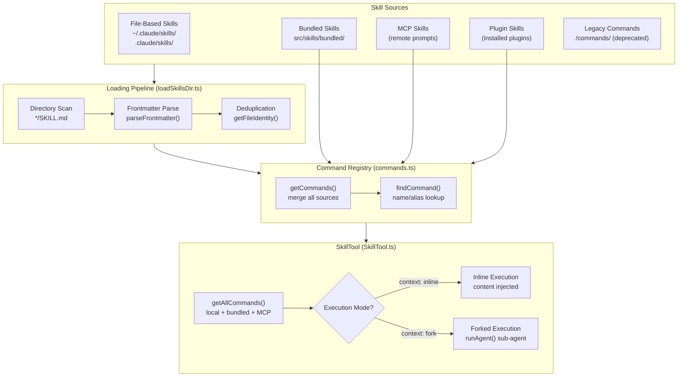
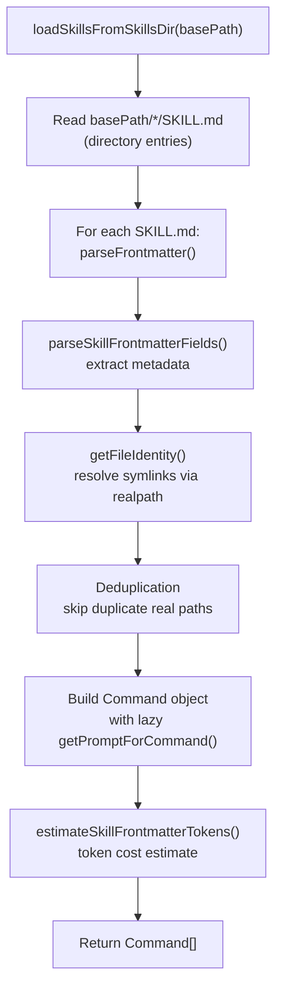
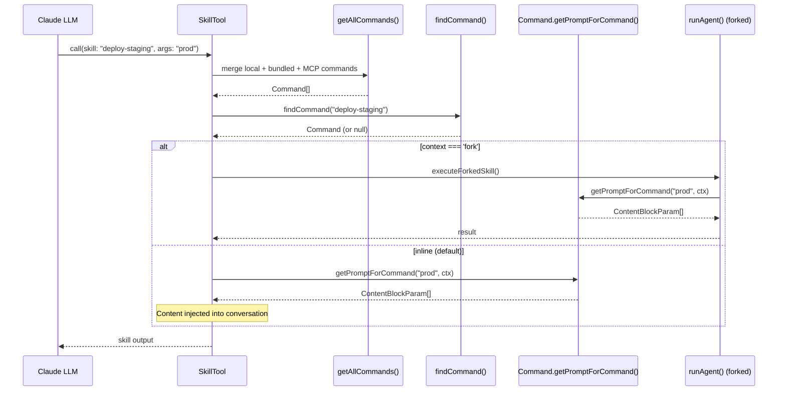
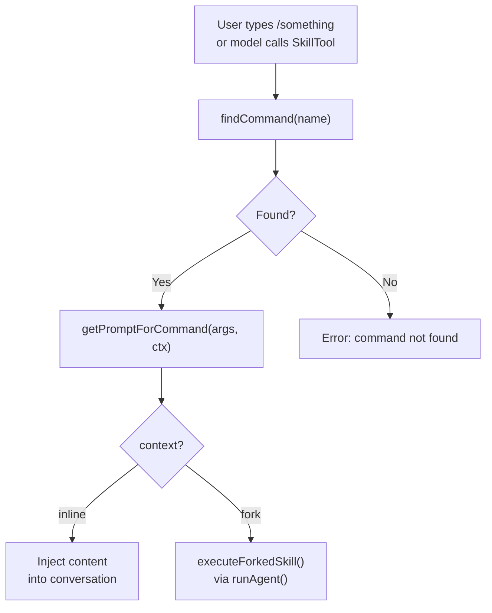
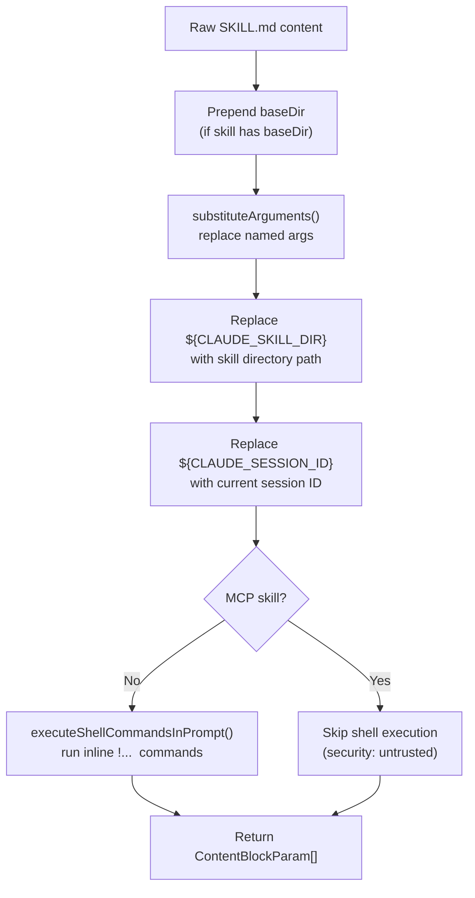
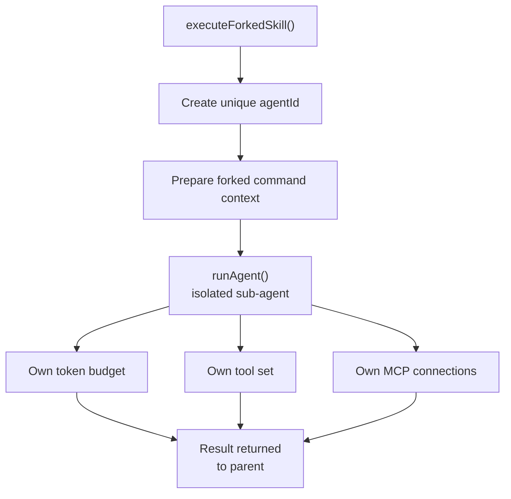
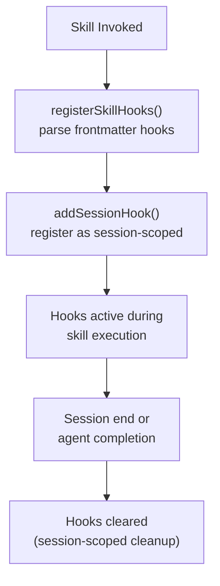
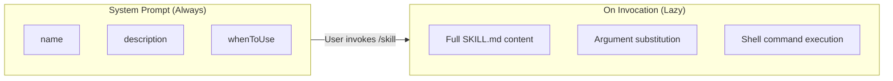
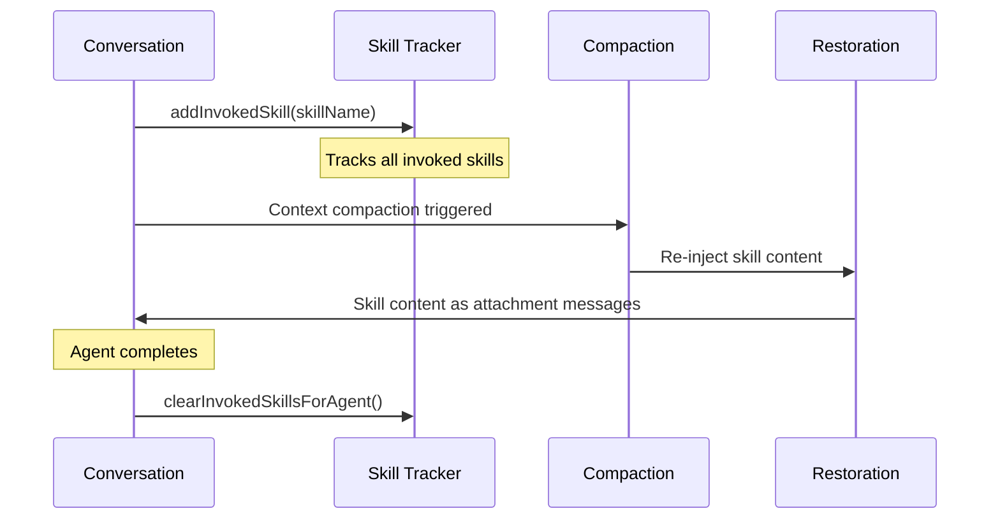
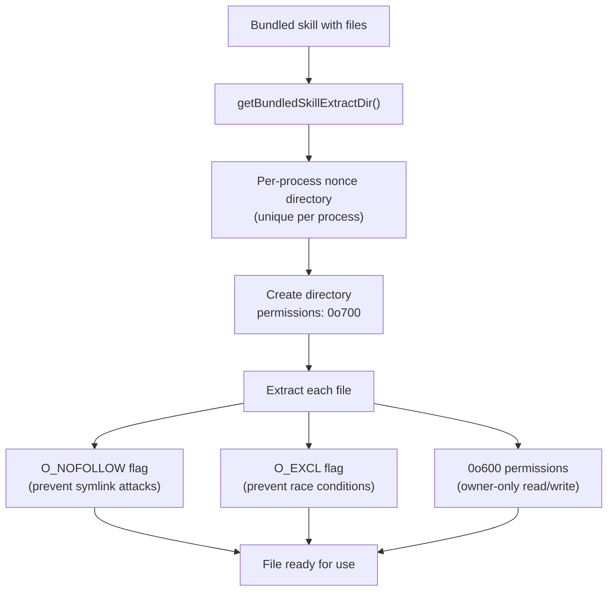

# Skills & Commands System

Deep dive into how Claude Code's skills and commands system works — from skill definition and loading through invocation, argument substitution, hook integration, and the full discovery-to-execution lifecycle.

---

## Table of Contents

1. [Architecture Overview](#architecture-overview)
2. [Skill Types & Sources](#skill-types--sources)
3. [The Command Type](#the-command-type)
4. [Skill Loading Pipeline](#skill-loading-pipeline)
5. [Frontmatter & Configuration](#frontmatter--configuration)
6. [Skill Invocation via SkillTool](#skill-invocation-via-skilltool)
7. [Slash Command Resolution](#slash-command-resolution)
8. [Content Preparation & Argument Substitution](#content-preparation--argument-substitution)
9. [Execution Modes: Inline vs Forked](#execution-modes-inline-vs-forked)
10. [Skills & Hooks Integration](#skills--hooks-integration)
11. [Skill Discovery & Relevance](#skill-discovery--relevance)
12. [Post-Compaction Skill Restoration](#post-compaction-skill-restoration)
13. [Bundled Skill Security](#bundled-skill-security)
14. [Key Source Files](#key-source-files)

---

## Architecture Overview



---

## Skill Types & Sources

Skills are the primary extensibility mechanism in Claude Code. They come in several flavors, distinguished by their `LoadedFrom` type:

```typescript
type LoadedFrom = 'commands_DEPRECATED' | 'skills' | 'plugin' | 'managed' | 'bundled' | 'mcp'
```

### 1. File-Based Skills (`loadedFrom: 'skills'`)

File-based skills are stored as `SKILL.md` files inside named directories. They are loaded from three scope levels:

| Scope | Path | Purpose |
|-------|------|---------|
| User settings | `~/.claude/skills/*/SKILL.md` | Personal skills, shared across all projects |
| Project settings | `.claude/skills/*/SKILL.md` | Project-specific skills, committed to repo |
| Policy/Managed | `/.claude/skills/*/SKILL.md` | Organization-managed skills |

Discovery is performed by `getSkillsPath()` which resolves the base directory for each scope.

### 2. Bundled Skills (`loadedFrom: 'bundled'`)

Skills that ship with the CLI binary. Registered via `registerBundledSkill(definition)` at module initialization and stored in an internal `bundledSkills: Command[]` array.

Known bundled skills (from `src/skills/bundled/`):

| Skill | Purpose |
|-------|---------|
| `batch` | Batch operations |
| `claudeApi` | Claude API interaction |
| `claudeInChrome` | Chrome extension integration |
| `debug` | Debugging assistance |
| `keybindings` | Keybinding reference |
| `loop` | Loop/iteration patterns |
| `loremIpsum` | Placeholder text generation |
| `remember` | Memory management |
| `scheduleRemoteAgents` | Remote agent scheduling |
| `simplify` | Code simplification |
| `skillify` | Skill creation helper |
| `stuck` | Troubleshooting when stuck |
| `updateConfig` | Configuration updates |
| `verify` | Verification workflows |

### 3. MCP Skills (`loadedFrom: 'mcp'`)

Skills loaded from MCP servers via their prompts endpoint. Created by `getMCPSkillBuilders()` which returns builders that construct skill commands from MCP prompt definitions.

**Security constraint:** MCP skills are treated as remote/untrusted. Inline shell commands (`` `!`...` ``) embedded in their markdown body are **not** executed.

### 4. Plugin Skills (`loadedFrom: 'plugin'`)

Skills provided by installed plugins. They carry additional metadata:
- `pluginRoot` — filesystem path to the plugin
- `pluginId` — unique plugin identifier

These are used for variable substitution (e.g., `${CLAUDE_SKILL_DIR}` resolves relative to the plugin root).

### 5. Legacy Commands (`loadedFrom: 'commands_DEPRECATED'`)

The original `/commands/` directory format — still supported but deprecated in favor of `/skills/`.

---

## The Command Type

All skills resolve to `Command` objects (specifically `PromptCommand`). This is the unified representation regardless of source:

```typescript
type Command = {
  type: 'prompt'
  name: string
  description: string
  hasUserSpecifiedDescription: boolean
  allowedTools: string[]
  argumentHint?: string
  argNames?: string[]
  whenToUse?: string
  version?: string
  model?: string              // model override ('inherit' or specific model ID)
  disableModelInvocation: boolean
  userInvocable: boolean
  contentLength: number
  source: string              // 'bundled' | setting source identifier
  loadedFrom: LoadedFrom
  hooks?: HooksSettings       // skill-specific hooks from frontmatter
  skillRoot?: string          // directory containing the skill
  context?: 'inline' | 'fork' // execution context
  agent?: string              // agent definition name for forked execution
  effort?: EffortValue
  paths?: string[]            // path patterns for relevance filtering
  isHidden: boolean
  isEnabled?: () => boolean
  getPromptForCommand(args: string, context: ToolUseContext): Promise<ContentBlockParam[]>
}
```

Key design notes:
- `getPromptForCommand()` is lazy — full content is only loaded on invocation
- `contentLength` is estimated from frontmatter for token budgeting
- `allowedTools` restricts which tools are available during skill execution
- `context: 'fork'` triggers isolated sub-agent execution

---

## Skill Loading Pipeline



### File Discovery

`loadSkillsFromSkillsDir()` (~1000 lines) orchestrates the full pipeline:

1. Reads `basePath/*/SKILL.md` — only the directory format is supported in `/skills/`
2. For each directory entry, parses `SKILL.md` frontmatter and content
3. Deduplicates via `getFileIdentity()` which resolves symlinks using `realpath`
4. Returns an array of `Command` objects with lazy content loading

### Description Extraction

If no `description` is provided in frontmatter, it is extracted from the markdown body's first paragraph — providing a natural fallback for simpler skill definitions.

---

## Frontmatter & Configuration

Skills use YAML frontmatter (parsed via `parseFrontmatter()` from `utils/frontmatterParser.ts`) to declare metadata and behavior.

### Supported Frontmatter Fields

| Field | Type | Default | Purpose |
|-------|------|---------|---------|
| `name` | `string` | directory name | Display name |
| `description` | `string` | first paragraph | Short description |
| `user-invocable` | `boolean` | `true` | Whether user/model can invoke directly |
| `model` | `string` | (none) | Model override (`'inherit'` or model ID) |
| `effort` | `EffortValue` | (none) | Effort level override |
| `allowed-tools` | `string[]` | (all) | Tool whitelist during execution |
| `argument-hint` | `string` | (none) | Hint for argument format |
| `arguments` | `string[]` | (none) | Named argument list |
| `when_to_use` | `string` | (none) | Guidance for model on when to invoke |
| `hooks` | `HooksSettings` | (none) | Skill-specific hooks (validated against HooksSchema) |
| `context` | `'inline' \| 'fork'` | `'inline'` | Execution context |
| `agent` | `string` | (none) | Agent definition for forked execution |
| `paths` | `string[]` | (none) | Path patterns for relevance filtering |
| `shell` | `object` | (none) | Shell configuration for embedded commands |

### Example Skill with Full Frontmatter

```yaml
---
name: deploy-staging
description: Deploy the current branch to staging environment
user-invocable: true
model: inherit
allowed-tools:
  - Bash
  - FileRead
argument-hint: "<environment>"
arguments:
  - environment
when_to_use: When the user wants to deploy code to a staging environment
context: fork
paths:
  - deploy/**
  - .github/workflows/**
hooks:
  Stop:
    - hooks:
        - type: command
          command: "notify-deploy.sh $ARGUMENTS"
---

# Deploy to Staging

Deploy the current branch to the ${environment} staging environment...
```

---

## Skill Invocation via SkillTool

The `SkillTool` is the LLM-facing tool that enables skill invocation. It handles command discovery, resolution, and execution routing.



### Command Discovery — `getAllCommands()`

Merges skills from all sources:

1. **Local/bundled commands** via `getCommands(projectRoot)` — file-based + bundled + legacy
2. **MCP skills** from AppState (`context.getAppState().mcp.commands`)
3. **Deduplication** via `uniqBy` on name — first occurrence wins

---

## Slash Command Resolution

### Command Types

Users interact with skills through slash commands:

| Type | Example | Resolution |
|------|---------|-----------|
| Built-in commands | `/help`, `/clear`, `/model`, `/compact` | Hardcoded in CLI, not skills |
| Skill commands | `/deploy-staging`, `/remember` | Resolved via `findCommand()` |
| MCP prompts | `mcp__server__prompt` format | Resolved from MCP skill registry |

### Resolution Flow



`findCommand()` searches by both name and aliases, enabling backward-compatible renaming of skills.

---

## Content Preparation & Argument Substitution

When a skill is invoked, `getPromptForCommand()` performs a multi-step content preparation pipeline:



### Variable Substitution

| Variable | Resolves To |
|----------|-------------|
| `${CLAUDE_SKILL_DIR}` | Filesystem path to the skill's directory |
| `${CLAUDE_SESSION_ID}` | Current session identifier |
| `$1`, `$2`, ... (positional) | Positional arguments from invocation |
| `${argumentName}` | Named arguments declared in frontmatter |

### Inline Shell Commands

Skills can embed shell commands that execute during content preparation:

```markdown
Current git status:
`!git status --short`

Branch info:
`!git branch --show-current`
```

These are processed by `executeShellCommandsInPrompt()` — the command output replaces the backtick expression in the final content. **This is disabled for MCP skills** to prevent untrusted remote code execution.

---

## Execution Modes: Inline vs Forked

### Inline Execution (Default)

The skill's content is injected directly into the current conversation context:
- Content becomes part of the assistant's working context
- Tools available are filtered by `allowedTools` if specified
- No isolation — shares the parent agent's state

### Forked Execution (`context: 'fork'`)

Skills with `context: 'fork'` run in an isolated sub-agent:



Key characteristics of forked execution:
- Creates a unique `agentId` for the sub-agent
- Runs with its own token budget (independent of parent)
- Can specify a custom `agent` definition for specialized behavior
- Cleanup is automatic on agent completion (MCP servers, session hooks, file state)

---

## Skills & Hooks Integration

Skills can define their own hooks via frontmatter, enabling event-driven behavior during skill execution:

```yaml
---
hooks:
  PreToolUse:
    - matcher: "Bash"
      hooks:
        - type: command
          command: "validate.sh $ARGUMENTS"
  Stop:
    - hooks:
        - type: agent
          prompt: "Verify the changes are correct"
---
```

### Hook Lifecycle



Skill hooks are:
- **Registered** via `registerSkillHooks()` which delegates to `registerFrontmatterHooks()`
- **Stored** as session hooks via `addSessionHook()`
- **Scoped** to the current session — cleared automatically on session end
- **Validated** against `HooksSchema` during frontmatter parsing

### Supported Hook Points

| Hook | Trigger |
|------|---------|
| `PreToolUse` | Before a tool executes (with optional `matcher` for tool name) |
| `PostToolUse` | After a tool executes |
| `Stop` | When the agent completes |

Hook types:
- `command` — executes a shell command
- `agent` — spawns a sub-agent with a prompt

---

## Skill Discovery & Relevance

### Path-Based Filtering

Skills can specify `paths` patterns in their frontmatter to limit when they appear:

```yaml
paths: src/frontend/**, *.tsx
```

The `ignore` library evaluates these patterns against the current working files. Skills with `paths` defined only appear in the system prompt when the user is working in matching directories — reducing noise and token usage.

### Token Budget Management

Skills use a two-tier loading strategy to manage token costs:



- **Frontmatter tokens** are estimated per skill via `estimateSkillFrontmatterTokens()` (name, description, whenToUse only)
- **Full content** is loaded only on invocation (lazy loading)
- Skills are listed in the system prompt by frontmatter metadata only

### Experimental Skill Search

Feature-gated behind `EXPERIMENTAL_SKILL_SEARCH`:
- Remote skill discovery via `remoteSkillLoader`
- Prefetch during turns via `startSkillDiscoveryPrefetch()`
- Gated by `isSkillSearchEnabled()` check
- Enables discovering skills from a central registry beyond local filesystem

---

## Post-Compaction Skill Restoration

When context is compacted (long conversations trimmed to fit token limits), previously invoked skills need to be restored so the model retains awareness of their content:



- `addInvokedSkill()` tracks which skills were invoked during the session
- After compaction, skill content is re-injected as attachment messages
- `clearInvokedSkillsForAgent()` cleans up tracking on agent completion

---

## Bundled Skill Security

Bundled skills can include reference `files` that are extracted to disk on first invocation. This extraction process has hardened security:

### `BundledSkillDefinition` Interface

```typescript
type BundledSkillDefinition = {
  name: string
  description: string
  aliases?: string[]
  whenToUse?: string
  argumentHint?: string
  allowedTools?: string[]
  model?: string
  disableModelInvocation?: boolean
  userInvocable?: boolean
  isEnabled?: () => boolean
  hooks?: HooksSettings
  context?: 'inline' | 'fork'
  agent?: string
  files?: Record<string, string>  // reference files extracted to disk
  getPromptForCommand: (args: string, context: ToolUseContext) => Promise<ContentBlockParam[]>
}
```

### File Extraction Security Model



Security measures:
- **Per-process nonce directory** — prevents symlink attacks across processes
- **`O_NOFOLLOW | O_EXCL` flags** on file creation — prevents following symlinks and ensures exclusive creation
- **`0o700` directory permissions** — only the owning user can access
- **`0o600` file permissions** — owner-only read/write
- **Memoized extraction** — promise-based, concurrent-safe (only extracts once per process)

---

## Key Source Files

| File | Purpose |
|------|---------|
| `src/skills/loadSkillsDir.ts` | Main skill loading pipeline (~1000 lines): directory scanning, frontmatter parsing, deduplication |
| `src/skills/bundledSkills.ts` | Bundled skill registry, file extraction with security hardening |
| `src/skills/mcpSkillBuilders.ts` | MCP skill builder registration |
| `src/skills/bundled/index.ts` | Bundled skill registration index |
| `src/skills/bundled/*.ts` | Individual bundled skill definitions (batch, debug, verify, etc.) |
| `src/tools/SkillTool/SkillTool.ts` | SkillTool implementation: command discovery, inline/forked execution |
| `src/tools/SkillTool/prompt.ts` | SkillTool prompt/schema definition for LLM |
| `src/tools/SkillTool/UI.tsx` | SkillTool UI rendering |
| `src/types/command.ts` | Command/PromptCommand type definitions |
| `src/commands.ts` | Command registry: `getCommands()`, `findCommand()` |
| `src/utils/frontmatterParser.ts` | YAML frontmatter parsing utility |
| `src/utils/argumentSubstitution.ts` | Argument substitution in skill content |
| `src/utils/promptShellExecution.ts` | Inline shell command execution in skill prompts |
| `src/utils/hooks/registerSkillHooks.ts` | Skill hook registration |
| `src/utils/hooks/registerFrontmatterHooks.ts` | Frontmatter hook registration from parsed YAML |
| `src/utils/skills/skillChangeDetector.ts` | Skill file change detection (hot reload) |
| `src/utils/suggestions/skillUsageTracking.ts` | Skill usage telemetry |
| `src/utils/telemetry/skillLoadedEvent.ts` | Skill loaded telemetry events |
| `src/commands/skills/skills.tsx` | `/skills` command UI implementation |
| `src/components/skills/SkillsMenu.tsx` | Skills management menu component |
