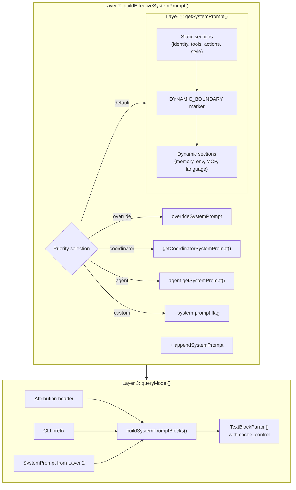
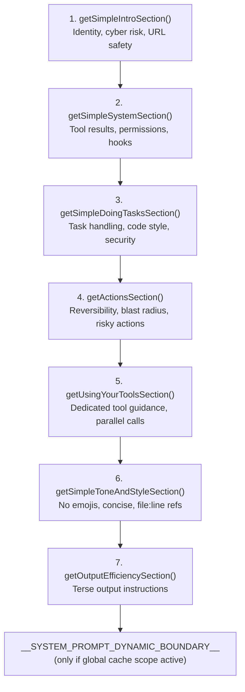
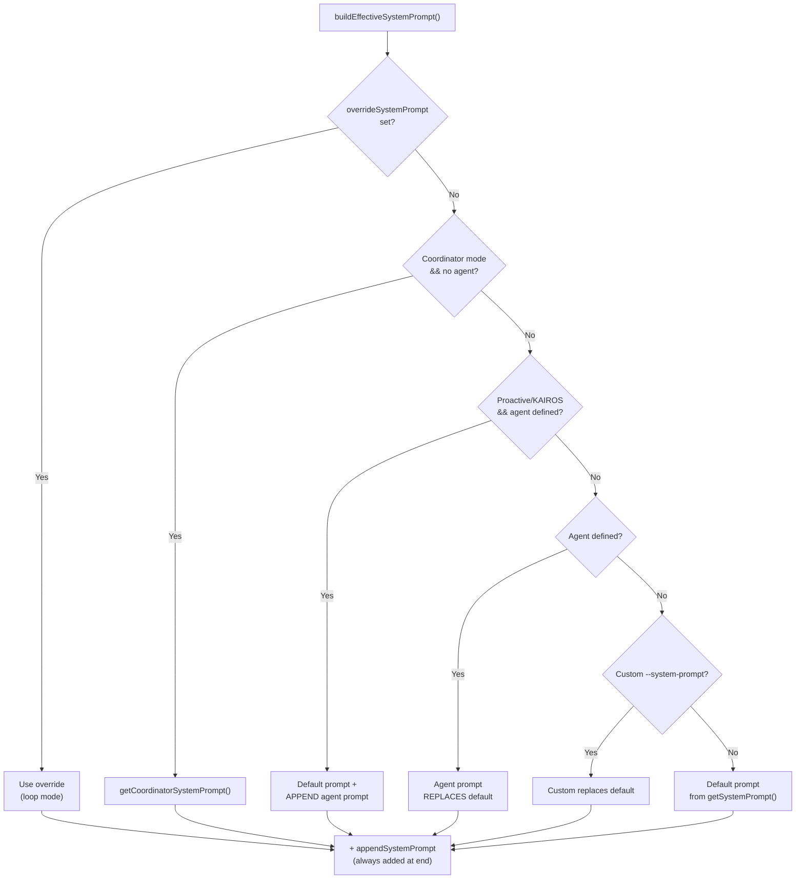
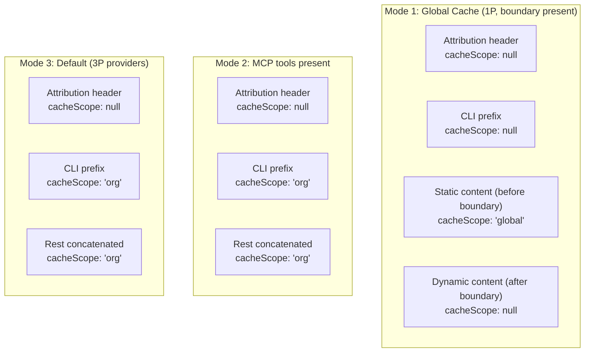

# System Prompt Archaeology

How Claude Code constructs, varies, and caches its system prompt — from the base prompt through context-dependent sections, entry-point variations, agent overrides, and cache control architecture.

---

## Table of Contents

1. [Architecture Overview](#architecture-overview)
2. [The Three-Layer Assembly Pipeline](#the-three-layer-assembly-pipeline)
3. [Layer 1: Base Prompt Sections](#layer-1-base-prompt-sections)
4. [Layer 2: Priority Selection](#layer-2-priority-selection)
5. [Layer 3: API-Level Assembly](#layer-3-api-level-assembly)
6. [Cache Control Architecture](#cache-control-architecture)
7. [Context Layers: userContext and systemContext](#context-layers-usercontext-and-systemcontext)
8. [How the Prompt Varies by Context](#how-the-prompt-varies-by-context)
9. [System Prompt Section Caching](#system-prompt-section-caching)
10. [Full Call Flow](#full-call-flow)
11. [Key Source Files](#key-source-files)

---

## Architecture Overview

The system prompt is a **branded string array** (`SystemPrompt = readonly string[] & { __brand: 'SystemPrompt' }`), not a single string. Each element becomes a separate `TextBlockParam` in the API request, enabling granular cache control.

**Type definition** — `src/utils/systemPromptType.ts:8-14`:
```typescript
export type SystemPrompt = readonly string[] & {
  readonly __brand: 'SystemPrompt'
}
```



---

## The Three-Layer Assembly Pipeline

| Layer | Function | File | Role |
|-------|----------|------|------|
| **1** | `getSystemPrompt()` | `src/constants/prompts.ts:444-577` | Builds the default prompt from ~15 sections |
| **2** | `buildEffectiveSystemPrompt()` | `src/utils/systemPrompt.ts:41-123` | Selects which prompt to use based on priority |
| **3** | `queryModel()` | `src/services/api/claude.ts:1361-1382` | Prepends attribution + CLI prefix, splits into cache blocks |

---

## Layer 1: Base Prompt Sections

`getSystemPrompt()` (`src/constants/prompts.ts:444-577`) has three code paths:

### Minimal Mode (`CLAUDE_CODE_SIMPLE=1`)
Returns a single-line CWD + date string (line 450-454).

### Proactive/KAIROS Mode
Returns a lean autonomous-agent prompt with memory, env info, MCP instructions, scratchpad (lines 467-489).

### Standard Mode (default)
Full prompt with static + dynamic sections separated by `SYSTEM_PROMPT_DYNAMIC_BOUNDARY`.

#### Static Sections (always present, cross-org cacheable)



| # | Function | File:Line | Content |
|---|----------|-----------|---------|
| 1 | `getSimpleIntroSection()` | prompts.ts:175-183 | Identity ("You are an interactive agent..."), cyber risk instruction, URL safety |
| 2 | `getSimpleSystemSection()` | prompts.ts:186-197 | Tool results, permission modes, hooks, system reminders, compression |
| 3 | `getSimpleDoingTasksSection()` | prompts.ts:199-253 | How to handle tasks, code style, security, `/help` info. Skipped if `outputStyleConfig.keepCodingInstructions === false` |
| 4 | `getActionsSection()` | prompts.ts:255-267 | Reversibility, blast radius, risky action examples |
| 5 | `getUsingYourToolsSection()` | prompts.ts:269-314 | Dedicated tool guidance (Read over cat, Edit over sed, etc.), parallel calls, TaskCreate |
| 6 | `getSimpleToneAndStyleSection()` | prompts.ts:430-442 | No emojis, concise, `file:line` references, no colons before tool calls |
| 7 | `getOutputEfficiencySection()` | prompts.ts:403-428 | Two variants: ant-internal gets "Communicating with the user" (prose), external gets terse "Output efficiency" |

#### The Boundary Marker

```typescript
...(shouldUseGlobalCacheScope() ? [SYSTEM_PROMPT_DYNAMIC_BOUNDARY] : []),
```

The `__SYSTEM_PROMPT_DYNAMIC_BOUNDARY__` string (line 114) separates globally-cacheable content from per-session content. Only inserted when 1P global cache scope is active.

#### Dynamic Sections (session-specific)

These are registered via `systemPromptSection()` or `DANGEROUS_uncachedSystemPromptSection()` and resolved through `resolveSystemPromptSections()`.

| Section | Cached? | Source | Condition |
|---------|---------|--------|-----------|
| `session_guidance` | Yes | `getSessionSpecificGuidanceSection()` | Agent tool, skills, AskUser presence, explore agents |
| `memory` | Yes | `loadMemoryPrompt()` | Auto memory enabled |
| `ant_model_override` | Yes | `getAntModelOverrideSection()` | `USER_TYPE === 'ant'` only |
| `env_info_simple` | Yes | `computeSimpleEnvInfo()` | Always (CWD, git, platform, shell, OS, model, cutoff, model IDs) |
| `language` | Yes | `getLanguageSection()` | Language preference set in settings |
| `output_style` | Yes | `getOutputStyleSection()` | Output style configured |
| `mcp_instructions` | **NO** | `getMcpInstructionsSection()` | MCP clients with instructions; skipped if delta mode enabled |
| `scratchpad` | Yes | `getScratchpadInstructions()` | Scratchpad feature enabled |
| `frc` | Yes | `getFunctionResultClearingSection()` | CACHED_MICROCOMPACT feature + model support |
| `summarize_tool_results` | Yes | Constant string | Always |
| `numeric_length_anchors` | Yes | Constant string | `USER_TYPE === 'ant'` only |
| `token_budget` | Yes | Constant string | TOKEN_BUDGET feature flag |
| `brief` | Yes | `getBriefSection()` | KAIROS/KAIROS_BRIEF feature + brief enabled |

The `mcp_instructions` section is the only `DANGEROUS_uncachedSystemPromptSection` — it recomputes every turn because MCP servers can connect/disconnect between turns, busting the prompt cache.

---

## Layer 2: Priority Selection

`buildEffectiveSystemPrompt()` (`src/utils/systemPrompt.ts:41-123`) determines which prompt to use:



**Priority order (first match wins):**

1. `overrideSystemPrompt` — replaces everything (used by loop mode)
2. Coordinator mode — uses `getCoordinatorSystemPrompt()` (`src/coordinator/coordinatorMode.ts:111`)
3. Proactive agent — agent prompt APPENDED to default prompt
4. Agent system prompt — agent prompt REPLACES default prompt
5. Custom system prompt — from `--system-prompt` flag
6. Default — from `getSystemPrompt()`

`appendSystemPrompt` (from `--append-system-prompt` CLI flag or SDK parameter) is always added at the end, except when override is active.

---

## Layer 3: API-Level Assembly

Just before the API call, `queryModel()` (`src/services/api/claude.ts:1361-1382`) prepends headers:

```typescript
systemPrompt = asSystemPrompt([
  getAttributionHeader(fingerprint),     // billing header
  getCLISyspromptPrefix({ isNonInteractive, hasAppendSystemPrompt }),
  ...systemPrompt,                       // from Layer 2
  ...(advisorModel ? [ADVISOR_TOOL_INSTRUCTIONS] : []),
  ...(injectChromeHere ? [CHROME_TOOL_SEARCH_INSTRUCTIONS] : []),
])
```

### Attribution Header

**File:** `src/constants/system.ts:73-95`

```
x-anthropic-billing-header: cc_version=999.0.0-local; cc_entrypoint=cli; ...
```

Contains version, fingerprint, entrypoint, optionally attestation token and workload hint.

### CLI System Prompt Prefix

**File:** `src/constants/system.ts:30-46`

Three variants based on entry point:

| Context | Prefix |
|---------|--------|
| Interactive CLI | `"You are Claude Code, Anthropic's official CLI for Claude."` |
| Non-interactive + append prompt (SDK preset) | `"You are Claude Code, Anthropic's official CLI for Claude, running within the Claude Agent SDK."` |
| Non-interactive, no append (bare SDK) | `"You are a Claude agent, built on Anthropic's Claude Agent SDK."` |

---

## Cache Control Architecture

### How Prompt Blocks Get Cache Scopes

`splitSysPromptPrefix()` (`src/utils/api.ts:321-435`) splits the prompt array into blocks with different cache scopes:



### `buildSystemPromptBlocks()`

**File:** `src/services/api/claude.ts:3256-3279`

Maps blocks to API `TextBlockParam` objects with `cache_control`:

```typescript
{ type: 'text', text: blockContent, cache_control: { type: 'ephemeral', scope?, ttl? } }
```

### `getCacheControl()`

**File:** `src/services/api/claude.ts:360-376`

- Always `type: 'ephemeral'`
- Optionally `ttl: '1h'` for eligible users (ant, subscribers not on overage)
- `scope: 'global'` only for the static block when global caching is active

---

## Context Layers: userContext and systemContext

Beyond the system prompt, two context dictionaries are injected per-request:

### `getSystemContext()`

**File:** `src/context.ts:116-150`

| Key | Content |
|-----|---------|
| `gitStatus` | Branch, main branch, git user, status (truncated at 2000 chars), recent 5 commits |
| `cacheBreaker` | Optional ant-only debug injection |

Injected into system prompt via `appendSystemContext()` (`src/utils/api.ts:437-447`).

### `getUserContext()`

**File:** `src/context.ts:155-189`

| Key | Content |
|-----|---------|
| `claudeMd` | Concatenated contents of all CLAUDE.md files (managed, user, project, local, rules) |
| `currentDate` | Today's date string |

Injected as a `<system-reminder>` user message via `prependUserContext()` (`src/utils/api.ts:449-474`).

---

## How the Prompt Varies by Context

### By Entry Point (`CLAUDE_CODE_ENTRYPOINT`)

| Entry Point | CLI Prefix | Notes |
|------------|-----------|-------|
| `cli` | DEFAULT_PREFIX | Standard interactive mode |
| `sdk-cli` / `sdk-ts` / `sdk-py` | AGENT_SDK_PREFIX or PRESET_PREFIX | Non-interactive; prefix depends on `appendSystemPrompt` |
| `claude-vscode` | Varies by non-interactive flag | IDE extension |
| `claude-desktop` | Varies | Desktop app |
| `mcp` | Uses CLAUDE_CODE_ENTRYPOINT env | MCP server mode |

### By `USER_TYPE` ('ant' vs 'external')

~6 sections have ant-specific differences:

| Section | Ant Difference |
|---------|----------------|
| `getSimpleDoingTasksSection()` | Extra bullets: comment writing, thoroughness, false-claims mitigation, assertiveness, `/issue` and `/share` commands |
| `getOutputEfficiencySection()` | Entirely different: "Communicating with the user" (prose) vs terse "Output efficiency" |
| `getSimpleToneAndStyleSection()` | Removes "Your responses should be short and concise" |
| `numeric_length_anchors` | Only present for ant |
| `ant_model_override` | Ant-only config suffix |
| Model name display | "Undercover" checks suppress model names for ant in stealth mode |

### By Agent Definition

| Scenario | Prompt Source |
|----------|--------------|
| No agent (main REPL) | Full default prompt |
| Custom agent (subagent) | Agent's `getSystemPrompt()` REPLACES default |
| Built-in agent (subagent) | Agent prompt + `enhanceSystemPromptWithEnvDetails()` |
| Built-in agent (main thread, proactive) | Default prompt + APPEND agent prompt |
| Fork subagent | Inherits PARENT's exact system prompt (byte-identical for cache) |
| Teammate (tmux swarm) | Appends `TEAMMATE_SYSTEM_PROMPT_ADDENDUM` |

### By Feature Flags

| Flag | Effect on Prompt |
|------|-----------------|
| `PROACTIVE` / `KAIROS` | Entirely different prompt path (autonomous agent) |
| `KAIROS_BRIEF` | Adds brief section |
| `COORDINATOR_MODE` | Uses coordinator system prompt |
| `CACHED_MICROCOMPACT` | Adds "Function Result Clearing" section |
| `TOKEN_BUDGET` | Adds token budget section |
| `EXPERIMENTAL_SKILL_SEARCH` | Adds DiscoverSkills guidance |
| `VERIFICATION_AGENT` | Adds verification agent instructions |

### By MCP Servers

Two injection modes:

1. **Traditional**: `getMcpInstructionsSection()` in the `DANGEROUS_uncached` section — recomputed every turn, busts prompt cache on late MCP connects
2. **Delta mode** (`isMcpInstructionsDeltaEnabled()`): Instructions delivered as `mcp_instructions_delta` attachment messages instead of system prompt, avoiding cache busting

---

## System Prompt Section Caching

**File:** `src/constants/systemPromptSections.ts`

### `systemPromptSection()` (lines 20-25)
Creates a **memoized** section — computed once, cached until `/clear` or `/compact`.

### `DANGEROUS_uncachedSystemPromptSection()` (lines 32-38)
Creates a **volatile** section that recomputes every turn. Currently only used for `mcp_instructions`.

### `resolveSystemPromptSections()` (lines 43-58)
Resolves all sections, using cache for non-cache-breaking sections.

### `clearSystemPromptSections()` (lines 65-68)
Clears all cached sections and beta header latches. Called on `/clear` and `/compact`.

---

## Full Call Flow

```
REPL.tsx (user submits message)
  │
  ├── getSystemPrompt(tools, model, additionalDirs, mcpClients)
  │     └── Static sections + BOUNDARY + Dynamic sections → string[]
  │
  ├── getUserContext()   → { claudeMd, currentDate }
  ├── getSystemContext()  → { gitStatus, cacheBreaker? }
  │
  ├── buildEffectiveSystemPrompt({
  │     mainThreadAgentDefinition, toolUseContext,
  │     customSystemPrompt, defaultSystemPrompt, appendSystemPrompt
  │   })
  │     └── Priority: override > coordinator > agent > custom > default
  │
  └── query({ systemPrompt, userContext, systemContext, ... })
        │
        ├── fullSystemPrompt = appendSystemContext(systemPrompt, systemContext)
        ├── messagesForQuery = prependUserContext(messages, userContext)
        │
        └── callModel({ messages, systemPrompt })
              │
              └── queryModel()
                    ├── Prepend: attributionHeader + CLISyspromptPrefix
                    ├── Append: advisorInstructions? + chromeInstructions?
                    ├── buildSystemPromptBlocks()
                    │     └── splitSysPromptPrefix() → blocks with cache scopes
                    │     └── getCacheControl() → ephemeral + ttl? + scope?
                    └── API request: { system: TextBlockParam[], messages, tools, ... }
```

---

## Key Source Files

| File | Purpose |
|------|---------|
| `src/constants/prompts.ts` | `getSystemPrompt()`, all static/dynamic section functions, `enhanceSystemPromptWithEnvDetails()` |
| `src/utils/systemPrompt.ts` | `buildEffectiveSystemPrompt()` — priority selection |
| `src/utils/systemPromptType.ts` | `SystemPrompt` branded type definition |
| `src/constants/systemPromptSections.ts` | Section caching: `systemPromptSection()`, `DANGEROUS_uncachedSystemPromptSection()`, `resolveSystemPromptSections()` |
| `src/constants/system.ts` | Attribution header, CLI prefix variants |
| `src/services/api/claude.ts` | `queryModel()`, `buildSystemPromptBlocks()`, `getCacheControl()` |
| `src/utils/api.ts` | `splitSysPromptPrefix()`, `appendSystemContext()`, `prependUserContext()` |
| `src/context.ts` | `getUserContext()`, `getSystemContext()` |
| `src/coordinator/coordinatorMode.ts` | `getCoordinatorSystemPrompt()` |
| `src/tools/AgentTool/runAgent.ts` | `getAgentSystemPrompt()` for subagents |
| `src/utils/swarm/teammatePromptAddendum.ts` | `TEAMMATE_SYSTEM_PROMPT_ADDENDUM` |
