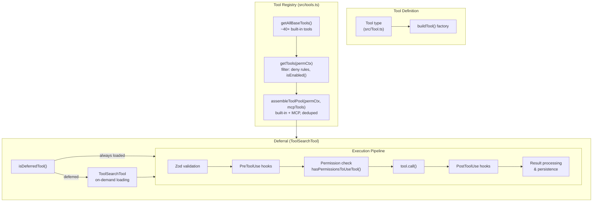
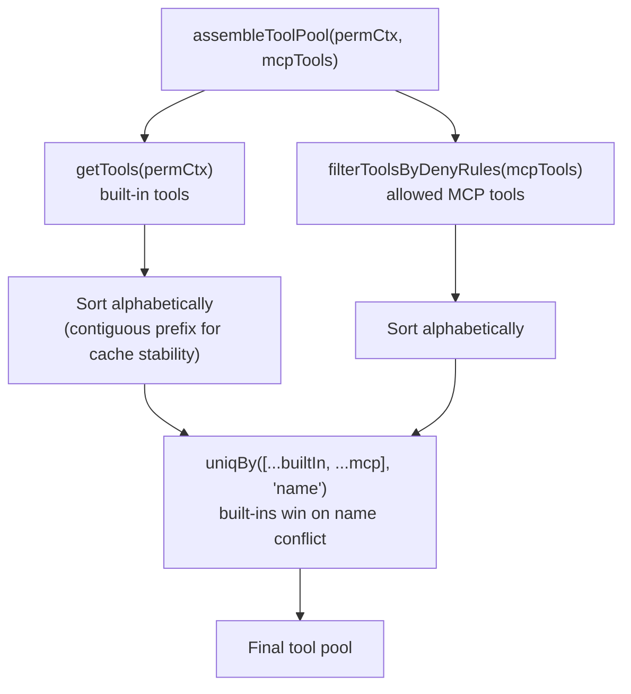
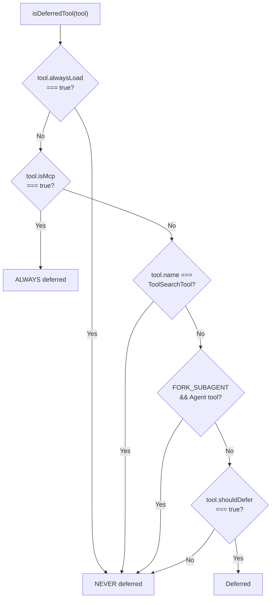
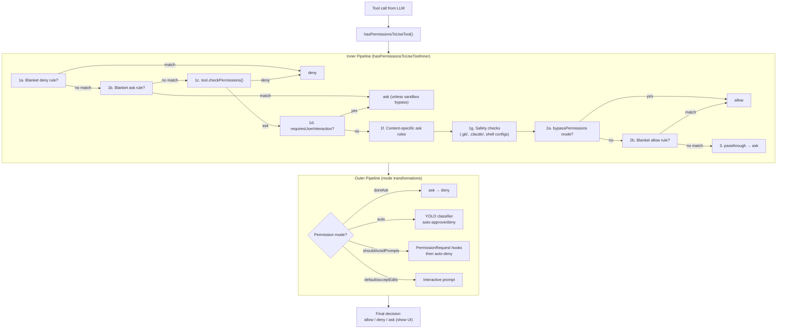
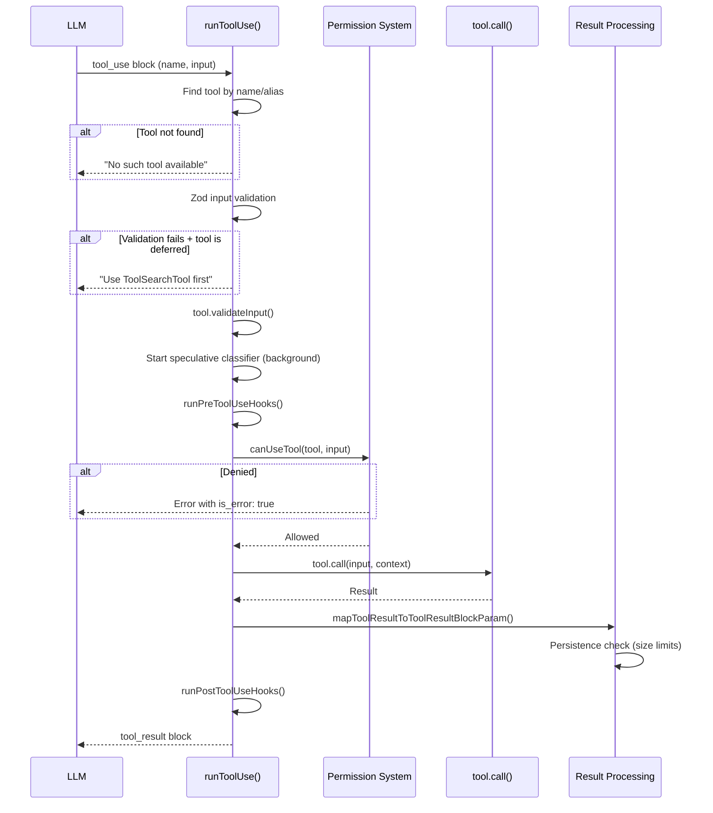
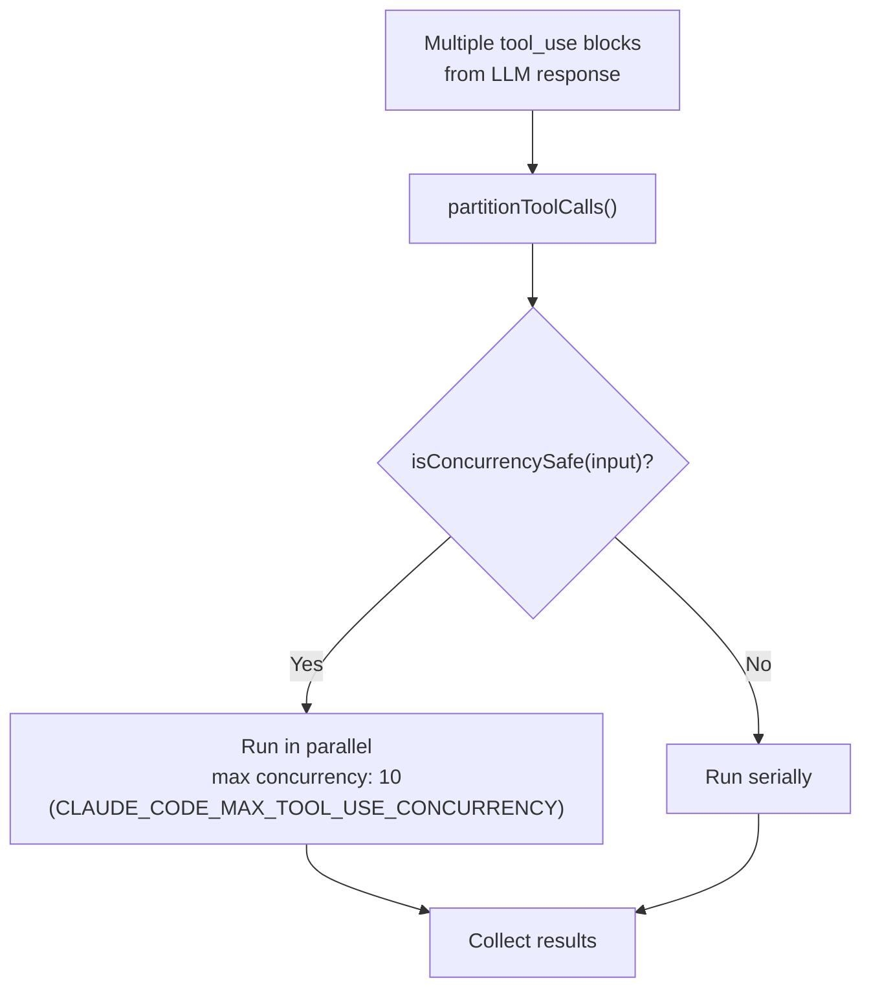
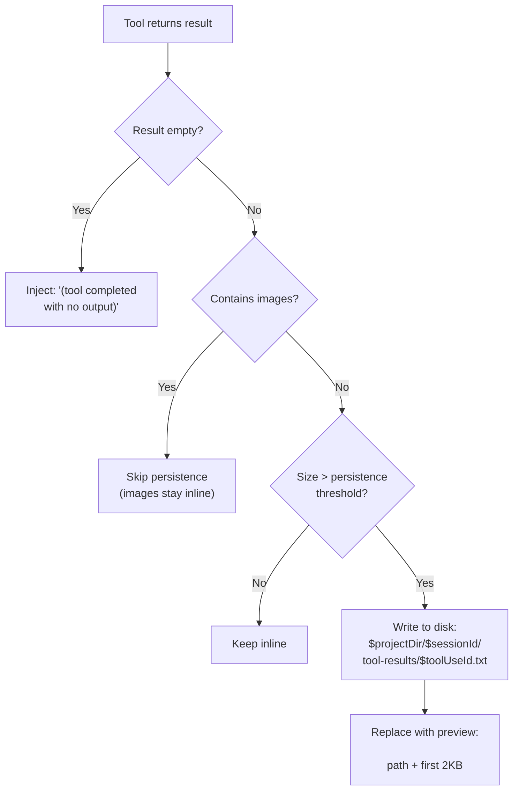

# Tool System Deep Dive

How Claude Code's tool system works — from tool definition and registration through permission checking, execution, and result processing.

---

## Table of Contents

1. [Architecture Overview](#architecture-overview)
2. [Tool Definition & Registration](#tool-definition--registration)
3. [Tool Availability & Deferral](#tool-availability--deferral)
4. [Permission System](#permission-system)
5. [Tool Execution Pipeline](#tool-execution-pipeline)
6. [Result Processing & Persistence](#result-processing--persistence)
7. [Full Lifecycle Summary](#full-lifecycle-summary)
8. [Key Source Files](#key-source-files)

---

## Architecture Overview



---

## Tool Definition & Registration

### The `Tool` Type

**File:** `src/Tool.ts:362-695`

The `Tool` type is a generic interface with three type parameters: `Input` (Zod schema), `Output`, and `P` (progress data). Key properties:

| Property | Type | Purpose |
|----------|------|---------|
| `name` | `string` | Primary identifier |
| `aliases` | `string[]` | Backward-compat lookup names |
| `inputSchema` | `Zod schema` | Input validation |
| `call()` | method | Actual execution |
| `checkPermissions()` | method | Tool-specific permission logic |
| `validateInput()` | method | Input validation before permissions |
| `isEnabled()` | `boolean` | Whether tool is currently available |
| `isReadOnly(input)` | `boolean` | Used for concurrency decisions |
| `isConcurrencySafe(input)` | `boolean` | Whether parallel execution is safe |
| `shouldDefer` | `boolean` | Deferred behind ToolSearchTool |
| `alwaysLoad` | `boolean` | Never deferred, even for MCP tools |
| `isMcp` | `boolean` | Marks MCP-sourced tools |
| `maxResultSizeChars` | `number` | Per-tool persistence threshold |
| `mapToolResultToToolResultBlockParam()` | method | Converts output to API format |

### The `buildTool()` Factory

**File:** `src/Tool.ts:757-792`

All tool exports go through `buildTool()`, which fills safe defaults:

```typescript
buildTool({
  name: 'MyTool',
  inputSchema: z.object({ ... }),
  call: async (input, context) => { ... },
  // Defaults filled by buildTool():
  // isEnabled: () => true
  // isConcurrencySafe: () => false (assume not safe)
  // isReadOnly: () => false (assume writes)
  // isDestructive: () => false
  // checkPermissions: () => ({ behavior: 'allow', updatedInput: input })
})
```

### Master Tool List — `getAllBaseTools()`

**File:** `src/tools.ts:193-251`

The **single source of truth** for all built-in tools. Returns ~40+ tools depending on feature flags and environment:

**Always included:**
- AgentTool, TaskOutputTool, BashTool, FileReadTool, FileEditTool, FileWriteTool
- NotebookEditTool, WebFetchTool, TodoWriteTool, WebSearchTool, TaskStopTool
- AskUserQuestionTool, SkillTool, EnterPlanModeTool, BriefTool, SendMessageTool
- ExitPlanModeV2Tool

**Conditionally included:**

| Condition | Tools Added |
|-----------|-------------|
| `!hasEmbeddedSearchTools()` | GlobTool, GrepTool |
| `USER_TYPE === 'ant'` | ConfigTool, TungstenTool, REPLTool |
| `isTodoV2Enabled()` | TaskCreateTool, TaskGetTool, TaskUpdateTool, TaskListTool |
| `isWorktreeModeEnabled()` | EnterWorktreeTool, ExitWorktreeTool |
| `isAgentSwarmsEnabled()` | TeamCreateTool, TeamDeleteTool |
| `isToolSearchEnabledOptimistic()` | ToolSearchTool |
| Various feature flags | WebBrowserTool, WorkflowTool, SleepTool, CronTools, etc. |
| `NODE_ENV === 'test'` | TestingPermissionTool |

### `assembleToolPool()` — Combining Built-In + MCP

**File:** `src/tools.ts:345-367`



**`getTools()` filtering layers** (`src/tools.ts:271-327`):

1. **Simple mode** (`CLAUDE_CODE_SIMPLE`): only Bash, FileRead, FileEdit
2. Remove special tools (ListMcpResourcesTool, ReadMcpResourceTool, SyntheticOutputTool)
3. **`filterToolsByDenyRules()`** — removes tools with blanket deny rules
4. **REPL mode**: hides primitive tools (accessible inside REPL VM)
5. **`isEnabled()`**: final per-tool check

---

## Tool Availability & Deferral

### `isDeferredTool()` Decision Tree

**File:** `src/tools/ToolSearchTool/prompt.ts:62-108`



### Tools Always Loaded (Never Deferred)

These core tools are always sent to the LLM with full schemas:

- **AgentTool** — model needs it for spawning subagents
- **BashTool** — fundamental execution
- **FileReadTool, FileEditTool, FileWriteTool** — core file operations
- **GlobTool, GrepTool** — core search
- **SkillTool** — skill invocation
- **AskUserQuestionTool** — user interaction
- **ToolSearchTool** — the loader itself (never deferred)
- **BriefTool, TaskOutputTool**

### Tools with `shouldDefer: true` (~25 tools)

These are loaded on-demand via ToolSearchTool:

NotebookEditTool, WebFetchTool, WebSearchTool, EnterPlanModeTool, ExitPlanModeV2Tool, TodoWriteTool, TaskStopTool, TaskCreateTool, TaskGetTool, TaskUpdateTool, TaskListTool, TeamCreateTool, TeamDeleteTool, SendMessageTool, ConfigTool, LSPTool, EnterWorktreeTool, ExitWorktreeTool, ListMcpResourcesTool, ReadMcpResourceTool, RemoteTriggerTool, CronCreateTool, CronDeleteTool, CronListTool

### Tool Search Modes

**File:** `src/utils/toolSearch.ts:172-198`

Controlled by `ENABLE_TOOL_SEARCH` env var:

| Mode | When Active | Behavior |
|------|-------------|----------|
| **`tst`** (default) | env unset, `true`, or `auto:0` | Always defer MCP + shouldDefer tools |
| **`tst-auto`** | `auto` or `auto:1-99` | Defer only when deferred tools exceed N% of context window (default 10%) |
| **`standard`** | `false` or `auto:100` | No deferral — all tools exposed inline |

Kill switch: `CLAUDE_CODE_DISABLE_EXPERIMENTAL_BETAS` forces `standard` mode.

Runtime check at `isToolSearchEnabled()` (`src/utils/toolSearch.ts:385-473`) also verifies model support (Haiku doesn't support `tool_reference` blocks).

### Special Mode Filtering

**Coordinator mode** (`src/utils/toolPool.ts:35-41`): Only AgentTool, TaskStopTool, SendMessageTool, SyntheticOutputTool.

**Agent disallowed tools** (`src/constants/tools.ts:36-46`): See [Multi-Agent Internals](multi-agent-internals.md#tool-filtering--permissions).

---

## Permission System

### Permission Pipeline Overview



**File:** `src/utils/permissions/permissions.ts:473-956` (outer), `:1158-1319` (inner)

### `ToolPermissionContext`

**File:** `src/Tool.ts:123-138`

```typescript
type ToolPermissionContext = {
  mode: PermissionMode        // 'default' | 'acceptEdits' | 'bypassPermissions' | 'auto' | ...
  additionalWorkingDirectories: Map<string, AdditionalWorkingDirectory>
  alwaysAllowRules: ToolPermissionRulesBySource   // { userSettings, session, ... }
  alwaysDenyRules: ToolPermissionRulesBySource
  alwaysAskRules: ToolPermissionRulesBySource
  isBypassPermissionsModeAvailable: boolean
  shouldAvoidPermissionPrompts?: boolean          // headless/background agents
  awaitAutomatedChecksBeforeDialog?: boolean       // coordinator workers
  prePlanMode?: PermissionMode                     // restore on plan mode exit
}
```

Rules are keyed by source: `userSettings`, `projectSettings`, `localSettings`, `flagSettings`, `policySettings`, `cliArg`, `command`, `session`.

### Permission Modes

**File:** `src/types/permissions.ts:16-38`

| Mode | Behavior |
|------|----------|
| **`default`** | Ask for every non-read-only operation |
| **`acceptEdits`** | Auto-allow file edits in working directory; ask for Bash |
| **`bypassPermissions`** | Allow everything except safety checks and deny rules |
| **`auto`** | AI classifier decides instead of prompting user |
| **`dontAsk`** | Never prompt — all `ask` becomes `deny` |
| **`plan`** | Read-only planning mode |
| **`bubble`** | Internal (agent swarm, permissions bubble to parent) |

### `canUseTool` / `useCanUseTool` Hook

**File:** `src/hooks/useCanUseTool.tsx:28-203`

The React hook that orchestrates the full permission check:

1. Creates a `PermissionContext` (queue ops for UI, abort handling)
2. Calls `hasPermissionsToUseTool()`
3. On **`allow`**: resolves immediately
4. On **`deny`**: logs rejection, records auto-mode denials
5. On **`ask`**: tries handler paths in order:
   - **Coordinator handler** — for `awaitAutomatedChecksBeforeDialog`
   - **Swarm worker handler** — forwards to leader via mailbox
   - **Speculative classifier grace period** (2s timeout for bash classifier)
   - **Interactive handler** — shows UI permission dialog to user

### Safety Checks (Bypass-Immune)

Certain paths are protected regardless of permission mode (`src/utils/permissions/permissions.ts`):

- `.git/` directory modifications
- `.claude/` directory modifications
- Shell config files (`.bashrc`, `.zshrc`, etc.)
- These checks run at step 1g and cannot be bypassed even in `bypassPermissions` mode

---

## Tool Execution Pipeline

### `runToolUse()` — Entry Point

**File:** `src/services/tools/toolExecution.ts:337`



### Tool Concurrency

**File:** `src/services/tools/toolOrchestration.ts`

`runTools()` partitions tool calls into batches:



Read-only tools (Glob, Grep, Read) typically return `isConcurrencySafe: true`, enabling parallel execution.

---

## Result Processing & Persistence

### Per-Tool Size Limits

**File:** `src/utils/toolResultStorage.ts`

Each tool defines `maxResultSizeChars`. When results exceed the threshold, they're persisted to disk:

| Tool | `maxResultSizeChars` | Effective Limit |
|------|---------------------|-----------------|
| FileReadTool | `Infinity` | Never persisted (avoids circular Read loops) |
| GrepTool | `20,000` | 20K chars |
| BashTool | `30,000` | 30K chars |
| Most tools | `100,000` | Capped at 50K by global default |

**Persistence threshold** (`getPersistenceThreshold()`, line 55):
```
effective = Math.min(tool.maxResultSizeChars, DEFAULT_MAX_RESULT_SIZE_CHARS=50,000)
```

### What Happens When Results Are Too Large



### Per-Message Aggregate Budget

**File:** `src/utils/toolResultStorage.ts:769`, `src/constants/toolLimits.ts:49`

Beyond per-tool limits, there's an aggregate budget per API-level user message:

**`MAX_TOOL_RESULTS_PER_MESSAGE_CHARS = 200,000`**

`enforceToolResultBudget()` enforces this:

1. Groups tool results by API-level user message (consecutive user messages merge)
2. Partitions candidates: `mustReapply` (previously replaced), `frozen` (previously unreplaced), `fresh` (new)
3. If a message group exceeds budget → persists the **largest fresh results** to disk
4. Tracked in `ContentReplacementState`:
   - `seenIds: Set<string>` — results whose fate is frozen (no re-evaluation)
   - `replacements: Map<string, string>` — persisted results mapped to preview strings
5. Re-application is a Map lookup (zero I/O, byte-identical) for **prompt cache stability**

### Size Constants Summary

**File:** `src/constants/toolLimits.ts`

| Constant | Value | Purpose |
|----------|-------|---------|
| `DEFAULT_MAX_RESULT_SIZE_CHARS` | 50,000 | Global cap for per-tool persistence |
| `MAX_TOOL_RESULT_TOKENS` | 100,000 | ~400KB text |
| `BYTES_PER_TOKEN` | 4 | Conservative estimate |
| `MAX_TOOL_RESULT_BYTES` | 400,000 | Derived from token limit |
| `MAX_TOOL_RESULTS_PER_MESSAGE_CHARS` | 200,000 | Aggregate per-message budget |
| `TOOL_SUMMARY_MAX_LENGTH` | 50 | Display truncation |

---

## Full Lifecycle Summary

```
DEFINITION (Tool.ts)
  ├─ Tool type with ~40 methods/properties
  └─ buildTool() factory fills defaults
       │
REGISTRATION (tools.ts)
  ├─ getAllBaseTools() — master list of ~40+ tools (conditional on features)
  ├─ getTools(permCtx) — filters: deny rules, REPL mode, isEnabled()
  └─ assembleToolPool(permCtx, mcpTools) — combines built-in + MCP, dedupes
       │
DEFERRAL (ToolSearchTool/prompt.ts, utils/toolSearch.ts)
  ├─ isDeferredTool() — MCP always deferred; ~25 built-in tools deferred
  ├─ Core tools always loaded: Bash, Read, Edit, Write, Glob, Grep, Agent, Skill
  ├─ ToolSearchTool returns tool_reference blocks for on-demand loading
  └─ Modes: tst (default), tst-auto (threshold), standard (no defer)
       │
EXECUTION (services/tools/toolExecution.ts, toolOrchestration.ts)
  ├─ Zod input validation
  ├─ tool.validateInput()
  ├─ PreToolUse hooks
  ├─ PERMISSION CHECK
  │   ├─ Inner pipeline: deny rules → ask rules → checkPermissions() →
  │   │   safety checks → bypass mode → allow rules → passthrough→ask
  │   └─ Outer pipeline: mode transforms (dontAsk→deny, auto→classifier)
  ├─ tool.call(input, context)
  ├─ PostToolUse hooks
  └─ RESULT PROCESSING
      ├─ mapToolResultToToolResultBlockParam()
      ├─ Per-tool persistence: if size > min(maxResultSizeChars, 50K)
      │   → write to disk, replace with 2KB preview in <persisted-output>
      ├─ Empty results → "(tool completed with no output)"
      ├─ Per-message budget: if aggregate > 200K per user message
      │   → persist largest fresh results
      └─ ContentReplacementState ensures byte-identical replays for cache
```

---

## Key Source Files

| File | Purpose |
|------|---------|
| `src/Tool.ts` | `Tool` type definition, `buildTool()` factory, `ToolPermissionContext` |
| `src/tools.ts` | `getAllBaseTools()`, `getTools()`, `assembleToolPool()` |
| `src/tools/ToolSearchTool/prompt.ts` | `isDeferredTool()`, deferred tool formatting |
| `src/tools/ToolSearchTool/ToolSearchTool.ts` | On-demand tool loader (keyword search, direct select) |
| `src/utils/toolSearch.ts` | Tool search modes, `isToolSearchEnabled()`, token threshold |
| `src/services/tools/toolExecution.ts` | `runToolUse()`, `checkPermissionsAndCallTool()` |
| `src/services/tools/toolOrchestration.ts` | `runTools()`, concurrency partitioning |
| `src/utils/permissions/permissions.ts` | `hasPermissionsToUseTool()`, full permission pipeline |
| `src/hooks/useCanUseTool.tsx` | React hook: permission orchestration + UI |
| `src/types/permissions.ts` | `PermissionMode` type definitions |
| `src/utils/toolResultStorage.ts` | Result persistence, `ContentReplacementState`, budget enforcement |
| `src/constants/toolLimits.ts` | Size constants (50K, 200K, 400K limits) |
| `src/constants/tools.ts` | Agent disallowed tool sets |
| `src/utils/toolPool.ts` | Coordinator mode tool filtering |
